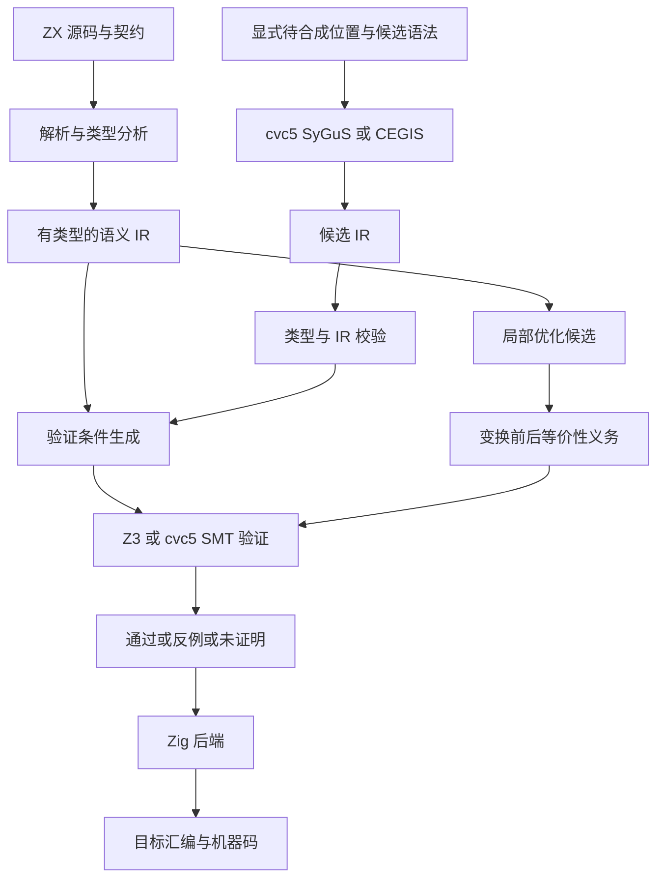

# 形式化证明与逆向求解资料核验

## Intent：最终目标

依据用户提供的历史讨论，明确 zxc 的目标包含：类 TS 源码到 Zig 的常规编译、用户程序契约验证、约束驱动的程序合成，以及保持语义的底层优化。不能将“形式化证明”缩减为证明模块图无环，也不能将“逆向求解”理解为普通代码生成。

## Data：可用证据

已阅读附件中约束合成、TS→Zig、工业实践与 Dafny/Z3 选型段落，并核对以下一手资料。附件是设计意图来源，不是技术结论的权威依据。

| 资料                                                                                                    | 用途                                                           |
| ------------------------------------------------------------------------------------------------------- | -------------------------------------------------------------- |
| [Dafny Reference](https://dafny.org/latest/DafnyRef/DafnyRef)                                           | 前置/后置条件、循环不变量、终止条件，以及 VC→Boogie→SMT 的分层 |
| [Z3 Bitvectors](https://microsoft.github.io/z3guide/docs/theories/Bitvectors/)                          | 位宽、模运算和有符号/无符号操作的准确编码                      |
| [Z3 Tactics](https://microsoft.github.io/z3guide/docs/strategies/tactics/)                              | SAT、UNSAT、UNKNOWN 的含义与求解边界                           |
| [cvc5 SyGuS Functions](https://cvc5.github.io/docs/latest/examples/sygus-fun.html)                      | 从语法约束和全称规格合成函数的完整输入示例                     |
| [Rosette](https://emina.github.io/rosette/)                                                             | 求解器辅助的语言实现与合成原型                                 |
| [Alive2](https://github.com/AliveToolkit/alive2)                                                        | 对 LLVM 优化进行翻译验证；需注意其支持范围和有界性             |
| [Souper](https://github.com/google/souper)                                                              | LLVM IR 局部超级优化的实现参考                                 |
| [CompCert 语义保持](https://compcert.org/man/manual001.html)                                            | “程序满足规格”与“编译器保持语义”是不同证明义务                 |
| [Halide 自动调度论文](https://halide-lang.org/papers/halide_autoscheduler_2019.pdf)                     | 搜索、代价模型和实测；论文明确不保证全局最小化                 |
| [AWS 授权引擎论文](https://www.amazon.science/publications/formally-verified-cloud-scale-authorization) | 生产验证案例，不能推导出一般程序自动合成能力                   |
| [Kani 官方仓库](https://github.com/model-checking/kani)                                                 | 纠正附件将 Kani 描述成直接对接 Z3 的例子；其核心使用 CBMC      |

## Edges：边界与限制

- 本轮是资料核验和实现路线修正，没有运行证明或合成任务。当前环境未发现 lean、lake、z3 可执行文件。
- 原始附件含其他话题和个人信息；本文仅摘取技术意图，不复制无关内容。
- 求解器结论依赖编码的语义、规格与假设。UNKNOWN、超时、资源耗尽、未支持特性不能记为证明通过。
- 数学整数、有限位整数与 IEEE 浮点不能互换；Zig 运行时安全检查必须进入证明义务。
- 证明源程序不自动覆盖 ZX→Zig、Zig→机器码、外部 ABI、插件和宿主 I/O。

## Answer：核验结论与实施路线

### 一、用户意图的准确归纳

需要区分五个问题：

1. 常规编译：给定程序，生成保持其语义的 Zig。
2. 程序验证：给定程序及契约，证明所有满足前提的输入都满足要求。
3. 输入逆解：给定程序及目标输出，求一个或多个满足条件的输入。
4. 程序合成：给定契约与候选语法，求一个对所有允许输入都正确的程序。
5. 超级优化：给定已有程序和有限搜索空间，找更低代价的等价程序。

附件主要讨论第 2、4、5 项，并非单纯第 3 项。排班、背包等场景还可能是在运行时求某个具体问题实例的最优解；这与合成解决所有实例的算法不同。

### 二、必须纠正的技术结论

**“Z3 是唯一正确选择”不成立。** Z3 适合作为 SMT 验证后端；cvc5 原生支持 SyGuS，适合语法引导合成。Dafny 处于语言与验证条件生成层，可以借鉴其契约模型，也可作为验证路径的中间表示；使用 Dafny 验证不要求放弃独立 Zig 代码生成。选型应依据编码和求解能力，而非绝对排除某个工具。

**“求出一组输入输出”不等于“合成函数”。** 附件中的 declare-fun 常量加 assert 示例只建立可满足性问题，缺少“寻找程序且对全部输入正确”的量词与候选语法约束。

**“位向量与 Zig 类型一一对应，所以自动无溢出”不成立。** 位向量加减默认按位宽取模；ZX 若规定溢出陷阱，必须另行证明操作可定义或将陷阱纳入语义。位向量本身不区分有符号性，是比较、除法、移位等操作区分解释方式。不能把所有比较都编码为 bvsge。

**“有后置条件便能自动产生正确实现”不成立。** 规格可能矛盾、欠约束，候选语法可能无解，求解也可能超时。即使合成成功，也只证明相对于该规格的正确性，不证明规格准确表达了业务。

**“minimize(time_complexity) 自动生成全局最优 SIMD 汇编”不成立。** 需要先限定候选空间、指令/IR 语法、输入规模与代价函数。指令数、延迟估计、代码体积和渐近复杂度是不同目标。固定周期相加无法完整刻画流水线、缓存、寄存器压力和数据依赖。

**Halide 不是任意算法的全局最优证明器。** 其自动调度使用搜索和代价模型，并可结合实测；论文明确说明代价模型不完美、搜索不保证全局最优。

**Kani 的例子引用错误。** Kani 的核心验证引擎是 CBMC，不应将其作为“现代工具都直接使用 Z3”的论据。

### 三、原始价格示例的规格问题

附件同时要求：

```text
final_price = raw_price - discount
final_price >= 0
```

在数学整数语义下，如果没有限制 discount <= raw_price，输入 raw_price=3、discount=5 会使两条要求矛盾。合成器应报告无可满足实现，不能擅自把减法替换为截断到零。

可选择的规格由业务意图决定：

```text
方案 A：requires discount <= raw_price
        ensures final_price = raw_price - discount

方案 B：ensures final_price = max(raw_price - discount, 0)
```

对 u32 的方案 B，应以条件分支选择安全减法，或明确使用饱和语义；先执行普通无符号减法再取 max 可能已经下溢。对 i32 也需要处理两端极值，不能假定数学减法永远在位宽内。

附件的 raw_price + 5 > raw_price 示例同样必须处理溢出；raw_price=0 并不是这个例子在数学整数语义下的反例。问题发生在机器整数边界，而不是零输入。

### 四、统一规格与查询形式

设 P 为前置条件，Q 为后置条件，f 为待验证程序，Safe 表示无溢出、除零、越界等非法执行。

程序验证寻找：

```text
存在 x：P(x) 且（非 Safe_f(x) 或 非 Q(x, f(x))）
```

该查询返回 SAT 时提供反例；返回 UNSAT 时，在编码和求解器的信任边界内证明不存在违反者。若需证明终止，应额外建立终止义务；安全性质或有界展开不能替代它。

程序合成寻找：

```text
存在程序 p 属于候选语法 G：
    对所有 x，P(x) 蕴含 Safe_p(x) 且 Q(x, p(x))
```

CEGIS 在候选搜索与反例搜索之间迭代。候选不可信，必须重新经过相同 IR 校验、类型分析与验证条件检查；求解器输出不能直接拼入 Zig 源码。

### 五、适合 zxc 的分层



验证、合成与常规编译共用语义，不另建脱离现有类型系统的“证明专用近似程序”。原有模块图与 Store 授权证明属于系统级不变量，不能替代用户程序的 requires/ensures 验证。

建议先通过 SMT-LIB 进程协议接入固定版本求解器，保留完整查询和原始结果，降低 Zig 直接 C 绑定的初始复杂度。只有性能证据需要时再引入进程内绑定。不要为两个后端预建通用插件框架。

### 六、语言与实现约束

- requires/ensures 是契约语法目标，尚未实现，不能把本文伪代码称为当前 ZX 可编译语法。
- 合成必须显式标记，避免将合法空 void 函数体误认为合成请求。
- 不复用 `??` 作为合成洞：它已经是 ZX 的空值合并运算符。
- 第一批完整语义从布尔、固定宽度整数、结构字段和有限分支开始；浮点按 IEEE 语义另行编码，禁止以实数冒充。
- 列表、循环、递归、Store 与 effect 必须明确不变量、范围或契约假设。未支持部分返回未证明，不能自动略过。
- zig:/c: 和插件具有宿主语义；若仅根据其接口契约进行模块化验证，报告必须列出该契约作为假设，不能声称插件实现也已证明。
- 优化目标先用明确可计算代价，例如限定语法内的表达式节点数或目标代价模型；最优性声明必须附带搜索范围。

### 七、证据产物与成功标准

每次验证至少保留源码/IR 哈希、契约、类型和目标语义版本、外部假设、SMT 查询、求解器版本、结果及反例。可以使用求解器作为可信计算基；若宣称独立可检查证明，还需保存证书并经过对应检查器。单个 UNSAT 文本不是整个工具链的独立证明证书。

每次合成额外保留候选语法、搜索预算、候选代码、成本模型与再次验证记录。搜索耗尽只能说明当前空间/预算的结果，不能说所有程序都不存在解。

每次汇编优化额外保留前后 IR、语义保持证据、目标 CPU/特性、优化选项和产物。生成 `.s` 文件只是汇编输出，不代表做过超级优化，更不代表机器码已获形式化证明。

### 八、自我复核

此前执行计划把形式化工作主要写成模块图、类型和优化不变量，未充分涵盖附件中的“业务函数契约验证与空实现合成”。已据此扩充目标。资料中可取的是统一语义 IR 和验证/合成分流；应剔除唯一工具论、无条件全局最优和绝对安全的宣传性结论。
