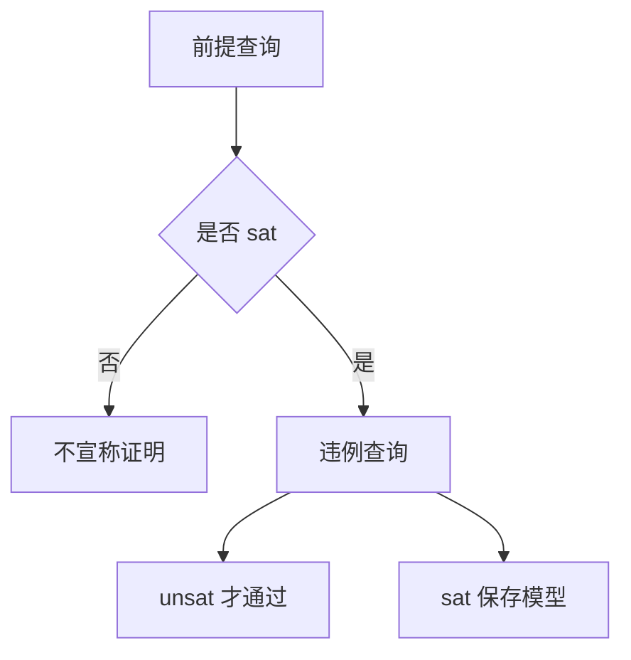

# 形式验证求解器回归记录

## Intent：最终目标

验证并行新增的符号执行和 CLI 求解流程能正确区分安全、反例、不可满足前提和不支持的能力。

## Data：可用证据

公开 verification.generate 输出 feasibility/correctness 两份 QF_BV 查询；CLI verify 调用外部 Z3，只有前提 sat 且违例 unsat 才成功。环境未预装 Z3，本轮从 Z3Prover 官方发行安装临时验证工具，不修改系统安装。

固定工具：z3-5.1.0-x64-osx-13.3.zip；官方 SHA-256 `f25cabdb01a32942a42227c36902c0846c759dcaabef4aca3b2e86331447f6ff`。来源 https://github.com/Z3Prover/z3/releases/tag/z3-5.1.0 。

## Edges：边界与限制

测试只证明所列验证问题，不能证明符号执行器普遍正确。浮点应明确拒绝，不伪装成已证明。真实求解测试需 Z3：默认 PATH 中的 z3，或 `ZXC_TEST_SOLVER` 指定路径。求解器缺失应失败，不静默跳过。

## Answer：交付与成功标准

临时目录创建真实 ZX 文件，调用正式 zxc verify，核对退出码、状态、查询、solver 版本记录及反例文件；测试代码位于 `packages/test/tests/verification/`，草案位于 `docs/2026-10-03/verification_tests/`。




## 执行记录与自我批判

Z3 官方压缩包 SHA-256 核验一致，执行版本为 5.1.0。Debug 专项 3/3 步骤、13/13 CLI 场景通过。首轮在前提不可满足结果文件断言处失败，确认并行接口已改为预写 not_proved 后更新预期并重跑通过；未修改生产实现。最终增加 source.json 源码证据与前提结果检查后进入根 ReleaseSafe 回归。包含浮点拒绝边界；不会通过伪造求解器响应证明正确性。

## 复现命令

```sh
ZXC_TEST_SOLVER=/tmp/zxc-z3-5.1.0/z3-5.1.0-x64-osx-13.3/bin/z3 zig build test --summary all
```

该路径为本机临时工具位置；其他环境应使用本机 Z3 路径。CLI 场景临时目录完成后清理，生产 CLI 的证据输出行为由断言核验；测试日志保留汇总，不将临时产物称为永久证明档案。

首次根回归因并行 match 符号分支的 id 捕获遮蔽编译失败：128/454 步骤成功、9 个编译步骤失败，已执行 10,805/10,805 测试通过。随后实现侧已改为 subject_id，确认文件变化后重新运行。新增源码证据和前提结果断言已用前一次编译产物复验，13/13 通过；最终源码版本仍以新的根回归结果为准。

最终根 ReleaseSafe 454/454 构建步骤、39,528/39,528 Zig 测试通过，13 个真实求解器 CLI、11 个 RX CLI 场景与隔离安全执行步骤通过。日志 `/tmp/zxc-test262-verification-root-final.log`。

## 资源与非法 IR 增补

Intent：检查公共查询生成入口在 OOM、不支持类型和损坏 IR 下的清理与拒绝行为。

Data：verification.generate 使用独立 Arena，入口先执行 validateIr；调用者必须释放解析、分析和查询结果。

Edges：逐分配检查针对底层分配点，不是每个 Arena 内部逻辑申请；查询包含 check-sat 只验证结构存在，语义正确性仍由上文真实求解场景提供证据。

Answer：新增三个 Zig 测试，分别执行支持路径逐分配失败、不支持路径逐分配失败，以及非法版本 IR 拒绝。草案在 `docs/2026-10-03/verification_resources/`；不增加 JSONL 或上游映射数。Debug 专项 3/3 步骤、20/20 CLI 场景通过。最终根 ReleaseSafe 459/459 构建步骤、39,531/39,531 根 Zig 测试通过；20 个真实验证 CLI、11 个 RX CLI、app/lib 消费链路及隔离安全执行步骤通过。日志 `/tmp/zxc-test262-match-verification-root.log`。

资源专项 Debug 3/3 步骤、3/3 测试通过；首次根 ReleaseSafe 中该专项也 3/3 通过。根整体因并行 app/lib 实现尚缺 cli/library.zig 而失败：157/457 步骤成功，1 个编译失败，已执行 13,988/13,988 测试通过。确认实现侧已创建该文件后重新运行根回归；日志分别为 `/tmp/zxc-test262-verification-resources-root.log` 与 `/tmp/zxc-test262-verification-resources-root-final.log`。

最终根 ReleaseSafe 457/457 构建步骤、39,531/39,531 Zig 测试通过，13 个验证 CLI、11 个 RX CLI 与隔离安全执行步骤通过。日志 `/tmp/zxc-test262-verification-resources-root-final.log`。

## match 分支验证增补

Intent：验证新加入的 match 符号执行对分支选择、后续条件和 subject 安全性的建模。

Data：match 支持有 subject 的值匹配与无 subject 的条件匹配，按源码顺序选择首个命中分支。

Edges：不支持的匹配类型不由这些整数案例推断；本轮使用真实 Z3，不通过字符串比对推断证明结论。

Answer：新增七个场景：零分支保护除法、选中非法除法、首分支排除后续非法条件、首个命中优先、错误后置条件、subject 自身除零及其有界对照。四项应证明、三项应产生反例。继续使用既有架构与数据流，测试源码草案同步到 `docs/2026-10-03/verification_tests/`。验证进行中。
