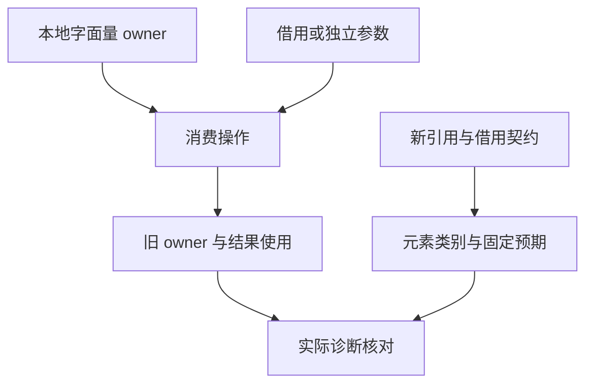
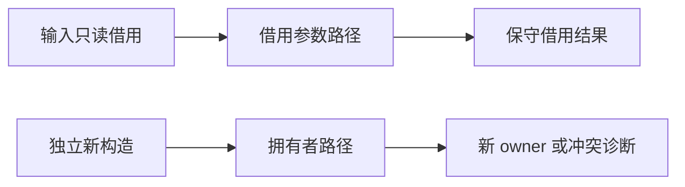

# 所有权矩阵移除深拷贝前置

## Intent：最终目标

恢复 404 个所有权分析案例的原测试目的：借用不可消费、消费使旧 owner 失效、自引用参数冲突，以及输出引用的保守传播。仅移除 clone 前置条件，不把这些案例改成 clone 拒绝。

## Data：可用证据

当前 propagation 156 条、consumption 248 条，其中 330 条先调用 clone。旧生成器将普通对象视为非资源，新设计明确将对象、元组和字符串作为引用值，因此旧 nested 布尔分类不再适用。依据为《不可变绑定与唯一所有权实施》的聚合引用和只读借用契约；当前分析器对混合 borrowed 元素结果采取整个值的保守借用状态。

## Edges：边界与限制

- 以本地非空字面量列表建立独占 owner；标量、字符串、对象和嵌套列表分别使用自身类型的独立字面量，不复制输入聚合。
- 原 cloned 标签改为 constructed_owner，避免案例名称继续声称支持 clone；旧档案保留在 drafts。
- 只读输入仍来自 in，不能通过构造新外层容器取得其内部引用的独占修改权。
- 构造的独立参数、空参数和借用参数仍分别覆盖。旧 owner 与 self_argument 继续预期 ownership，不改为任意错误。
- 对包含借用引用的结果，本轮检验现有保守拒绝边界，不宣称已证明细粒度分离借用或外层引用槽重排能力。
- 这些是分析案例；不以通过推断所有动态索引都不越界，也不替代独立执行与指针身份验证。

## Answer：交付格式与成功标准

保持 156+248 个不同结构场景，逐类固定 analyze/ownership 或成功预期，运行 ownership 名称过滤专项与完整前端目录。确保生成一致性、无 clone 成功前置、目录审计与类型检查通过。

## 执行与自我批判

迁移后仍为 404 条；126 个 cloned ID 改为 constructed_owner，字符串和普通对象的 8 个借用传播预期按引用类别调整，其余诊断分类保持。ownership 过滤专项含 clone 禁止案例共 412/412 通过，完整前端 5/5 步骤、2,944/2,944 通过。日志 `/tmp/zxc-test262-ownership-migration.log`、`/tmp/zxc-test262-ownership-frontend-final.log`。

新增 test-ownership-contracts 三组 Zig 测试并纳入默认 test：新建返回可继续消费，借用返回及混合分支拒绝消费；第三方 IR 将借用结果伪造为 owned 被拒绝；返回只读视图后不可消费其源 owner。4/4 步骤、3/3 测试通过，日志 `/tmp/zxc-test262-ownership-returns-final.log`。TypeScript、生成一致性、审计、格式与 diff 检查通过。无生产代码修改。

自我批判：保守拒绝应明确记录其精度限制，不能因为更容易通过就把原合法场景普遍改为拒绝；本轮仅对新契约明确列为引用的字符串与普通对象重新分类。
