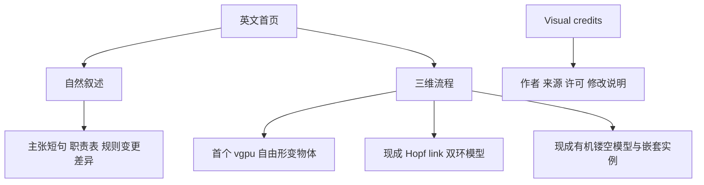
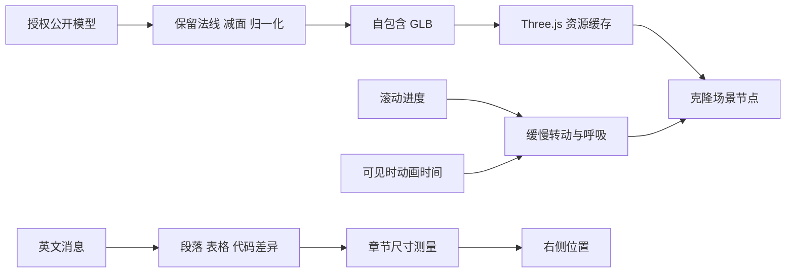

# 末端结构、连接模型与首页内容节奏

## Intent：最终目标

首页右侧依次表达自由形变、受约束的关联、依赖方向、数据流动与嵌套组织。第二个元素需要两个明确关联、形状较规整的部分；末端采用抽象有机结构，保留“结构中还有结构”的层次。所有标注为一行。

首页内容参考 code.storage 的阅读节奏，在自然叙述中穿插规格、代码与短句，补充有价值的信息，缓解右侧较高造成的页尾留白。

## Data：可用证据

- 用户两次以截图指出自行拼接的基础几何体缺乏美感，明确要求寻找现成资源。
- 用户选择“抽象有机结构，保留嵌套层次”，因此不采用真实生物细胞剖面模型。
- [Code Storage](https://code.storage/) 在介绍、规格、工作原理与代码之间切换。仅参考内容组织，不复制其客户、商业数据或可靠性承诺。
- ZX 编译、RX 结构校验与宿主执行的当前边界，已由仓库实现核对。

## Edges：边界与限制

只调整英文首页、第二与第五个三维元素及其标注。保留 Three.js、React Three Fiber、vgpu 与淡金色方向。新模型直接加载 GLB；原有首个物体的 vgpu 变形继续保留。

不新增测试用例，不打开本地浏览器做 UI 确认。使用离线原生 WebGPU 渲染检查资源，不把它等同于浏览器中的最终页面验收。模型表达软件组合的隐喻，不宣称是生物模型或数学上的无限分形。

## Answer：交付格式与成功标准

源码位于 `packages/website`。审阅副本位于 `docs/2026-10-03/末端细胞与首页叙事/`。资源处理脚本与渲染图位于 `docs/2026-10-03/官网三维资源/`。

### 资源与处理

| 用途         | 原始资源                            | 来源与许可                                                                                                                                                   | 处理                                                                         |
| ------------ | ----------------------------------- | ------------------------------------------------------------------------------------------------------------------------------------------------------------ | ---------------------------------------------------------------------------- |
| RX / ZX 关联 | Hopf-Verschlingung 20230214 001.stl | PantheraLeo1359531，[Wikimedia Commons](https://commons.wikimedia.org/wiki/File:Hopf-Verschlingung_20230214_001.stl)，CC0 1.0                                | STL 转 GLB、平滑法线、缩放、减面、淡金材质                                   |
| 末端嵌套组织 | Parametric Voronoi Sphere           | sc8di，[Sketchfab](https://sketchfab.com/3d-models/parametric-voronoi-sphere-7dd14e614d2946fcaaa101acd7b90ee1)，CC BY 4.0；文件来自 Ai2 Objaverse 的公开分发 | 保留作者形体与原始法线、减面、淡金材质、内部增加两个缩小且比例不同的同源结构 |

球体资源许可经 Sketchfab 公开模型接口核对为 CC BY 4.0。镜像位置为 `glbs/000-142/7dd14e614d2946fcaaa101acd7b90ee1.glb`。页面提供 Visual credits 链接，注明原作者、资源地址、许可与修改。

资源处理保留平滑法线，并把法线作为减面约束。球体的基础网格约 12.5 万三角形，嵌套实例共享几何体，GLB 约 2.25 MB；双环约 8 万三角形，GLB 约 1.44 MB。保留原型关系，不重新用球、盒、管拼一个同义模型。

### 架构

### 数据流

### 首页内容

介绍与动机继续使用短段落。动机之后以一句独立主张形成停顿。工作原理之后用职责表说明 ZX、RX、宿主和人工判断分别负责什么。维护场景配一小段折扣规则变更 diff，并明确它是函数体片段及输入前提。About 保持合并章节，补充具体反馈邀请与资源署名入口。

五个三维标注删除副标题并限制单行。右侧尾部预留从 100px 减为 32px，容纳 24px 标注和剩余间距。末段叙事位于最后一个物体锚点之后，避免加文字的同时把物体继续推低。

### 验证

资源已完成离线原生 WebGPU 编译和渲染检查，查看了实际模型而非只依赖资源缩略图。类型检查与生产构建通过。HTTP 检查确认首页与文档返回 200，新模型与署名资源返回 200，职责表、独立主张、规则变更代码差异均已输出，五个标注只保留单行标题。

### 自我批判

此前把概念直接翻译为规则排列的小球与金属按钮，满足了名词关系，却没有满足用户对美感和造型质量的要求。最终改为保留现成作者模型，只做适配与嵌套。视觉隐喻仍然需要用户在页面中判断；离线资源图不能证明不同浏览器、窗口高度下的整体布局都达到预期。
