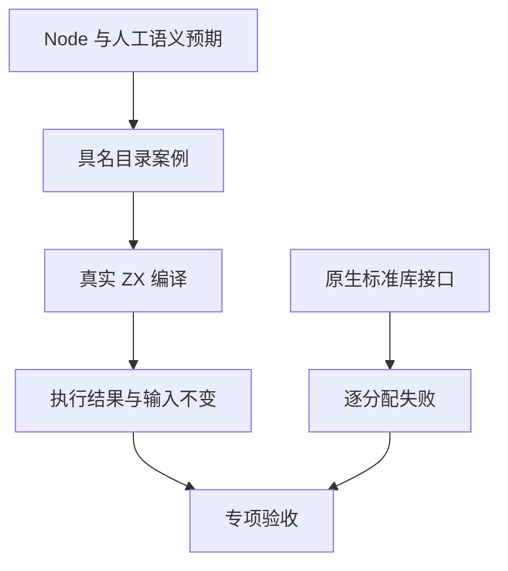
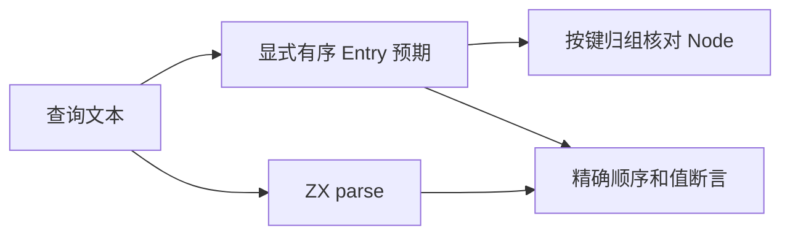

# 查询字符串独立测试与资源验证

## Intent：最终目标

为新增 std:querystring 六个入口补充独立可定位的语义案例、真实 ZX 执行和逐分配失败验证，按 Test262 粒度记录边界，不以运行数量代替规则。

## Data：可用证据

正式接口为 escape、unescape、parse、parseWith、stringify、stringifyWith。源码位于 compiler/standard/src/querystring，当前没有对应自动测试。参考 [Node 官方查询字符串文档](https://nodejs.org/api/querystring.html)，编码与容错解码以本机 node:querystring 为独立对照；解析的有序 Entry 由明确的人工输入和预期确定，再按键归组与 Node 核对。

## Edges：边界与限制

- ZX 使用有序重复 Entry，Node 使用按键聚合对象；不能用 Node 对象枚举顺序冒充输入顺序，尤其数字键和交错重复键。
- 不测试 JavaScript 隐式类型转换或自定义回调，不将其当成 ZX 的遗漏。
- UTF-8 编码测试包含 ASCII 字节、Unicode 边界；解码覆盖全部百分号单字节、非法转义、截断和不合法多字节序列。
- 解析单独覆盖空项、重复键、原型名称、分隔符优先级、多个等号、加号和百分号，以及 999/1000/1001 默认上限和显式零上限。
- 格式化保持 Entry 顺序，使用独立 encodeURIComponent 对每项计算预期，不采用 parse 后 stringify 往返作为唯一依据。
- 资源测试直接使用 testing allocator，释放返回字符串和 Entry/列表，逐分配失败必须传播 OutOfMemory；非法 UTF-8 输入的拒绝单独具名。
- Node 的参考值不是 ZX 执行证据；JSONL 必须通过真实 CLI 生成并执行 Zig。

## Answer：交付与成功标准

新增按用途分层 JSONL/ZX、生成器及资源测试，注册到默认回归。生成一致性、类型检查、目录审计、专项运行与逐分配失败全部通过后记录数量。原上游审查计数不变，Node querystring 不属于 Test262 上游文件。

## 执行与自我批判

专项已通过：36/36 步骤、555/555 测试，其中 querystring 540 条运行案例、九个新资源测试，以及六个既有标准库资源测试。日志 `/tmp/zxc-test262-querystring-final.log`。参数循环只用于覆盖有意义的边界，失败保留稳定 ID。直接原生资源测试不能代替共享 ABI 的端到端验证；两者都要执行。

## 原始 Unicode 与非法百分号混合的接口差异

实际 Node 对照中，unescape("中%FF文") 返回 "-��"，unescape("🌱%E2%82") 返回 "<1�"，unescape("%G1中") 返回 "%G1-"。其失败回退对原始 UTF-16 码元的处理不符合 ZX 既有 UTF-8 字节字符串契约。

三个案例明确使用人工预期 "中�文"、"🌱�"、"%G1中"，不调用 Node 计算这三个预期。保留原始合法 Unicode、只替换无效解码字节，不为模拟另一接口的截断行为修改生产实现。因而不宣称 querystring 与 Node 在所有混合非法输入上字节一致。

## 验证结果与计数

| 入口          | 具名运行案例 |
| ------------- | -----------: |
| escape        |          142 |
| unescape      |          292 |
| parse         |           23 |
| parseWith     |           35 |
| stringify     |            8 |
| stringifyWith |           40 |

真实 Node 参考运行版本为 v25.8.1，所阅读官方文档与源码为 v26.10.0。混合非法 Unicode 差异也可从 [官方回退源码](https://raw.githubusercontent.com/nodejs/node/v26.10.0/lib/querystring.js) 的码元写入字节缓冲路径解释；不假设不同版本的全部行为一致。

TypeScript、生成一致性与矩阵审计通过。目录为 52,519：runtime 38,429、frontend 2,944、safety 464、RX 10,446、Store 236；上游审查仍 220，关联仍 606。资源遍历次数不计入目录数。

首次资源测试编译暴露测试 helper 使用 comptime 参数与分配失败工具参数反射不兼容；改为普通 enum 参数后全部通过。这是测试驱动问题，没有修改标准库生产逻辑。目录名采用 snake_case，接口调用保持公开 camelCase 名称。

根级最终回归：868/868 步骤、52,493/52,493 条 Zig 测试通过，日志 `/tmp/zxc-test262-querystring-root.log`。本次新增 540 条运行案例和九个资源测试，与上一轮根 Zig 计数差值一致。格式和 diff 检查通过，无生产逻辑修改。

自我批判：六个入口都已有真实执行与资源失败证据，但不代表组合输入空间穷尽；三类人工差异预期明确区别于 Node oracle。解析与格式化使用独立预期而非仅作往返验证，现有通用驱动也检查可写输入副本保持不变。压缩、RX 新装载链路及其他全特性缺口仍需继续。
