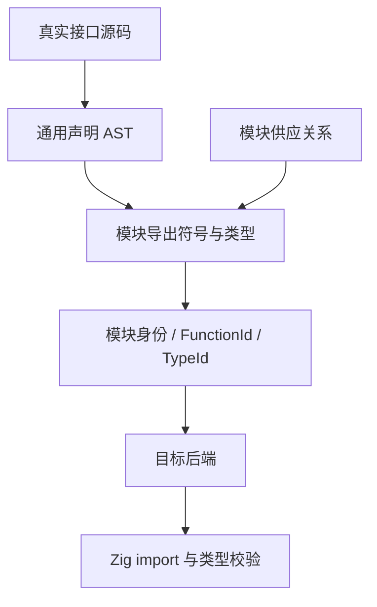

# 标准库导入去硬编码审计

## Intent：最终目标

落实用户本轮明确要求：不得以编译器内按标准库函数名编写的签名表或分支绕过模块与类型系统。标准库必须以真实模块声明进入解析、符号与类型分析、IR，再由目标后端生成导入与调用。

## Data：改造前的源码证据

- `packages/compiler/src/standard/registry.zig` 手工列出标准库成员名、Input/Output 字符串、分配器和错误标记，并拼接实现成员路径；这不是从模块声明获得的接口。
- `modules/project.zig` 的 importExternal 针对 std: 改选该固定表，形成编译器内置的特殊接口来源。
- `modules/external.zig` 将该表提供的签名再作为类型源码解析，得到 IR Function.external。
- `backends/zig/external.zig` 已经通过 genz import、field、call 节点生成 @import 与调用，没有按 sha256 等方法名分支。
- 因此问题主要是前端接口权威来源与模块身份，而不是现有所有原生调用完全未经过 IR；不得以错误诊断为理由无关重写后端。
- ZX string 与 u8[] 目前都降低为 Zig []const u8。单纯反射原生 Zig 类型不能恢复语言中的二者区别，不能用函数名特判补洞。
- 当前普通 ZX 实现文件坚持一个匿名 default 函数，命名导出仅类型与枚举。增加多成员声明文件会新增公共语法，需明确该边界。

## Edges：边界与限制

- 不通过移动 registry、把它改成 JSON、生成同一张手写表或按函数名反射特判冒充修复。
- 标准库实现本身使用算法常量与语言内建运算的通用分派，并不等于绕过编译器；审计目标是与真实声明脱节的特殊接口来源及生成路径。
- 项目原生模块需使用同一解析机制。项目提供的链接入口仍属于构建供应关系，不得把接口声明当作纯度证明或未授权 effect 的通行证。
- compileProject 保持无 I/O；CLI 或打包资源提供源码，编译核心只处理传入的声明和模块绑定。
- 原生 ABI 一致性由静态代码和 Zig 类型检查保障，不能保留反射转换作为隐式兜底；声明正确不等于实现获形式化证明。
- 原生库搬迁已完成实际执行，详见《原生库依赖打包实施》；搬迁证据不替代接口来源审计。
- 以下初始方案保留决策背景，当前实现状态见末尾；用户已明确禁止反射推导。

## Answer：拟议改造与成功标准

推荐随模块发布独立 ZX 声明源码，例如拟议的 `.d.zx`：

```ts
export type Authentication = {
  key: u8[];
  data: u8[];
};

export declare function sha256(in: u8[]): u8[];

export declare function hmacSha256(in: Authentication): u8[];
```

上述初始草案已由下文带 allocator/throws 的真实声明语法取代。声明不能包含函数体；普通 ZX 实现文件不因此变成多函数模块。

1. 通用声明解析器产生具名声明 AST，复用类型 AST、命名检查和类型解析器。
2. 模块配置只建立 specifier、接口源码和原生模块入口之间的关系，不列成员、签名或方法白名单。
3. IR 保留模块来源与成员导出关系，调用使用解析后的 FunctionId 与 TypeId。
4. 后端通用生成 import 和成员调用；对于 allocator、错误联合与参数形状，采用明确的通用 ABI 适配，不能按方法名配置行为。
5. 标准库源文件作为构建资源发现/打包，编译器不能再拥有手写函数签名清单。无 I/O 使用方可以提供同类型的用户模块声明。
6. 删除 compiler/src/standard/registry.zig 以及 Project 对标准库固定表的特殊选择。

验收：新增、删除或改变一个标准库声明，只涉及模块声明和实现；同样机制能用于用户 Zig 模块；编译器源码没有新增该成员名。必须能观察到真实接口类型检查、IR 模块绑定及后端 import。执行现有回归和实际应用，不新增针对性测试用例。




## 已解决的来源决定

用户已明确禁止反射，因此采用 ZX 声明源码。构建供应清单不携带成员签名；声明文件由真实解析器读取，而不是生成固定成员表。

## 自我批判

此前扩展密码学功能时沿用了已有注册表，使更多成员依赖同一手写通道。即使运行结果与 Node 一致、回归通过，也只能证明那些已注册路径的行为，不能证明模块机制符合用户要求。需要修正接口来源，不能用测试数量为当前架构辩护。

## 不依赖声明语法选择的 IR 改造

先实施两种类型来源方案都需要的模块身份建模：IR 实验版本升级为 4，Program 保存 native_modules，原生函数以 NativeModuleId 和成员路径数组引用模块；项目配置的旧字符串绑定只在前端边界转换。后端从模块表生成一次导入并复用模块符号，不再从每个函数中拆解模块字符串。

该步骤不删除签名注册表，也不宣称消除了前端硬编码；它为随后接入真实声明建立共同的 IR 边界。旧项目 externals JSON 形状保留，旧版本原始 IR 明确拒绝，避免两个含义不同的 External 混用同一版本。

### IR 改造的当前代码结果

- 已实现 NativeModuleId、Program.native_modules 与 External 的结构化成员路径。
- 旧 project.Options.externals 配置使用独立 Implementation 类型，在模块解析阶段转换为 IR 模块编号；不再把配置结构直接作为 IR External。
- IR 校验检查原生协议、模块身份重复、编号范围和成员路径。后端从生成节点中读取已有导入，再按 import_name 去重，不另建标准库方法或模块别名白名单。
- 真实生成的 native_math 示例包含 calibration 与 native_math 的各一次 @import；原生 app 实际输入 factor=1.5、value=81 返回 root=9、scaled=121.5。
- 这些结果证明导入和调用可以使用新的通用 IR 结构，不证明标准库声明来源已修正；registry 的删除仍属于下一阶段。

### 当前验证结果

IR v4 与当前库打包代码共同执行最终完整回归：`ZXC_TEST_SOLVER="$PWD/.zxc/tools/verification/bin/z3" zig build test --summary all`，611/611 步骤、52100/52100 测试通过，退出码 0。日志 `/tmp/zxc-native-ir-final-regression.log`。第一次执行的运行测试虽通过，但目录登记审计失败，未计为整条回归成功；同一审计重新通过后才补跑得到最终结果。没有修改审计规则或新增测试用例以放行。

独立只读复核未发现 ModuleId 归属、跨函数传播、成员路径生成或导入去重错误。验证仍不证明原生成员存在或 ABI 一致；这些需要实际 Zig 编译。此次原生应用真实编译与执行通过。格式与 diff 空白检查通过。

## 用户已明确的约束：不使用反射

用户后续明确“不要用反射，编译器能实现的就用编译器实现”。据此采用真实 ZX 声明源码作为类型权威，不再等待反射推导方案的选择。

声明文件将允许 export declare function 与已有类型/枚举声明。原生分配器和错误返回属于 ABI，需要在声明中显式表达，不能通过函数名表或反射猜测。例如 `export declare function sha256(allocator, in: u8[]): u8[] throws;`；调用者仍只传业务参数。allocator 是原生首参数声明，throws 是原生错误返回声明。普通 ZX 实现文件仍保持单个匿名默认函数。

模块供应清单只绑定 specifier、真实声明文件与原生模块/命名空间；不保存成员列表或类型签名。标准库和项目原生声明经过同一个解析、命名、类型与 IR 建模过程。现有 nativeArgument/nativeResult 反射适配也必须转为编译器生成的具体转换，完成前不能宣称整个原生链路符合不反射要求。

## 当前实现：声明源码与静态转换

标准库真实接口位于 `packages/compiler/standard/interfaces/*.d.zx`，模块清单只保存 specifier/path/module/namespace。通用声明解析器复用类型 AST 和类型分析，模块导出同时包含类型、枚举和可调用成员；project.native_interfaces 与内置标准模块走同一路径。旧 standard/registry.zig 和 runtime/native.zig 已删除，runtime 不再导出 nativeArgument/nativeResult。

后端根据 IR 生成对象字段、枚举 switch、optional 分支和必要的数组转换，原生调用结果只求值一次。原生参数 IR 另外保留声明类型名及子结构，不会把两个同形对象错误映射到第一个原生类型。ZX 结构类型系统没有为此改成名义类型系统。原生聚合数组的元素需有明确的命名类型；匿名聚合元素在声明分析时拒绝，避免把未转换切片交给后端碰运气。

已执行的真实应用：密码学派生/校验、POSIX 与 Windows 路径计算、Zig scale 与 C sqrt、命名对象数组和 optional enum。原生声明示例中 Item 与 Snapshot 字段完全相同，但对应不同 Zig 类型；Scale/Keep/null 三种输入均实际执行成功。`lib` 导出同时复制声明源码并重写配置路径。独立 Zig build 消费者传递 target/optimize 的模板问题已修复，ReleaseSafe 构建实际通过。

对象数组转换需要分配与复制，不能声称所有原生调用均零复制。类型布局不同就必须转换；编译器生成静态代码消除了反射 helper，但并不消除表示差异的成本。标准库声明被正确读取也不证明 native 实现纯度或形式化正确性。

### 后续决定：取消动态插件

用户随后明确要求 zero runtime，并选择取消动态加载、所有模块静态链接。因此插件桥、SDK 和加载器已删除，不继续完成动态 codec 分支。标准算法作为独立静态源码模块接入，普通语言操作由编译器生成。新的深拷贝禁令还要求移除本轮聚合数组适配；该变化属于新的引用与所有权契约改造，不能沿用本轮转换成功作为最终验收。
