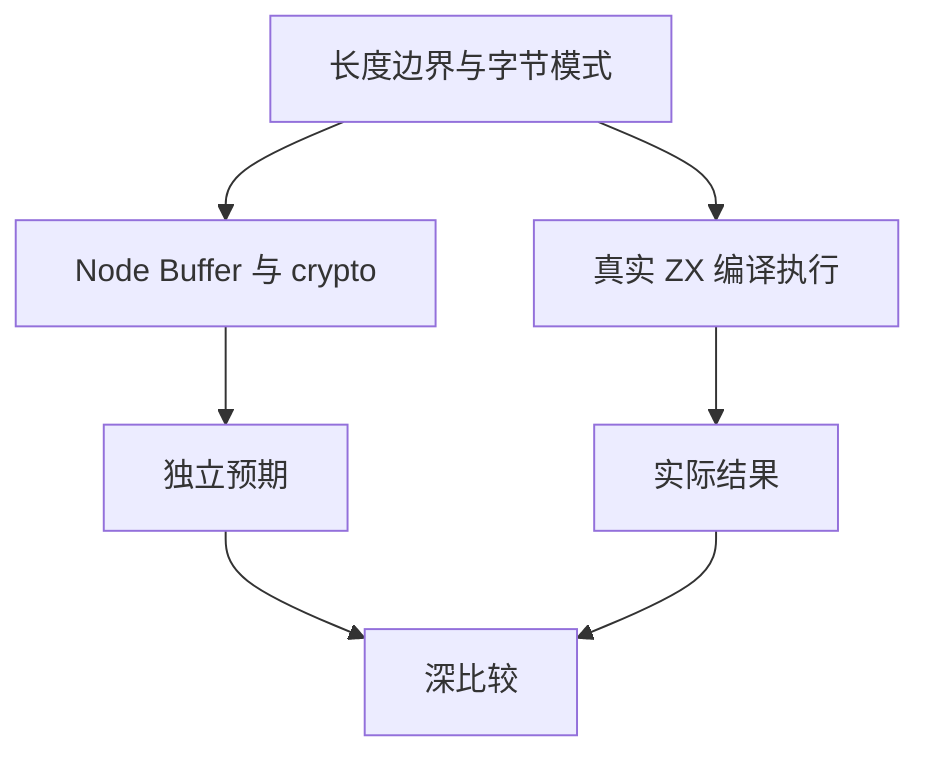

# 标准库编码与哈希测试记录

## Intent：最终目标

验证并行实现的 std:encoding 与 std:crypto 公开命名空间，经真实 ZX 导入、编译、生成代码执行后得到正确输出。

## Data：可用证据

标准库注册表已声明 Base64、Hex、UTF-8 双向转换与 SHA-256/SHA-512。底层实现使用 Zig 标准库。本轮使用 Node Buffer 与 crypto 独立产生预期，避免直接调用被测 Zig 实现作为 oracle。

## Edges：边界与限制

这是 zxc 自有标准库扩展，不增加 Test262 上游映射。编码和哈希基础路径不能证明密码系统或生产安全；本轮不覆盖尚未实现的 I/O。解码错误与资源失败需独立测试，不从正常往返推断。

## Answer：交付与成功标准

分层保存标准库编码、哈希组合场景，所有预期经真实 ZX 执行断言。生成器进入一致性审计，套件进入根构建。草案位于 `docs/2026-10-03/standard_tests/`。

## 执行记录与自我批判

已生成并登记 324 个案例，全部经真实 ZX 命名空间导入并执行通过。Debug runtime 266/266 步骤、21,026/21,026 测试通过，其中新增标准库 324/324。TypeScript 严格检查通过。根 ReleaseSafe 382/382 步骤、35,027/35,027 Zig 测试通过，11 个 RX CLI 场景及隔离安全执行步骤通过。新增标准库 324/324 通过，日志 `/tmp/zxc-test262-standard-root.log`。普通输入目录和上游语义映射分别统计；后续补充解码负例及分配失败。

## 输入覆盖

字节长度为 0/1/2/3/4/55/56/63/64/65/111/112/127/128/129/255/256/257/1024；零值、255 和递增字节三种模式，重复输入去重。组合六类文本：空、ASCII、控制字符、中文与非 BMP、组合音标、Unicode 最大标量。Base64/Hex 编码与 SHA 输出均与 Node 独立结果对照，解码与 UTF-8 结果深比较。
