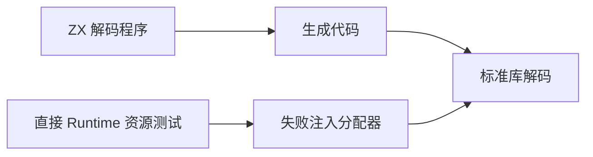
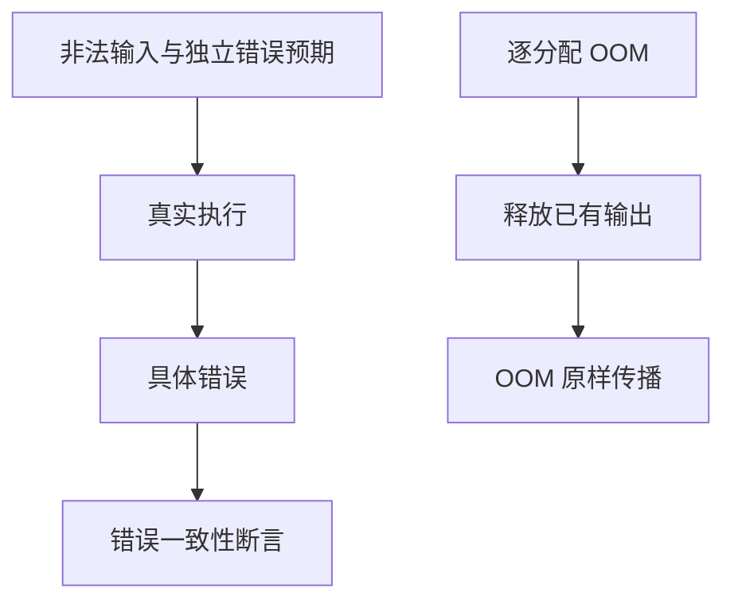

# 标准库解码错误与资源测试记录

## Intent：最终目标

验证标准库解码失败能够跨 ZX 生成代码传播，并验证底层直接分配的失败清理与 OOM 传播。

## Data：可用证据

已有 324 个标准库正常输入案例。Base64 公开实现使用 Zig standard Decoder；Hex 对奇数长度返回 InvalidHex，对非法数字返回 InvalidCharacter；UTF-8 明确拒绝非法序列。直接分配测试与 Arena 执行测试承担不同职责。

## Edges：边界与限制

Node Buffer 解码对非法输入较宽松，不能作为这些错误契约的 oracle。错误预期根据格式约束与公开 Zig 接口契约单独列出。直接资源测试不等于生成代码端到端测试，两层分别运行。哈希正确性复用此前独立 Node 结果，资源测试只检查成功长度与释放。

## Answer：交付与成功标准

`tests/standard/resources` 保存逐分配失败测试；解码负例用真实 ZX 源码及登记目录执行。成功分配必须释放；OOM 必须向检查器传播，不把 OOM 当作预期语法错误吞掉。草案保存于 `docs/2026-10-03/standard_failures/`。

## 执行记录与自我批判

38 个真实 ZX 目录案例（26 个负例、12 个正常对照）通过 Debug；普通执行组 270/270 步骤、21,064/21,064 通过。4 个直接 Runtime 资源测试通过 Debug。TypeScript 严格检查、目录生成一致性、审计通过。根 ReleaseSafe 390/390 构建步骤、35,069/35,069 Zig 测试通过，11 个 RX CLI 场景与隔离安全执行步骤通过。日志 `/tmp/zxc-test262-standard-errors-root.log`。不能将循环中的失败注入次数另算成独立目录案例。
