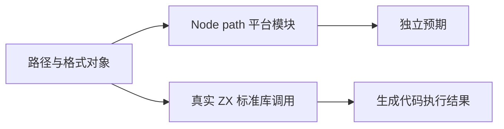
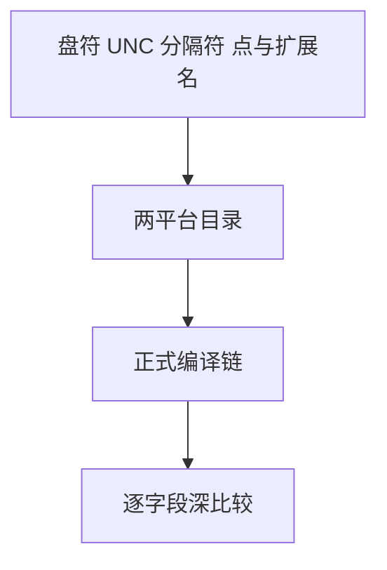

# 标准库路径接口对齐测试

## Intent：最终目标

为并行新增的 POSIX/Windows 路径标准库提供真实 ZX 执行对照，及时暴露与既定 Node 行为的差异。

## Data：可用证据

当前注册表包含 isAbsolute、basename、dirname、extname、parse、format、normalize、join。使用本机 Node 的 path.posix/path.win32 生成独立预期，不调用被测 Zig 实现。

## Edges：边界与限制

显式 POSIX/Windows 模块不依赖当前操作系统选择。路径是字符串运算，不访问这些路径对应的文件。resolve/relative 尚在并行实现，本轮不伪造其完成。

## Answer：交付与成功标准

真实 ZX 通过 std:path/posix 与 std:path/win32 调用，逐字段比较标量、结构和拼接结果。目录按平台分层；草案位于 `docs/2026-10-03/path_tests/`。

## 执行记录与自我批判

88 个目录案例已通过 Debug，runtime 374/374 步骤、32,054/32,054 测试通过，TypeScript 检查通过。最终根 ReleaseSafe 519/519 构建步骤、46,073/46,073 根 Zig 测试通过；20 个验证 CLI、11 个 RX CLI、app/lib 消费链路及隔离安全执行步骤通过。日志 `/tmp/zxc-test262-path-root.log`。有限路径集合不能证明完整路径兼容；Node 当前行为以实际 oracle 结果为证据。

## 后续增补

resolve/relative 已在阶段 39 通过真实 ZX 验证，并修复 Unicode 大小写比较；见《路径解析与Unicode比较测试》。本文件前文保留阶段 38 当时边界。
