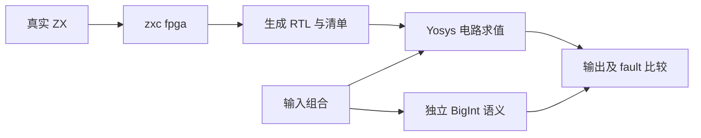
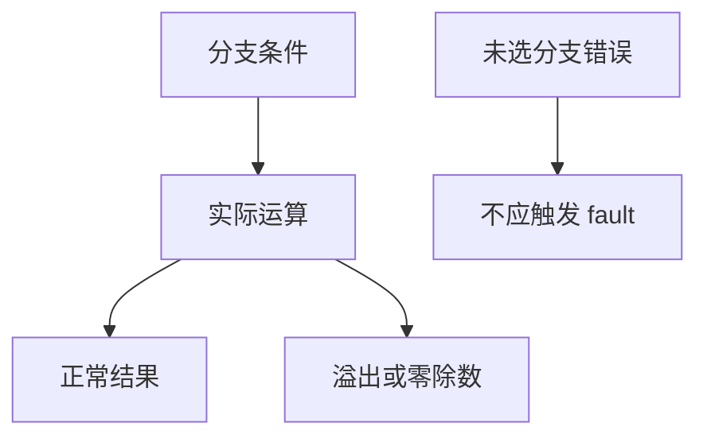

# 硬件 RTL 独立行为对照

## Intent：最终目标

用真实电路求值检查 ZX 到硬件转换的行为，补足上一阶段只有图校验与资源检查的证据缺口。

## Data：可用证据

当前 zxc fpga 命令输出 SystemVerilog 与端口清单；项目内安装了 YoWASP Yosys。已通过真实工具的 help eval 和已有 add.sv 探针确认输出格式，再构建独立 Node BigInt 预期。

## Edges：边界与限制

独立工具入口 test-hardware-evaluation 要求显式 ZXC_TEST_YOSYS，未加入无 Yosys 环境的默认根测试，不静默跳过。它验证组合电路所选输入；时钟握手、形式等价、器件技术映射和板级时序仍未覆盖。fault=1 时不检查无效业务输出，但必须精确检查 fault 位。

## Answer：交付与成功标准

两个真实 ZX 程序分别覆盖受分支控制的 u8 加法，以及 i32 除法/余数。各 72 个输入组合，使用独立整数计算预期。CLI 生成 RTL 后，Yosys read_verilog/prep/check/eval 实际求值；必须获得每个输入的完整输出和 fault 记录，不以进程退出码单独认定成功。





## 执行与自我复核

两个真实生成的 RTL 均已通过：conditional_add 72 个组合，signed_division_remainder 72 个组合，共 144 个独立输入/fault 对照。含 u8 溢出、未选分支溢出屏蔽、i32 正负边界、零除数、最小整数 / -1 的 fault 与最小整数 % -1 的正常零结果。

第一次运行中 unsigned 72 组通过；signed 日志收集只识别带位宽二进制文本，漏掉 Yosys 对部分 32 位数使用的十进制输出，导致完整记录数量检查失败。已扩展测试解析器同时处理两种工具输出，并保持所有有效输出不得含 x/z 的要求。修正后专项 3/3 步骤成功，144 组全部通过，日志 `/tmp/zxc-test262-hardware-evaluation-final.log`。一次中间重编译遇到并行原生打包实现的 relative 调用参数变更；确认源文件已由实现线程改为当前 Zig 五参数签名后才重跑，未在本任务修改该文件。

TypeScript、Zig 格式与 diff 空白检查通过。默认根 ReleaseSafe 561/561 步骤、51,144/51,144 根 Zig 测试通过，退出码 0；日志 `/tmp/zxc-test262-hardware-evaluation-root.log`。独立 Yosys 专项通过与默认根回归通过是两条分别执行的证据。测试分组不会新增 JSONL 登记数，也不增加 Test262 审查数。

自我批判：Yosys eval 是实际 RTL 组合逻辑求值，能够提供独立于编译器符号模型的结果证据，但 144 个输入仍是有限边界集合，不是全部输入形式证明。没有进行 clocked 包装握手仿真，也未完成目标 FPGA 的布局布线与时序。本测试严格区分 fault 与业务数据，错误输入的任意数据值不作为成功或失败依据。

可复现命令（仓库根目录）：

```sh
ZXC_TEST_YOSYS="$PWD/.zxc/tools/fpga/bin/yowasp-yosys" \
  zig build test-hardware-evaluation --build-file packages/test/build.zig --summary all
```
