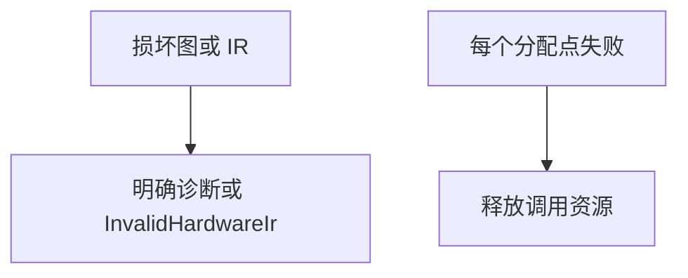

# 硬件后端图校验与资源测试

## Intent：最终目标

为新增硬件后端建立基础可信边界：合法 ZX 生成结构有效的硬件图，不支持的类型和损坏 IR 明确拒绝，失败分配不泄漏资源。

## Data：可用证据

公开 compiler.hardware.generate 返回带 arena 的 module 或诊断；hardware.validate 检查位宽、拓扑和端口；compiler.verilog.emit 在生成文本前校验图，支持组合与时钟包装两种形式。

## Edges：边界与限制

本阶段先验证图边界和资源生命周期。生成 Verilog 文本不等于通过仿真或综合，不能据此证明电路和 ZX 行为等价。硬件后端仍由并行线程实现，不根据未稳定的 CLI 选项编写猜测测试。

## Answer：交付与成功标准

新增 tests/hardware 的资源与图校验测试，接入独立 test-hardware-resources 和根测试。所有负例必须明确拒绝；对成功生成和不支持类型的分配点逐个注入失败，确保清理。

## 执行与自我复核

新增 5 个 Zig 测试：成功生成与两种 RTL emitter 的分配失败遍历、不支持 f64 输入的诊断与清理、损坏前端 IR 的 contract 拒绝、合法图接受，以及 18 种损坏图拒绝。

图负例包括零/过大位宽、错误 bool 位宽、常量溢出、自引用/越界子节点、运算类型和结果类型不符、输入索引与端口名称/节点不符、非布尔或越界 safe、signed bool、非布尔 select 条件与错误扩展宽度。每个损坏图还分别经过组合和时钟 RTL emitter，均返回 InvalidHardwareIr。

首次专项 4/5 通过；失败是测试工具与内存 writer 的错误表示不同：std.Io.Writer.Allocating 的 drain 在扩容失败时返回 WriteFailed，而 checkAllAllocationFailures 只继续遍历 OutOfMemory。测试仅在这个已知内存 writer 调用边界把 WriteFailed 归一为 OutOfMemory；未修改生产错误接口，也未把失败吞掉。该 writer 不涉及文件/设备 I/O，定位证据见 `/tmp/zxc-test262-hardware-resources.log`。

适配后专项 Debug 5/5 步骤、5/5 测试通过，完整遍历所有实际分配点，日志 `/tmp/zxc-test262-hardware-resources-final.log`。最终根 ReleaseSafe 561/561 步骤、51,144/51,144 根 Zig 测试通过，额外插件测试及 CLI/隔离执行步骤通过；退出码 0。日志 `/tmp/zxc-test262-hardware-resources-root.log`。Zig 格式与 diff 空白检查通过。无生产代码修改，JSONL 目录和 Test262 上游审查数不变。

自我批判：合法图的节点、端口数量以及 emitter 非空文本检查只验证基本结构与资源路径，不能证明输出电路计算正确。18 种损坏形式不是对所有畸形图的穷举。并行实现已有真实 YoWASP Yosys 综合记录；本阶段未把该记录当作独立语义回归，后续仍需独立 RTL 输入/输出对照。
