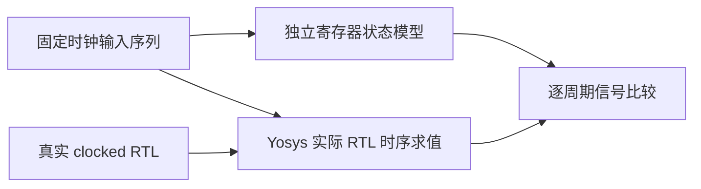
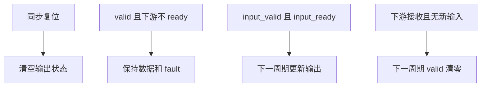

# 硬件时钟握手独立对照

## Intent：最终目标

验证真实 RTL 单级输出寄存器的同步复位、ready/valid 背压、同时消费与接收，以及 fault 随数据保持的行为。

## Data：可用证据

公开 FPGA 清单声明同步高有效复位与单级输出寄存器。已有组合 RTL 对照不覆盖寄存器状态。本轮使用 Yosys sat -seq 的实际时序电路模型，输入固定序列由 Node 独立状态模型计算预期。

## Edges：边界与限制

SAT 求取固定输入序列下的时序值，不声称对任意输入的归纳证明。初始寄存器显式设为非零，使复位检查有实际区分能力。fault 或 output_valid 无效时不把输出数据当作业务结果，但仍验证接口承诺的保持与复位状态。

## Answer：交付与成功标准

扩展 test-hardware-evaluation，增加真实 --clocked RTL。每个时刻的 input_ready、output_valid、fault 以及有效无错误时的业务输出与独立状态模型比较；必须取得完整的 SAT 模型行，不仅检查工具退出码。

## 执行与自我复核

14 个时刻完整取得 56 条信号记录；逐时刻检查 ready、valid、fault，并对有效无错误数据核对数值。覆盖初始非零状态后的同步复位、连续背压、同时消费并接收、无新输入时排空、错误结果保持、背压期间复位，以及连续无错误/溢出输入。

自我复核发现最初模型对 fault=1 的数据指定了加法回绕值，超出了公开接口的有效数据约束。最终仅在 valid=1 且 fault=0 时核对业务数值；背压时独立比较相邻实际输出是否保持，不把无效数据值固化为契约。信号记录必须周期范围正确、无重复且总数完整，未知值不被悄悄转换。

最终专项 3/3 步骤通过，同时回归前一阶段 144 个组合电路输入。日志 `/tmp/zxc-test262-hardware-clocked-final.log`。TypeScript 与 diff 空白检查通过。本轮修改仅涉及外部工具测试及文档，按相关范围验证，未重复运行默认根测试；最近一次根回归仍见阶段 46。

本测试不验证任意输入的归纳性质、器件时钟、电气特性或板级时序。14 个时刻不是 14 个独立 Test262 用例，不增加 JSONL 或上游审查数。
