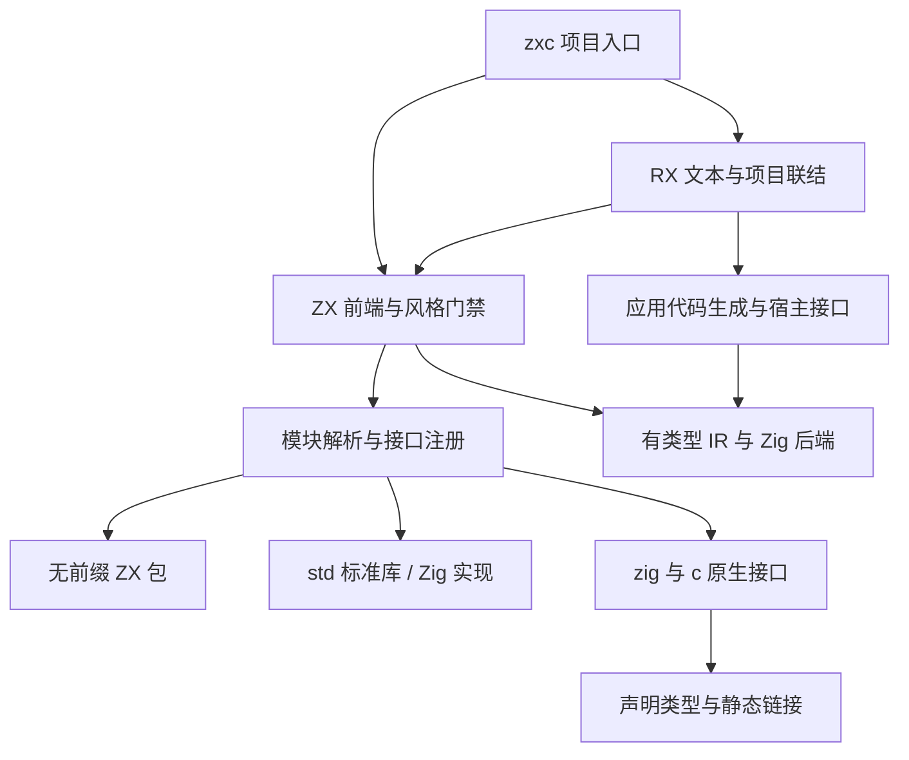

# 系统完整实现计划

## Intent：最终目标

将 RX 配置、ZX 编译、模块导入与 Zig 实现的静态标准库连接成可使用的系统。用户后续明确取消动态插件与懒加载，要求产物不依赖 zxc runtime，并禁止深拷贝；聚合值按引用、标量交给 Zig，采用单一可变所有者及共享只读借用。支持 zig:、c:、std: 和无前缀 ZX 模块，并在官方编译入口强制命名与格式规范。目标还包括形式化证明、汇编级优化与生成。

用户进一步增加 zxc 内置包管理：采用 `pkg.yaml`，同文件管理 workspace，原生支持 monorepo，加载与共享参考 pnpm。具体边界、阶段与验收见 [包管理与工作区实施计划](包管理与工作区实施计划.md)，不能以现有手工 packages 映射替代。

最新增加两个交付：使用 Bun 与 `@jlarky/gha-ts` 定义并构建跨平台 GitHub Actions；在 `packages/translib` 提供名为“lib转换”的 skill 和程序化转换步骤。用户最新要求每完成并验证一个大的 feature 就提交并 push；全部前置功能完成后再开始最终自举阶段：用 zxc 实现 zxc。单个 feature 的提交不代表前置阶段整体完成，也不得把调用现有 Zig 编译器的包装器冒充自举。

## Data：可用证据

- 用户原始讨论已逐字保存在 [原始需求资料索引](原始需求资料/资料索引.md)，后续设计与实现应同时核对原文与当前澄清。形式化与合成技术核验见 [形式化证明与逆向求解资料核验](形式化证明与逆向求解资料核验.md)。

- RX 文本解析、显式多文件校验、普通入口依赖装载与 Gateway 路由目标联结已经接入；完整应用装载、ZX 类型联结和应用生成仍未完成。
- compiler 已接入 zig:/c:/std:、无前缀包、命名空间与 CLI 项目注册；共享 ABI 支持同一逻辑模块的多个实现来源。
- lint 已在 compile/compileProject 中检查值 snake_case、函数 camelCase、类型 PascalCase 和语义块空行；需要核对新语法的递归覆盖。
- Node.js 官方索引提供标准库能力目录：https://nodejs.org/api/index.html 。它包含纯计算、系统 I/O、网络以及特定 JavaScript/V8 能力，不能将目录数量误认作 zxc 已实现的功能。
- 路径行为参考 https://nodejs.org/api/path.html ，原生扩展机制参考 https://nodejs.org/api/addons.html 。底层实现采用本地 Zig 0.16.0 API。

## Edges：边界与限制

- 用户已明确授权完整实现，可修改相关源码；不回退现有工作区修改。
- 不新增测试用例；执行现有回归和必要构建。不会调用浏览器进行 UI 确认。
- 所有新计划、实施记录和临时代码草稿位于本日期 docs 目录，正式功能源码按项目职责存放。
- 用户已确定以 zxc 的纯计算与受控 I/O 模型对齐 Node.js feature；具体清单与取舍由实现者参考 Node.js 与 Zig 完成，无需再次逐项确认。不能把几个工具函数冒充完整标准库。
- Node.js 是能力参考，不自动引入 JavaScript、V8 或 npm 兼容性承诺。
- 动态插件与懒加载已取消，不再设计动态加载器。资源和受控 I/O 由生成的 Zig 代码及显式宿主接口承接，不重新引入 zxc 专用 runtime。数据库也已按用户决定排除。
- 旧 lib: 兼容性需明确记录；新文档与新功能使用用户指定的命名空间。

## Answer：交付格式与成功标准

交付正式实现、中文实施记录、使用文档和实际验证证据。以下每项保持独立状态，全部完成前不宣称整体完成。

| 项目                                 | 初始状态                                                                                                                                 | 验收要求                                                                                                                           |
| ------------------------------------ | ---------------------------------------------------------------------------------------------------------------------------------------- | ---------------------------------------------------------------------------------------------------------------------------------- |
| 模块分类与解析                       | 进行中                                                                                                                                   | 四类目标身份明确，未知 scheme 拒绝，无前缀包可解析，循环仍拒绝                                                                     |
| 包管理与 monorepo                    | 新增目标，未实现；已有手工包映射                                                                                                         | pkg.yaml 与内嵌 workspace、CLI 包操作、完整依赖图、锁文件、共享存储、隔离解析及 app/lib 联结                                       |
| 跨平台 GitHub Actions                | 新增目标，未实现                                                                                                                         | 参考 polywise/.github，gha-ts 定义由 Bun 构建；产出平台/架构矩阵中的真实 zxc 可执行文件及校验信息                                  |
| translib 转换 skill                  | 新增目标，未实现；用户已补充 X 正文，引用 Anthropic code-migration-kit-with-claude-code                                                  | packages/translib 中的 skill、RULEBOOK、迁移单元、独立对抗审查、集中构建修复队列与行为对照，明确不能自动保持的语义                 |
| 原生接口与构建注册                   | Zig 模块与 C 头文件构建已接入，完整 FFI 能力待扩展                                                                                       | zig:/c: 从用户项目声明接入，签名与链接可核验                                                                                       |
| std: 标准库                          | 编码、密码、路径、查询字符串与压缩的部分能力已接通，详见标准库功能对齐清单；其余功能组待完成                                             | 能力清单逐项有 Zig 实现及真实导入调用路径                                                                                          |
| 插件与懒加载                         | 用户已取消；生产入口与 SDK 已移除                                                                                                        | 不生成或部署动态加载器                                                                                                             |
| 编译器风格门禁                       | 已有待复核                                                                                                                               | 新旧语法均检查对应命名角色，外部字段不误改                                                                                         |
| RX 文本与项目装载                    | 文本、显式文件集合、普通入口依赖闭包、Gateway 路由目标和 Store 定义文件装载已接入；app 装载、Store 值联结和 Gateway 路由展开冲突仍未完成 | 真实文件到结构校验与模块图，无合成 AST 替代                                                                                        |
| RX 与 ZX 联结                        | Call.fn 相对文件与真实 ZX 项目分析已接入；RX 表达式、参数兼容、Store 上下文及应用生成尚未完成                                            | 函数和数据类型绑定、分支返回、Store 授权来自真实 RX                                                                                |
| RX 应用生成与宿主联结                | 未完成；不引入 zxc 专用 runtime                                                                                                          | 生成流程执行代码，明确 Store 提交恢复、Gateway、事件及受控 effect 的宿主契约                                                       |
| 形式化证明                           | 有限整数子集已接通真实 Z3、同一 IR 的证明后生成与运行时前提检查与纯 ZX 跨模块调用；其他类型及独立证书待扩展                              | 用户函数 requires/ensures 契约验证；明确规格、前提及源码对应关系；兼顾模块图、类型/能力与关键变换性质；有限测试不能替代证明        |
| 约束式逆向求解                       | 未完成                                                                                                                                   | 显式合成请求、候选语法、CEGIS/SyGuS、反例回路、候选 IR 再校验；准确区分无解、超时与未支持                                          |
| 汇编级优化与生成                     | 原生构建与汇编输出已接入，形式化优化待实现                                                                                               | 官方入口支持目标架构和优化级别，输出可追踪汇编，优化保持已规定语义                                                                 |
| FPGA 电路代码生成                    | 定宽纯函数硬件图、组合/握手 SystemVerilog 与通用逻辑综合已接通；器件映射、等价验证与时序待完成                                           | 可综合硬件子集、时序和接口契约、RTL 输出及综合/时序证据；定位于高频量化与机器人反应系统基础，不能用 CPU 汇编输出替代               |
| app/lib 构建模式                     | 两种入口与双语言真实消费已接通；Zig 静态文件依赖闭包已打包并验证搬迁，C 完整依赖封装未完成；动态插件已取消                               | app 生成应用；lib 生成可复用库并交付类型与依赖信息，支持 zxc 项目消费与 Zig 模块接入                                               |
| 按大的 feature 提交与 push           | 用户已授权每完成一个大的 feature 就提交推送                                                                                              | 每个大功能有对应实现和验证，核对无关工作区修改及提交依赖，再推送正确分支；最终核对前置阶段全部完成                                 |
| zxc 自举                             | 最终阶段，尚未开始                                                                                                                       | 使用 ZX/RX 实现编译器核心，完成阶段编译与自身重建，验证产物一致性和真实语言回归；不能以外部编译器包装替代                          |
| 按 feature 完善使用与 reference 文档 | 用户要求的最终交付阶段，尚未完成                                                                                                         | 每个实际功能都有使用说明、可运行示例、参数/语法/API reference 与能力边界，文档和实现逐项对应；内部执行记录不能替代面向使用者的文档 |

### 架构图

### 数据流图

### 执行顺序

1. 统一导入分类和依赖解析，补全真实项目注册入口；保留无环与纯度边界。
2. 实现 RX XML 解析和项目装载，复用既有校验器。
3. 固定标准库清单，建立 Zig 实现与静态类型注册；同时核对风格门禁。
4. 完成 RX 流程语义分析和代码生成，使真实输入可执行。
5. 通过生成代码和显式宿主接口完成 effect、Store、Gateway 和事件；不恢复已取消的插件、懒加载或专用 runtime。
6. 逐项审计证据、运行相应回归、补齐使用文档。

### 自我复核标准

每轮区分“已有接口”“已实现算法”“已接入 CLI”“已验证真实执行”。不以注册空壳、占位函数或单包测试替代端到端完成；遇到设计未定处记录具体分歧，不默默缩小目标。
