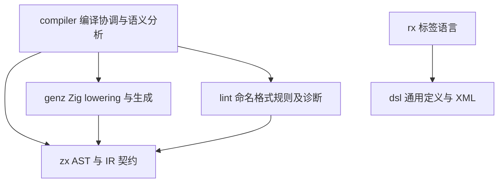

# 编译器包职责拆分实施计划

## Intent：最终目标

按用户新增要求收紧包职责：Zig 代码生成交给 `packages/genz`，通用 DSL 定义框架交给 `packages/dsl`，格式化与格式相关提示交给 `packages/lint`。compiler 负责前端语义、编译流水线与 CLI 协调；不能只移动文件而继续由 compiler 提供被拆分包的核心实现。

## Data：可用证据

- `genz` 目前仅导出 node、Builder 和 render；ZX IR 到 Zig 的生成仍在 compiler/backends/zig 的 16 个文件中，生成器调用 genz 的语法树与渲染器。
- `dsl` 已含 ast、attributes、children、diagnostic、element 与 XML 解析。RX 已直接依赖 dsl，不能把这部分已有分工重复实现。
- `lint` 已处理命名和空行 edits/format，但 compiler/root.zig 两处构造同一条 spacing 诊断；CLI 另有 fmt 检查失败提示。格式规则与诊断策略需要一个 owner。
- 新边界还需与 GCS 对齐目标统一：仅搬移现有空行算法不能证明符合 GCS。
- 按《文档分工》，内部构建与组织要求留在 rules 和本执行记录，不写进面向应用使用者的 packages/skills。

## Edges：边界与限制

- 拆分不得改变公开编译 API、生成代码语义、类型共享 ABI、native bundle 或形式化验证门禁。
- genz 可以消费 zx 的 IR 数据契约；不得反向依赖 compiler。IR 校验与前端语义实现的归属须先查清调用，避免形成循环依赖。
- 通用 Zig AST 构造与 ZX IR lowering 在 genz 内分目录表达，保留现有通用生成 API。
- dsl 接收通用声明、校验和 XML 机制；ZX 特有类型检查不因含有“DSL”字样就整体搬入 dsl。
- lint 接收格式判断和格式诊断内容；CLI 仍负责文件读写、退出码与诊断展示。
- 不新增测试用例，不执行浏览器 UI。复用现有生成、格式化、app/lib 与 native 回归，检查迁移后的依赖图和公开入口。

## Answer：交付格式与成功标准

1. 完成依赖与导出定位，再按包迁移，删除被迁移职责在 compiler 中的重复实现。
2. compiler 的现有公开入口委托到职责包；生成产物、错误归属与 ABI 保持一致。
3. 更新包构建声明、已有回归导入与内部维护文档，核对无依赖环。
4. 已有相关回归通过后，作为完整职责拆分 feature 提交并 push；实施结果与验证见下文。

## 自我复核

现有证据支持职责存在交叉，尚不足以直接机械搬移所有 backend 文件。尤其 IR 校验与生成前置检查必须保留真实行为，不能为包依赖看起来简单而删去校验。完成标准是职责与依赖收敛，下文记录实际迁移与验证，GCS 规则对齐仍是独立待办。

## 生成边界实施决策

IR 校验目前依赖类型分析、作用域及所有权分析，不适合为搬移代码生成而一并塞入 genz。compiler 保留薄的校验适配入口；15 个 lowering、类型映射、临时变量和输出实现迁入 `genz/src/zx/`，genz 新增 ZX IR 生成入口。已验证契约的生成路径同样调用该入口，不再穿透 compiler 内部 render 文件。genz 只依赖 zx 数据契约，没有 compiler/frontend 反向依赖。

该低层生成入口要求调用方完成 IR 结构、类型、所有权与形式化校验；这是原 render 层已有的前置条件，文档显式声明，不将迁移解释为取消 compiler 的验证门禁。

已检查 grit 的语言支持列表，没有 Zig；本次使用范围限定、带匹配数量核对的程序化迁移，禁止扫描式改写其他包。

## DSL 与格式职责

compiler/frontend/combinators.zig 仍持有 sequence、choice、optional、many 等可复用语法组合实现。迁入 dsl 的 grammar 工厂，以 Parser、Token、Error 类型明确实例化；ZX 只保留类型绑定和公开函数别名。回溯、零消耗拒绝和分配失败行为保持原样，XML Schema API 不变。

lint 新增 source 入口拥有命名/空行检查顺序、格式编辑生命周期及格式诊断内容；compiler 仅传入同一源码的 AST/注释并转发结果。CLI 仍负责退出码和诊断输出。此职责拆分不宣称 GCS 算法对齐已完成。

## 实施记录

- 15 个生成实现已移至 genz/src/zx；compiler 的 backends/zig.zig 只保留校验适配。经形式化验证的路径同样调用 genz，没有遗留对旧 render 路径的引用。
- genz 增加 zx 数据契约依赖，未引入 compiler/frontend 反向依赖；原 Builder/node/render API 保持。
- token 语法组合实现迁入 dsl/grammar，ZX 文件仅绑定类型并导出别名。去空白及类型绑定替换后的实现与迁移前逐 token 相同。
- lint/source 持有检查顺序、格式化编辑生命周期及诊断文本，compiler 两处重复诊断已删除；CLI 通过 lint 取得格式提示。
- 根构建通过；已有契约、所有权、验证资源门禁 12/12 测试通过。压缩与构建互操作回归同时证明生成迁移后 native bundle 和 app/lib 可用。最终根回归结果见下文。

## 最终回归与交付复核

使用仓库内真实 Z3 路径执行根 `zig build test --summary all`，896/896 步骤、52,876/52,876 测试通过；日志为 `/tmp/zxc-package-boundaries-regression.log`。包含 20 个验证 CLI 场景、11 个 RX CLI 场景、native bundle、app/lib 搬迁和 264 次压缩应用调用。格式及 diff 检查通过，没有新增测试用例。

本 feature 完成了明确要求的 genz、dsl、lint 三处职责迁移；compiler 保留领域语义与验证适配，未制造反向依赖。GCS 规则对齐、包管理、RX Context、增量编译与热重载等独立目标仍未完成。
