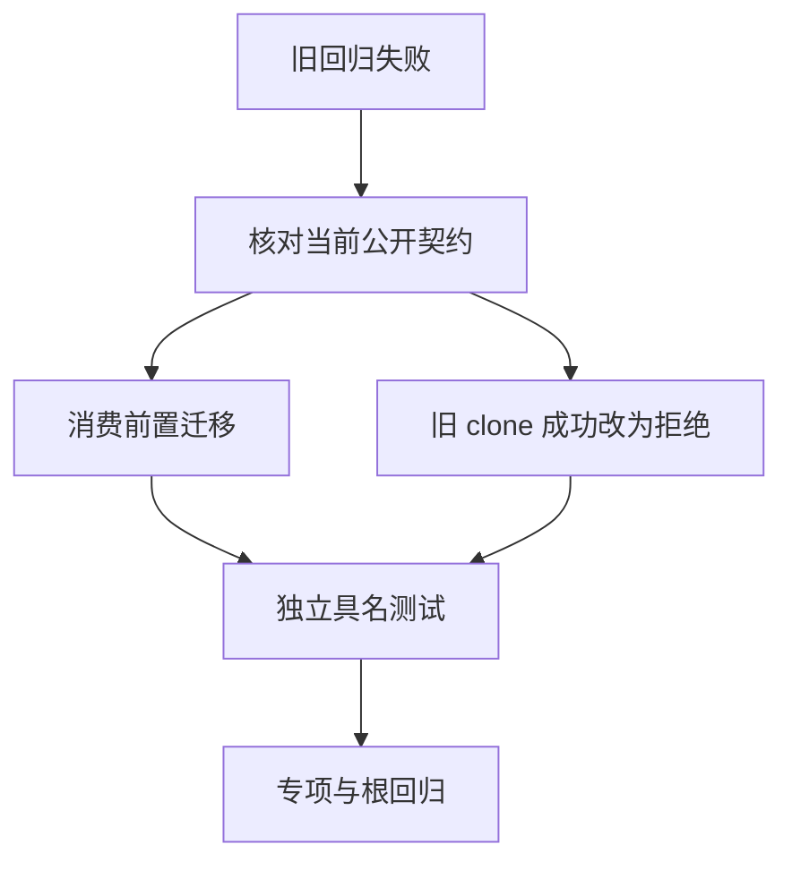
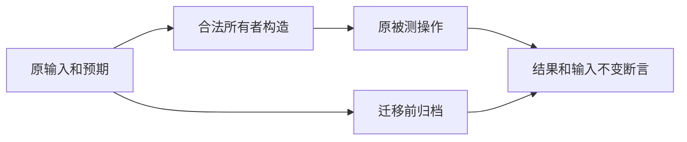

# 编译器旧所有权回归迁移

## Intent：最终目标

让 compiler 包自身的测试符合已落地的禁止深拷贝与引用 ABI，保留原本的消费、输入不变和错误阶段验证。与 packages/test 已恢复的运行目录分开留证。

## Data：可用证据

根回归日志 `/tmp/zxc-test262-root-reference.log` 已发现 9 个前端断言失败：六个操作的 clone 前置、一个 clone 参数诊断、一个 Store getter clone 前置及一个深拷贝成功断言。运行生成中 deep_clone、collections、splice、splice_ranges 依赖 clone；aggregate_values 在解构后再次使用原 tuple，不符合移动规则。

独立产物消费输出已经报告成功：72 组原生聚合引用调用、25 组原生参数调用、搬迁与应用/库消费。根回归最终为 807/842 步骤成功、14 个失败步骤，已执行 Zig 测试 51,715/51,724 通过、9 条失败。另发现 packages/test/tests/support/integer_process.zig 仍按值对象构造输入，六种整数隔离执行驱动编译失败。

## Edges：边界与限制

- 不恢复 clone，不放宽借用规则，不把旧深拷贝成功场景偷偷改成其他功能后沿用名称。
- 每种操作保持自己的具名案例；旧 clone 专属行为应明确改为 unsupported 拒绝。
- Store 的借用拒绝与本地所有者成功分别命名，不能因同一大测试的一条失败遮蔽另一条。
- 运行 fixture 的输入重建必须保持业务行为与原预期；必要的容器构造和禁止的递归深拷贝需明确区分。
- 并行实现正在增加标准库。根回归期间新增 zlib 源码曾产生语法错误，必须依据最终源码复核，不能归因到本轮字符串 fixture，也不能擅改其他线程正在写入的模块。

## Answer：交付格式与成功标准

先完成根回归记录，再逐项迁移前端和运行 fixture；保留迁移前后草稿、明确退役的旧契约、运行对应专项并最终重新执行根回归。测试失败可独立定位到语义条件，不用聚合数量替代 Test262 粒度。

## 执行与自我批判

本轮已按下述记录迁移 compiler 测试。需要避免将所有旧 clone 前置机械替换为复制操作：语义专属深拷贝测试应退役正例、保留拒绝证据，消费测试则应明确建立合法所有者。

## 整数隔离驱动修复

驱动从 Input 指针指向的布局读取 left 类型，使用显式 program.Input 指针初始化输入。命令参数、整数解析、真实 execute 调用、panic 标记与退出码保持不变；不改变任何预期溢出或除零结果。执行 Debug 与 ReleaseSafe 两种安全模式核验，464 条语义案例只计一次。

## 前端断言迁移

六个操作用例以借用输入的长度标量构造独立列表，继续验证操作可消费且原输入仍可读取。clone 专属正例改为精确 unsupported 负例，另以两个独立列表检查合法拥有者互不消费。Store getter 借用拒绝、clone 拒绝和标量建立独立拥有者分成三个具名测试。带参数 clone 同样报告 unsupported，而非不存在的 clone 参数契约。没有修改生产实现。

## 运行 fixture 迁移

标量集合以本地空列表 concat 输入建立独立 u64 槽容器，再执行原消费操作；这使用已有浅层集合操作，不递归复制引用元素。splice replacement 仅只读使用，直接借用原列表即可。aggregate_values 仍解构 tuple 并检查标量值，返回 tuple 明确由解构标量重新构造，不再读取已移动的旧 tuple。

deep_clone 运行正例及注册退役，原源码和断言先归档；禁止深拷贝是新契约，不能继续宣称深拷贝成功或将无关正例沿用旧名称。前端保留精确 unsupported 拒绝证据。旧测试中嵌套列表“独立复制”不再是支持行为，嵌套所有权其他行为仍需单独验证。boundaries 宿主输入改用对象引用，独立结果模型及原输入不变断言保持。

## 已验证结果

整数隔离执行在 Debug 与 ReleaseSafe 下分别 29/29 步骤通过；读取各模式六个 JSONL 报告确认各 464/464 条 passed，仍计 464 个语义案例。日志 `/tmp/zxc-test262-integer-reference-debug.log` 与 `/tmp/zxc-test262-integer-reference-safe.log`。

编译器前端 4/4 步骤、308/308 具名测试通过，日志 `/tmp/zxc-test262-compiler-owner-frontend.log`。相比原 305 个测试新增三个独立名称，来自 Store 拆分和合法独立所有者补充；不增加 packages/test JSONL 或上游审查数量。

compiler 新增 test-runtime 别名指向已有运行步骤，默认 test 仍复用相同步骤。后续仅执行对应专项，不因别名重复执行同一测试。

编译器运行专项最终 35/35 步骤、30/30 测试通过，日志 `/tmp/zxc-test262-compiler-owner-runtime-final.log`。运行中曾遇并行 RX 装载器修改 std.fs.path.relative 调用签名的瞬时编译失败；确认当前源码已被实现线程修正后重跑，未修改该生产文件。宿主 generated/numeric/syntax 三份测试仅适配指针输入与类型反射，原结果断言保持。

## 根级最终验证与自我批判

设置已验证的 Z3 路径后执行根 `zig build test --summary all`，841/841 步骤、51,944/51,944 条 Zig 测试通过。日志 `/tmp/zxc-test262-root-reference-final.log`。整数安全的进程报告、Node 集成场景与上游审查不混入该 Zig 测试数；packages/test 登记仍为 51,979。

格式和本轮 diff 空白检查通过。未修改生产逻辑；新增编译器 test-runtime 别名仅复用既有步骤。深拷贝正例退役有明确契约依据与归档，不可把减少一条运行测试解释为覆盖增加。现有 runtime 中的合并断言和边界循环尚未全部拆成 Test262 粒度，本轮通过证明运行恢复，不证明全特性覆盖完成。

标准库新增加 querystring 六个及 zlib 九个接口，当前七份声明共 68 个入口。其独立测试仍待接入，已更新全特性覆盖清单。完整 Test262 仍只审查 220/53,597，根回归通过不改变这一缺口。
