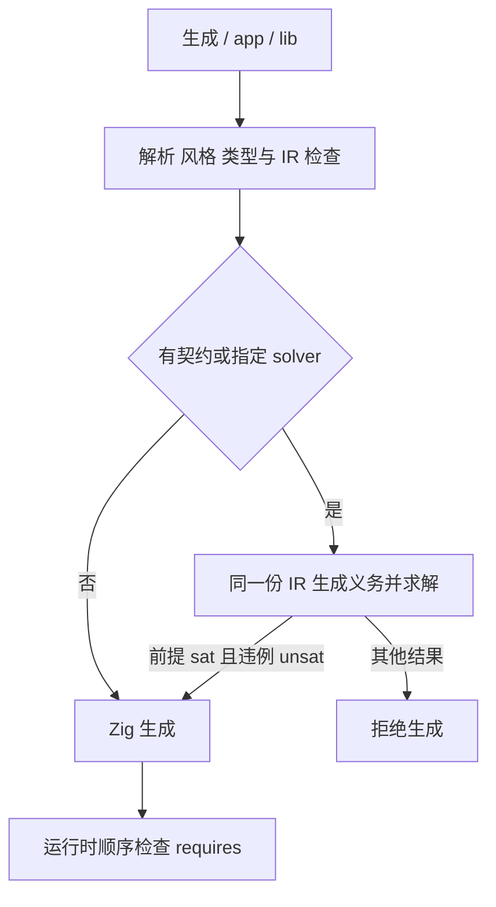
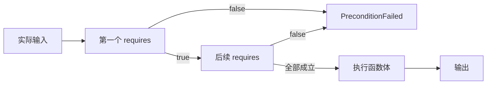

# 证明后生成代码实施

## Intent：最终目标

将契约验证接入正式生成与 app/lib 构建入口，使代码只在当前程序验证成功后产生。同时在运行时检查 requires，明确区分证明依赖的前提与调用方实际提供的输入。

## Data：实现与证据

新增 `compiler.compileProjectVerified`。它只分析一次源码，保留 AnalysisResult 所持有的 IR；遇到任何函数契约或调用方指定 solver 时，对同一份 IR 生成并求解义务。前提 sat 且违例 unsat 后，才将该 IR 交给内部 Zig renderer。CLI 的普通生成、app 和 lib 均使用此入口。

既有无 I/O 的 compileProject 与 zig.emit 保持门禁：它们没有求解能力，仍拒绝含契约的程序。没有新增“已验证”布尔参数或读取旧 result.txt 放行的路径。

验证器公共 check 与 verify CLI 共享实际求解流程。源码证据新增完整 IR 快照；证据目录的摘要覆盖源码/IR 记录和两份查询。摘要用于定位记录，成功状态仍来自本次求解，不作为可复用证明凭证。

生成的执行入口按源码顺序计算 requires，并调用 runtime.require。为 false 时返回 error.PreconditionFailed，不执行函数体。后续 requires 的求值依赖前面条件已成立；这与符号验证的顺序安全义务一致。

```sh
zig-out/bin/zxc build docs/2026-10-03/契约验证示例/discount.zx \
  --solver .zxc/tools/verification/bin/z3 \
  --out .zxc/examples/verified_discount \
  --asm .zxc/examples/verified_discount.s

.zxc/examples/verified_discount '{"raw_price":100,"discount":25}'

.zxc/examples/verified_discount '{"raw_price":10,"discount":25}'
```

实际构建通过并生成汇编。合法输入返回 `{"final_price":75}`；不满足前提的输入返回 `error: PreconditionFailed`，退出码为 1。

现有 `runtime/cases/add.zx` 通过普通生成命令加 --solver 验证时找到 u64 溢出反例，退出码为 1，报告没有生成代码。

## Edges：边界与限制

- 外部调用、Store、浮点和动态集合仍不支持；后续已接入纯 ZX 导入函数，见 [跨模块契约验证实施](跨模块契约验证实施.md)。
- --solver 可用于 verify、普通生成与 app/lib 构建。含契约但未指定时使用 PATH 中的 z3；缺失或求解失败不会放行。无契约且不指定 solver 的程序维持已有编译路径。
- 没有为超时、unknown、不可满足前提或错误响应增加默认成功逻辑。
- requires 在运行时保留；ensures 通过本次证明保证支持语义下的性质，不额外添加每次执行的后置条件检查。
- 这证明的是支持子集的符号语义性质；Zig lowering、Zig 编译器与求解器仍在信任基础内，尚未实现独立证明证书或机器码等价验证。
- 失败不会覆盖输出为新的生成代码，但原先已存在的输出文件仍可能保留。调用方必须以退出状态判断本次构建结果。
- 程序合成与 FPGA 时序不属于本轮已完成内容；跨模块证明由后续实现接入。

## Answer：交付与成功标准

正式生成入口已经把真实求解结果连接到同一份 IR 的代码生成，并验证了合法输入、前提失败和存在反例三条路径。没有新增测试用例；执行既有回归，并保留实际编译运行记录。





## 自我批判

只把 verify 命令的成功文件当凭证会留下源码、配置或 IR 改变后的错误放行风险。本轮将求解与渲染置于同一次调用，避免了这种缓存绑定问题；但它不意味着信任基础已被形式化证明，也不意味着外部程序提供的任意输入自动满足前提。运行时前提检查解决的是后一个边界。
