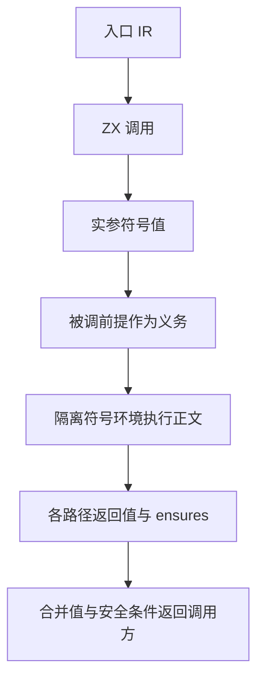
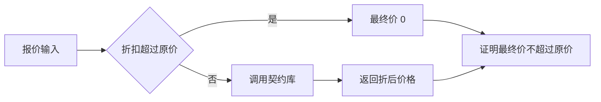

# 跨模块契约验证实施

## Intent：最终目标

使带契约的 ZX 库能被其他 ZX 程序消费，验证实际调用参数是否满足被调函数前提，并将返回值、安全条件与后置条件连接到入口函数证明。

## Data：实现设计

已有 IR 对函数按依赖拓扑编号，禁止自递归与间接递归。符号执行此前在存在任何 functions 时拒绝；本轮改为在调用位置展开纯 ZX 函数体。每次调用创建隔离的局部符号环境，将实参绑定为 in，沿现有路径执行语句并收集返回值。

调用的安全条件同时包含实参求值安全、callee requires 成立、函数体执行安全、返回覆盖和 callee ensures 成立。入口 requires 是验证输入域的前提；callee requires 是必须证明的调用义务，不能直接加入假设以消除错误调用。

返回值用各返回路径的条件表达式合并。表达式层把整体安全条件交给调用者，继续使用 &&、||、条件表达式和分支的路径约束，因此没有实际执行的调用不会制造安全违例。

## Edges：边界与限制

- 当前仍只支持有限整数、bool、静态对象/元组及有限分支。实际执行的 Zig/C/std 外部调用没有函数体语义，明确拒绝。
- 调用深度上限 128；表达式深度仍限制 256。无环不代表展开成本恒定，复杂调用图可能造成约束膨胀。
- 证明对象是入口函数及其可达调用路径，不声称每个未调用私有 helper 对任意独立输入都已得到证明。库被作为独立入口构建时，验证其独立契约输入域。
- 不使用 callee ensures 代替对真实函数体的分析，不把源码声明当作可信公理。
- 路径条件屏蔽的是已建模调用的逻辑违例；生成器仍遍历分支。不可达分支内的外部调用或超深调用仍可能直接触发不支持诊断，属于保守拒绝。
- 源码接口和无环约束保持不变，外部语义、浮点及动态数据仍需独立建模。

## Answer：交付与成功标准

交付纯 ZX 调用的符号展开、真实库消费示例、实际求解/执行证据和回归结果。示例 quote 从上一轮生成的 library 导入 discount：折扣超出原价时返回 0，其余路径调用带 requires 的库，并保证 final_price 不超过原价。





## 自我复核

需检查提前返回、void 隐式返回、分支内调用和嵌套调用均没有遗漏安全义务；结构合法性仍依赖入口 IR 校验。真实执行只提供具体输入证据，不能替代符号证明；符号证明也不能替代对实现信任边界的说明。

独立只读静态审查未发现可确认的错误证明路径，并复核了以上前提、返回覆盖、短路和函数拓扑关系。此结论不等于实现无漏洞。

### 实际执行证据

```sh
zig-out/bin/zxc build docs/2026-10-03/跨模块契约示例/quote.zx \
  --project .zxc/examples/verified_discount_library/zxc.json \
  --solver .zxc/tools/verification/bin/z3 \
  --out .zxc/examples/verified_quote
```

实际求解与构建成功。输入 raw_price=100、discount=25 返回 final_price=75；输入 raw_price=10、discount=25 返回 final_price=0。证据 IR 包含一个导入函数、两个输入字段和一个入口后置条件，确认使用了实际跨模块调用。

证明目录为 `.zxc/proofs/0c4fb3b5357dd1d05423b01b9cf6d0f825c5659363c77819ee9bc498b47ce82f/`。前提 sat、违例 unsat；这证明的是上述入口在其输入域中的受支持执行路径，而不是每个导入文件的独立全输入域。

完整根回归 468/468 步骤、42573/42573 测试通过，日志 `/tmp/zxc-cross-module-regression.log`。fmt 与 diff 空白检查通过。本轮没有新增测试用例；回归数量变化包含工作区其他并行工作。
