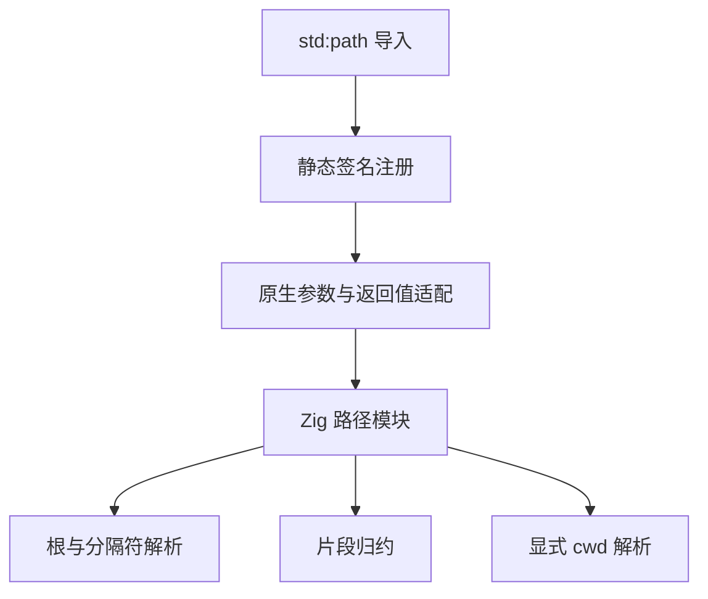

# 路径标准库实施

## Intent：最终目标

建立文件系统、模块和插件定位可复用的纯路径计算能力，基于 Zig 实现，按 POSIX/Windows 分离语义，不读取宿主工作目录或环境。

## Data：接口与证据来源

参考 [Node.js Path 官方文档](https://nodejs.org/api/path.html)，检查本地 Zig 0.16.0 fs.path 的路径解析实现。Node 平台默认、盘符目录等行为不能直接视为纯字符串操作；本实现显式区分这两个层面。

模块为 std:path、std:path/posix、std:path/win32。默认 std:path 依照最终编译目标 OS 选择后两者；显式模块可在任意宿主处理相应风格。

| 成员                                     | ZX Input                                   | Output                                       |
| ---------------------------------------- | ------------------------------------------ | -------------------------------------------- |
| isAbsolute                               | string                                     | bool                                         |
| basename / dirname / extname / normalize | string                                     | string                                       |
| parse                                    | string                                     | 包含 root、dir、base、ext、name 的字符串对象 |
| format                                   | parse 返回形状，所有字段均显式提供         | string                                       |
| join                                     | string[]                                   | string                                       |
| resolve                                  | { cwd: string; paths: string[]; }          | string                                       |
| relative                                 | { cwd: string; from: string; to: string; } | string                                       |

原生注册表为三种模块各声明完整静态签名，底层适配复用既有 nativeArgument/nativeResult 与调用级 allocator。basename 等视图结果不暴露可变内存。

## Edges：边界与限制

- resolve/relative 显式接收绝对 cwd；Windows cwd 还须包含盘符或 UNC 共享根。缺少其他盘符的工作目录时返回 MissingDriveDirectory，不读取 Node 式每盘符进程上下文。
- Windows 接受两种分隔符，并识别盘符、根路径与 UNC；POSIX 只将 / 当作分隔符。结果规范化不访问文件系统，也不解析符号链接。
- Windows 路径比较目前对 ASCII 字母忽略大小写，其他字节精确比较；尚未实现 Unicode 大小写折叠，因此不宣称所有非 ASCII 路径与 Node 行为一致。
- basename 的可选 suffix、glob 匹配、命名空间路径转换，以及缺少的盘符目录上下文仍需后续实现。
- 字符串词法规范化不能提供目录访问授权或防止符号链接逃逸。路径计算不是安全沙箱。
- 不修改现有编译器内部路径规则来套用新标准库；标准库首先作为正式 std: 接口交付。

## Answer：交付与成功标准

交付 Zig 实现、30 个有类型模块成员注册、使用示例和真实编译执行证据。路径能力仍保持单独进度，不以此宣称完整 Node 功能标准库完成。




## 自我复核

不能用宿主 Zig fs.path 的行为直接代替 Node 路径规则。本轮专门处理独立平台风格、尾部分隔符和工作目录依赖；实际对齐范围以接口与差异说明为准，后续须继续补齐特殊 Windows 路径和 Unicode 比较。

### 实际编译与对照

```sh
zig-out/bin/zxc build docs/2026-10-03/路径标准库示例/inspect.zx \
  --out .zxc/examples/path_inspect
```

示例接收 POSIX/Windows 路径与各自 cwd，通过正式 std: 导入调用全部十类接口。底层是 Zig，没有把 Node 作为运行依赖。

与本机 Node v25.8.1 对照的实际结果：

- POSIX `/foo/bar//baz/asdf/quux/..` 规范化为 `/foo/bar/baz/asdf`；相对 `/work` 得到 `../foo/bar/baz/asdf`。
- Windows `C:\temp\foo\bar\..\` 规范化为 `C:\temp\foo\`；resolve 去除非根尾部分隔符，相对 `C:\work` 得到 `..\temp\foo`。
- UNC `\\server\share\dir\..\file.txt` 规范化为 `\\server\share\file.txt`，相对同共享下的 work 目录得到 `..\file.txt`。
- POSIX `//foo` 的 dirname 为 `//`，但 parse/format 组合得到 `/foo`；实现已将解析目录切片与 dirname 的特殊规则分离。
- Windows cwd 为 `C:\work`、路径为 `D:notes.txt` 时，正式可执行文件返回 MissingDriveDirectory，退出 1。

官方文档版本为 Node v26.10.0，本机行为对照版本为 v25.8.1；这不是全版本兼容性证明，也没有在 Windows 宿主上运行原生二进制。未新增测试用例。

根回归 519/519 步骤、46073/46073 测试通过，日志 `/tmp/zxc-path-regression.log`。源码格式与 diff 空白检查通过；回归数量变化包含工作区其他并行工作。
