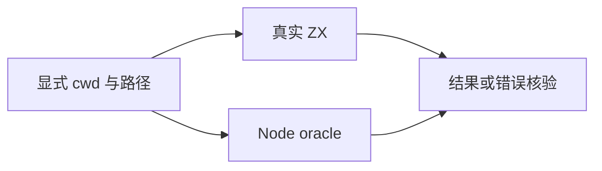
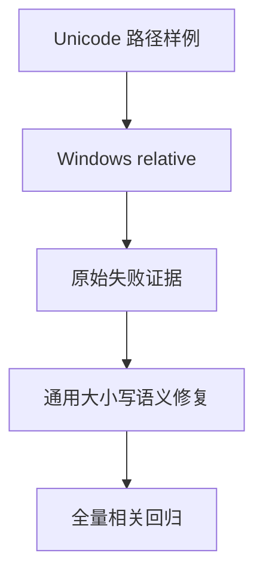

# 路径解析与 Unicode 比较测试

## Intent：最终目标

验证显式 cwd 的 resolve/relative，以及 Windows 路径大小写比较的完整行为，发现差异后按通用规则修复。

## Data：可用证据

新接口在 cwd 非绝对路径时返回 InvalidWorkingDirectory；Windows 缺少其他盘符工作目录时返回 MissingDriveDirectory。Node win32.relative("C:\\Ä", "C:\\ä") 实际返回空串；当前实现使用 ASCII 小写比较，需用真实 ZX 复现。

## Edges：边界与限制

不让 Node oracle 隐式读取其他盘符环境；只将可由显式绝对 cwd 确定的输入交给 Node。缺少上下文的错误由明确契约单独列出。Unicode 差异不能用针对样例的字符特判修补。

## Answer：交付与成功标准

真实源码分别调用两平台 resolve/relative；错误检查具体名称，正常结果对照 Node。若复现 Unicode 差异，先保存失败证据，再查找可复用的通用实现。草案在 `docs/2026-10-03/path_resolution/`。

## 执行记录与自我批判

首次真实 ZX 运行确认 5 个失败，均是 Windows relative 的 Unicode 比较。原先按 UTF-8 字节长度和 ASCII lowercase 比较，既漏非 ASCII 映射，也错误拒绝不同字节长度的小写等价字符串。失败日志 `/tmp/zxc-test262-path-resolution-before.log`。

采用无分配 UTF-8 码点流比较，使用固定 Unicode 17.0.0 默认 lowercase 数据；完整映射包含扩展输出，Final_Sigma 读取原始字符串的 Cased / Case_Ignorable 上下文。双属性码点先跳过 Case_Ignorable。不是 Windows uppercase 或 Unicode case folding，不进行归一化；返回路径保留原始拼写。非法 UTF-8 字节作为独立非 Unicode token 保留比较，未因此扩大 ZX 源码允许范围。

数据依据：[UnicodeData](https://www.unicode.org/Public/17.0.0/ucd/UnicodeData.txt)、[SpecialCasing](https://www.unicode.org/Public/17.0.0/ucd/SpecialCasing.txt)、[DerivedCoreProperties](https://www.unicode.org/Public/17.0.0/ucd/DerivedCoreProperties.txt)。生成器、原始数据及 SHA-256 锁定在 `docs/2026-10-03/path_resolution/`；运行 `python3 docs/2026-10-03/path_resolution/generate_unicode.py` 再运行 Zig fmt 可重新生成。生成器先核对固定源哈希，未知无 locale 条件直接报错。发布代码只携带必要映射、属性表和 Unicode 许可，无系统 ICU 依赖。

新增 1,694 个案例：POSIX resolve 12、relative 66，Windows resolve 13、relative 1,603。Node 25.8.1 / Unicode 17.0 独立生成全标量小写变化样例及上下文组合；不通过被测映射表生成预期。Debug runtime 390/390 步骤、33,748/33,748 测试通过。TypeScript 检查、目录审计通过。累计 47,822 个登记案例。

自我批判：全标量单字符覆盖不证明任意字符串上下文正确，也不等于 Test262 String lower 全部通过；本轮路径测试不增加上游审查数。Unicode 数据升级必须明确版本并重新验证 Node oracle。最终根 ReleaseSafe 536/536 步骤、47,767/47,767 根 Zig 测试通过，根构建退出码 0；日志 `/tmp/zxc-test262-path-resolution-root.log`。生成 Unicode 表后重新格式化，与原文件哈希完全一致。
