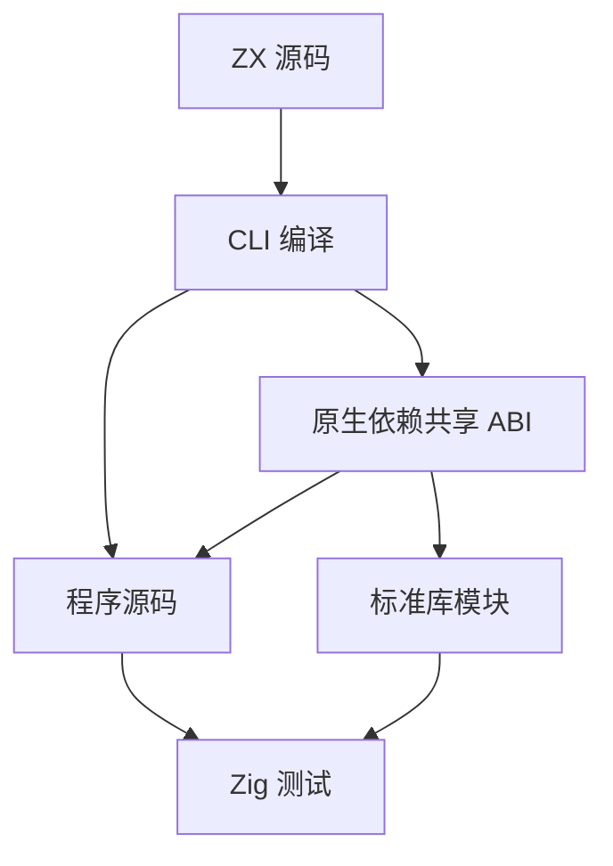
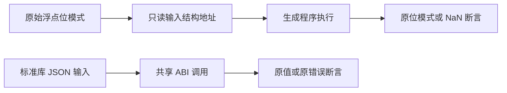

# 运行回归接入引用与共享 ABI

## Intent：最终目标

恢复对象引用布局下的浮点和标准库运行回归，不改变 JSONL 输入、位模式预期或错误契约。

## Data：可用证据

当前 objects/tuples 的 program.Input/Output 为 const 指针；浮点二元/三元驱动仍使用旧结构体初始化和 FieldType。CLI 在原生依赖存在时同时写出 `<output>.abi.zig`；纯 ZX 程序仍为单文件。标准库与调用者必须导入同一个 ABI 模块实例，不能继续使用独立生成的一套同形类型。

## Edges：边界与限制

- 浮点断言继续比较精确 IEEE 位模式；NaN 继续检查 isNan，不改为容差比较。
- 测试驱动只改变输入指针和比较结果的表达形式；不改源码中的运算顺序、输入数字或参考模型。
- suite 显式声明 shared_abi，当前全部指向标准库。为每份生成程序建立对应 ABI 模块，程序和标准库共享该模块；纯 ZX 不伪造 ABI 文件。
- 不增加复制适配层、反射调用或错误兜底。缺失 ABI 文件必须导致构建失败。
- 此轮不据此宣布字符串/Store 及自定义原生模块边界全部完成。

## Answer：交付格式与成功标准

增加浮点与标准库运行专项入口，在默认 runtime 下仍执行同一批案例。专项真实编译和执行通过，生成与目录审计通过，所有原 ID/input/expected 保持。

## 执行与自我批判

浮点 38 个 suite 共 19,534 条，shared_abi 23 个 suite 共 3,174 条。联合专项 248/248 步骤、22,708/22,708 测试通过，日志 `/tmp/zxc-test262-runtime-abi.log`。标准库资源专项 8/8 步骤、6/6 测试通过，日志 `/tmp/zxc-test262-shared-abi-resources.log`。TypeScript、目录审计、Zig 格式及 diff 检查通过。没有修改 JSONL 案例或生产实现。

共享类型按 suite 显式登记；每个程序及其标准库导入同一个由 CLI 生成的 zxc_abi 模块。缺失类型文件会直接导致构建失败，没有空类型模块兜底。纯程序保持单文件，无标准库依赖注入。

自我批判：两个结构字段相同不代表它们在 Zig 中是同一类型，必须共享类型模块，不能凭强制转换让测试变绿。
