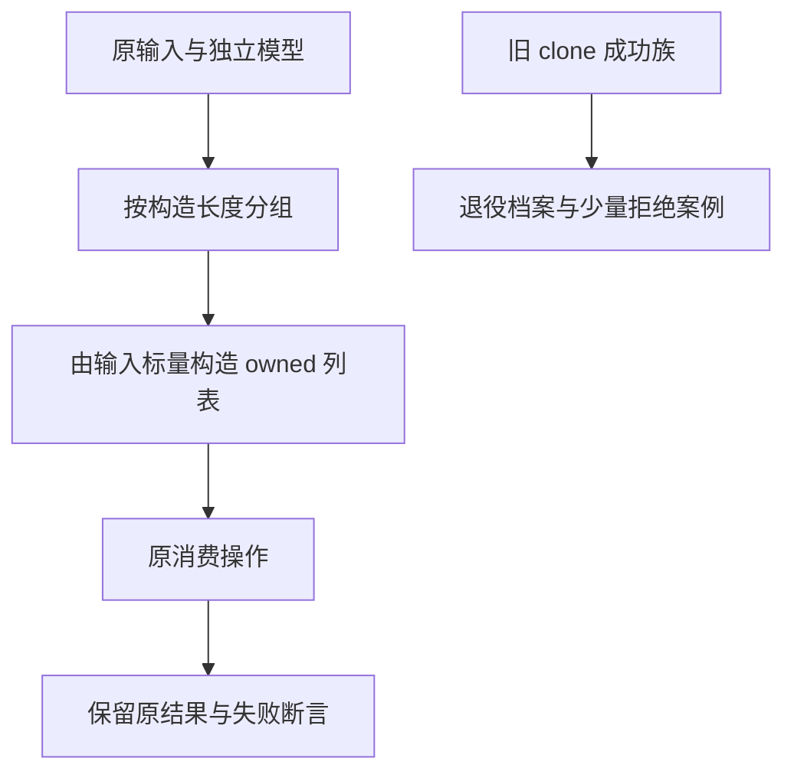
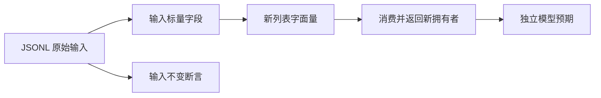

# 集合测试迁移到显式所有者

## Intent：最终目标

在禁止 clone 的新设计下，恢复消费式数值集合测试，保留每条原输入、独立预期和稳定 ID。直接验证深拷贝的旧正例单独退役，不能把同一语法拒绝按运行输入重复计数。

## Data：可用证据

当前九个消费式 i64 操作族共 10,855 条，源码用 in.items.clone() 准备独占列表。clone_aliases/clone_nested 两族共 211 条，以深复制为核心，且未被上游审查记录引用。旧目录、生成器和注册文件已复制到 `docs/2026-10-03/owned_collection_migration/before`。

新契约允许创建新容器及复制标量值，禁止递归复制已有聚合。当前列表字面量可以从输入标量构造 owned 列表；语言不支持列表 spread，因此不能机械替换为该语法。

## Edges：边界与限制

- 消费测试按初始列表长度分组。每组 fixture 使用 `[in.items[0], ...]` 形式的实际标量取值创建本地列表；空列表有明确 i64[] 类型。
- 分组仅确定构造形状，元素值仍由原输入提供。不得把参考预期、排序结果或 splice 结果写入 ZX 程序。
- 每个原案例 ID、input、expected 必须与迁移前逐项相等。测试继续检查借用输入未被修改。
- 不使用 identity map、递归构造复制或隐式复制兜底。九种被测消费操作与原断言保持不变，splice_reverse 的两个返回列表继续分别反转。
- 字符串只读引用、嵌套别名、Store 与所有权矩阵单独迁移，不从 i64 结果推断它们正确。
- clone 的 211 个旧成功场景退役并保留原始档案；新增少量不同类型的前端拒绝检查，不冒充 211 个有效运行用例。

## Answer：交付格式与成功标准

通过生成器重新生成分层目录，更新 suite 注册，增加 test-owned-collections 相关专项。成功标准为 10,855 条原案例不丢失、不改预期，实际生成代码执行通过，clone 拒绝处于分析阶段，目录审计无旧文件或重复注册。

## 执行与自我批判

待实施。长度分组是测试 fixture 的固定结构，不是生产实现中的用例分支；保留输入预期的逐项对照可防止迁移悄悄缩小语义范围。新拥有者构造本身不能证明任意宿主输入都可消费。

迁移前后逐 ID 对照已确认 10,855 条输入与预期完全一致；初步人工汇总的 10,870 已校正为实际目录统计。退役 211 条 clone 成功案例，新增 8 个区分目标类型/本地 owner/非法参数的拒绝案例，目录净减少 203 条。当前共 51,979 条登记案例；上游审查与 606 个关联 ID 均不变。

首次数值专项生成 ZX 已成功，但测试 Zig 驱动按旧值对象初始化，遇到 `*const program.zx_type_*` 类型错误，日志 `/tmp/zxc-test262-owned-collections.log`。确认新后端对象/元组引用 ABI 后，测试 literal 为对象生成地址字面量；错误/值联合仍由执行器显式包裹。fixture 分配器增加单对象指针分配，借用输入继续独立准备并检查不变；数据结果使用 expectEqualDeep，避免误比较指针地址。此测试侧 fixture 复制不是恢复语言 clone，也不用于证明别名图。

修正后数值专项 203/203 步骤、10,855/10,855 测试通过，日志 `/tmp/zxc-test262-owned-collections-final.log`。增加 frontend-filter 可针对案例名称过滤，但默认仍执行完整前端目录；clone 拒绝专项 5/5 步骤、8/8 测试通过，日志 `/tmp/zxc-test262-deep-copy-rejection.log`。TypeScript、生成一致性、矩阵审计、Zig 格式及 diff 空白检查通过。完整根回归尚未恢复，本轮未重复已知失效的全量测试。
