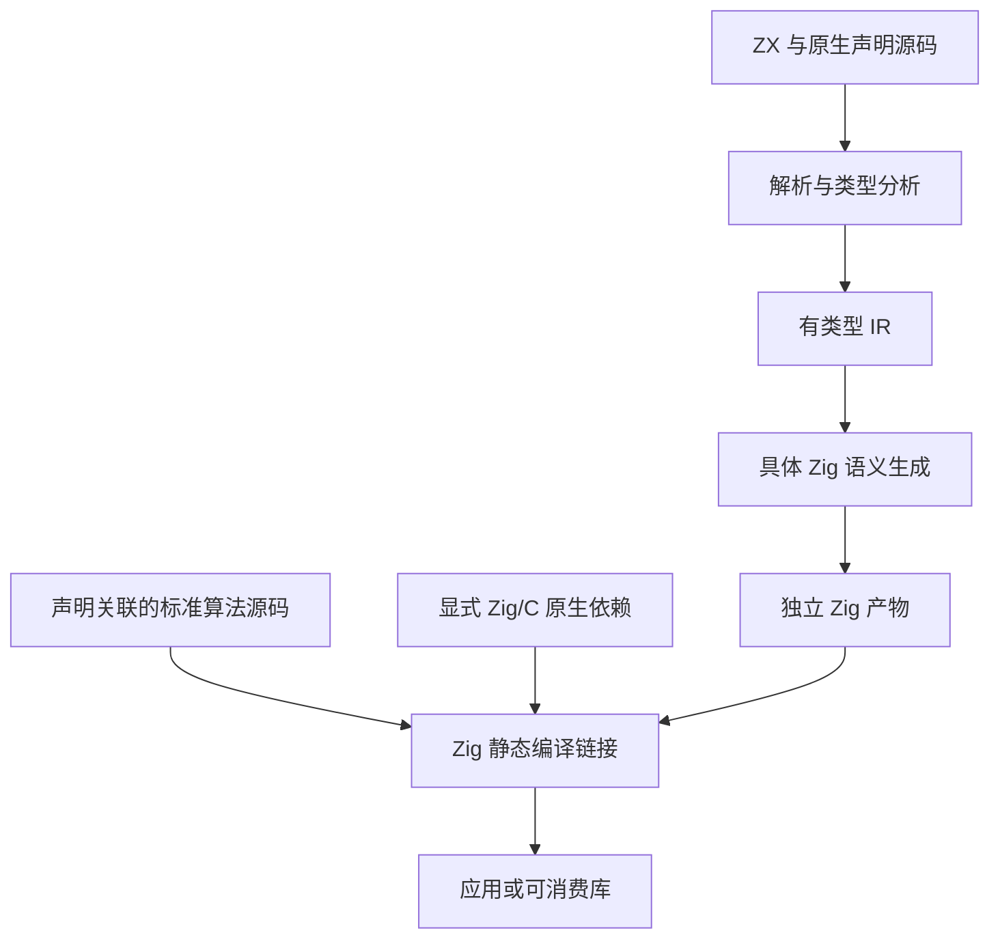

# 零运行时与静态链接实施

## Intent：最终目标

用户明确要求不保留 zxc 专用运行时，并选择取消动态加载、所有模块静态链接。此决定取代此前动态插件与懒加载目标。生成产物必须是具体 Zig 实现，仅依赖 Zig 标准库和显式静态原生源码/链接依赖。

## Data：可用证据

现有 Zig 后端无条件导入 zx_runtime，借用 Arena/Allocator 类型别名，并调用索引、clone、equal、集合、模板与契约 helper。CLI app 构建注册该模块，lib 导出复制整份 runtime 目录。标准库和动态插件也挂在 runtime 根模块下。仅修改目录名称不能满足目标。

声明源码已经替代标准库成员注册表，原生对象/枚举/可选值转换由 IR 静态生成。此次保留这条链路，继续清除普通语言操作与构建产物的运行时依赖。

## Edges：边界与限制

- 取消 native_modules.library、共享库插件 ABI 与懒加载，不生成动态加载器。
- 不通过复制整个 runtime 到产物或改名为 support 冒充完成。
- 保留实际算法所需的普通 Zig 运算、分配和循环；静态链接不等于运行时输入能在编译期求值。
- Zig/C 模块走正常静态编译及链接。目标平台系统 ABI 和系统库由 Zig 工具链决定；不能把没有自定义 runtime 等同于任意平台的完全静态系统二进制。
- 不新增测试用例，不使用浏览器；执行既有适用回归。已取消功能的旧回归需要明确区分，不能偷偷吞掉失败。
- 标准库是有声明的普通 Zig 源码模块，按引用作为编译依赖；普通算术或集合程序不引入标准库算法模块。

## Answer：交付格式与成功标准

1. 删除动态插件生产入口和本轮尚未交付的插件 codec 生成分支。
2. 用 Zig std 类型替代 Arena/Allocator 别名；直接生成索引、契约与余数语义。
3. 根据 IR 类型生成 clone、比较、模板和集合实现，保留一次求值、错误和所有权语义。
4. 将标准算法与真实声明组织为独立静态源码模块。
5. app/lib 不注册 zx_runtime、不复制 runtime、不依赖编译器安装目录的运行时文件。
6. 检查实际生成代码并执行普通计算、集合/深复制、标准库、原生模块、搬迁后 Zig/ZX 库消费者及既有适用回归。

## 执行记录

普通语言操作已改为编译器生成具体 Zig，生产 runtime 目录已删除。标准算法位于 standard/src，作为真实声明关联的普通静态模块；app/lib 不再注册 zx_runtime，lib 不复制运行时目录。动态插件配置、加载器、SDK 和 C ABI 安装入口已移除。

密码学与路径应用实际编译运行通过。新导出的密码学库目录包含 root.zig、build.zig、source、native/zxc_standard 和配置文件，没有 runtime 目录，扫描没有 zx_runtime/runtime 路径引用。

当前完整基线回归命令使用本地 Z3：`ZXC_TEST_SOLVER="$PWD/.zxc/tools/verification/bin/z3" zig build test --summary all`，619/619 步骤、52140/52140 测试通过，日志 `/tmp/zxc-zero-runtime-baseline.log`，退出码 0。此前未设置求解器路径的一轮虽然运行测试通过，但整条命令失败，不计为成功。

测试基础设施只迁移必要的依赖连线：标准库资源测试导入真实静态标准库，库消费脚本不再注册 zx_runtime。按用户取消的能力移除了动态插件套件注册和旧 runtime.sort 公共 helper 的直接测试注册；语言级排序、集合和所有权回归仍运行，没有增加用例或放宽断言。

这轮是零运行时改造的基线，仍包含旧 clone 语义与原生聚合转换。新的禁止深拷贝、聚合引用和所有权要求尚待同步前端、IR、原生 ABI 与后端，详见《不可变绑定与唯一所有权实施》。不能把此基线通过当作新语义已完成。

## 自我批判

此前把通用 helper 留在 runtime，以“也是 Zig 代码”解释不足以满足用户要求；新增加的插件字节入口同样仍引入专用运行库。当前按用户新决定取消该分支，验收看最终产物和链接关系，不以 helper 数量、目录改名或局部编译成功代替。
