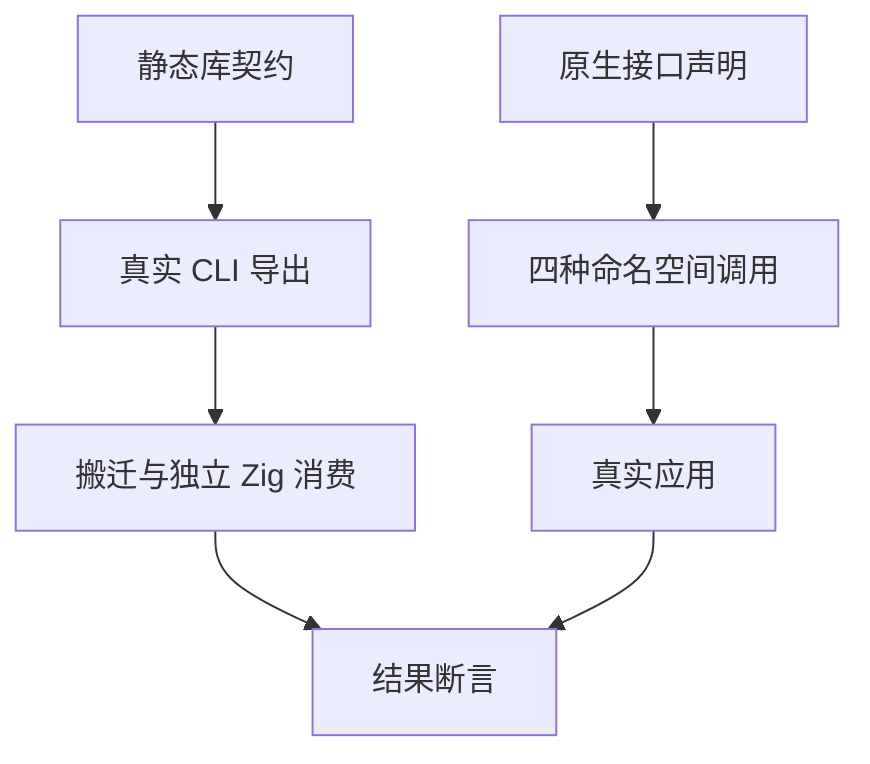

# 静态库消费与原生多参数回归

## Intent：最终目标

按当前静态产物契约更新自动回归，并将原生声明的零参数、多参数和命名空间属性检查推进到真实代码执行。

## Data：可用证据

本轮读取 cli/library_build.zig 与 cli/library.zig，确认库构建不再导入 zx_runtime 或写出 runtime 目录。三个消费脚本移除旧模块注入；普通搬迁库与聚合声明库检查不存在旧目录，并实际编译消费。

## Edges：边界与限制

不通过额外注入废弃模块维持旧测试。原生函数必须仍通过声明进入，独立 Zig fixture 实现四种组合：零参数、allocator 零参数、多参数、allocator 多参数。namespace 为 nested.api，输入与结果由 Node 独立计算。静态消费检查不等于所有新代码生成语义已回归；所有权设计仍在并行调整。

## Answer：交付格式与成功标准

test-build-modes 必须通过普通 app/lib、搬迁、聚合声明与新的调用组合。记录当前真实输出，若失败先区分测试过期、实现过渡和产品缺陷。测试与文档之外暂不改生产实现。

另扩展公开项目分析专项：重复原生接口、与旧 external 冲突、空/NUL/非法 UTF-8 模块名与命名空间、纯类型接口默认导入以及缺失调用成员，分别检查 module/name 诊断与入口来源。

## 执行与自我批判

静态消费首轮 2/2 步骤通过，日志 `/tmp/zxc-test262-static-library.log`。配置检查首轮 6/6 步骤、7/7 测试通过；最终配置专项 6/6 步骤、8/8 测试通过，日志 `/tmp/zxc-test262-native-config-final.log`。真实调用最终专项 2/2 步骤通过，25 组输入覆盖四种调用，原有 36 组聚合及分配失败测试继续通过，日志 `/tmp/zxc-test262-static-invocation-final.log`。TypeScript、Zig 格式及 diff 检查通过。完整根回归已启动，结果待记录。确认没有旧目录只是产物结构检查，真正的依赖证据来自不注入 zx_runtime 的 Zig 编译与执行；不能单靠文本搜索声称无运行支持依赖。

## 补测发现：纯类型原生命名空间绕过校验

只读辅助分析指出 namespace 检查位于函数循环内部。主 agent 新增公开 project.analyze 用例复现：`export type Value = u64;` 的接口使用空 namespace 成员时仍返回 IR。新增两个测试均失败，日志 `/tmp/zxc-test262-native-type-namespace-before.log`；这不是代码生成预期差异，而是同一接口元数据因是否声明函数而受到不同校验。

最小修复计划：将 namespace 合法性检查从函数循环提升到接口分析阶段，保留原 module 诊断和消息；每个函数仍复制自己的完整成员路径。测试同时覆盖空、NUL、非法 UTF-8，以及合法空 namespace 和 nested.api。

修复后 test-native-declarations 8/8 步骤、10/10 测试通过，日志 `/tmp/zxc-test262-native-type-namespace-final.log`。非法纯类型接口在公开分析阶段被拒绝，合法无前缀和双层 namespace 均通过 validateIr，错误路径分配遍历通过。

完整根回归首轮 615/619 步骤、52,140/52,140 Zig 测试通过，但验证器因未指定本机 Z3 路径报 FileNotFound，根退出码为 1；不能记为全量通过。已确认本机 Z3 5.1.0，带明确路径的验证器专项 20 个场景通过。修复后完整根回归已使用明确 ZXC_TEST_SOLVER 路径重新启动。

完整根最终运行退出码 1：565/621 步骤成功，40,042/40,381 已执行 Zig 测试通过，339 失败；20 个构建/执行步骤失败。日志 `/tmp/zxc-test262-static-backend-root-final.log`。此次已传入真实 Z3；失败来自并行落地的禁止 clone 与新所有权语义：330 个目录前端旧预期、9 个 compiler 旧预期，以及依赖 clone 的集合生成程序。静态库消费、36 组聚合、25 组原生调用及新 namespace 修复均通过。

这轮不能宣称全量通过。后续按用户已确认的新设计迁移旧测试：clone 本身改测拒绝；集合操作保留结果断言并使用合法新拥有值作为输入；借用/移动错误用例重新构造有效前置条件。禁止简单删除失败或把整个集合族改成 unsupported。
