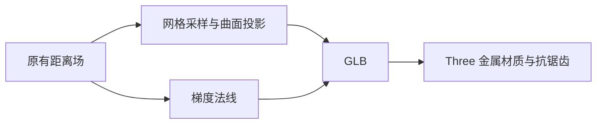
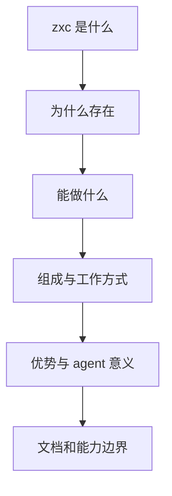

# 首页内容与曲面质量改进

## Intent：最终目标

改善用户截图中的模型轮廓与反射粗糙感；重写英文首页，使其完整解释 zxc 的定义、动机、能力、优势、对 AI agent 的意义和组成。移除 Start from source。

## Data：可用证据

用户提供的截图中，高光内部存在网格状方向变化。当前模型来自 surface nets 采样，使用三角面平均法线；反射会放大这种法线误差。画布 DPR 上限为 1.5。内容依据仓库 README 与已有语言/编译器公开契约。

## Edges：边界与限制

保持 Three / R3F / vgpu 与已有造型来源，仅改进资源精度、法线、采样和材质。继续只更新英文；不扩展语言能力、不加入无法证明的性能收益、不生成测试、不做本地浏览器 UI 检查。

## Answer：交付与成功标准

从原始距离场计算连续梯度法线，并将采样顶点投影回曲面；提高适量网格与像素采样，缓和过尖高光。内容按六个核心问题重组，移除首页源码构建入口并调整视觉锚点。类型、构建、资源检查和离线资源渲染分别记录。

## 后续要求与最终实现

首页改为连贯短文，删除能力表、优势清单、agent 步骤罗列。用产品定义、创建动机、一个业务场景、RX / ZX 分工、编译过程和接续编辑的意义展开。只更新英文。

`Start from source` 和对应组件已移除。`Keep reading`、`Where things stand`、`About zxc` 合并为 `About zxc`：一段交代 MATRIXAGES、实验状态与能力边界，再提供文档和源码链接。旧内容组件与不再使用的英文字段已删除，三维位置锚点同步更改。

### 曲面与反射

- 采样网格从 104³ 改为 160³。
- 每个顶点按原始距离场进行三次曲面投影；法线直接由距离场中心差分梯度计算，不再从三角面平均得到。
- 主体约 43,332 顶点 / 1,561,176 B；尾部约 51,484 顶点 / 1,854,716 B。
- 金属粗糙度从 0.18 调到 0.24，clearcoat 从 0.65 降到 0.25，缓和过尖反射。画布 DPR 上限从 1.5 提到 2；保留 Three 的 4× MSAA。
- 资源 URL 使用 GLB 内容摘要作为版本参数，避免 Three loader 在热更新时复用原地址缓存的旧网格。

### 自动播放与滚动形变

按用户新要求移除 Pause motion 控件及相关状态。默认自动播放，可见时持续绘制；页面隐藏或视觉列离开视口时停止，重新出现后恢复。系统减少动态效果偏好仍生效。

自动运动包含持续缓慢旋转、周期形变、粒子下落和连线数据点移动。滚动进度叠加到旋转与形变强度。首次幅度过小后，将径向变化幅度增到 10%–18%，并加快周期，便于直接看出变化。

形变材质同时提供位置函数和法线变换；法线按变换的逆转置关系处理，再转换到视图空间。主反射和 clearcoat 使用一致法线，避免位置变了但反射仍按旧曲面计算。

### 验证

- 类型检查、生产构建、vgpu 强制 shader 校验通过。
- 用本机原生 WebGPU + Three + vgpu 完整动态节点材质，渲染 0 秒与 2 秒资源图；两帧有明显形状与反射变化。模型不再出现原三角面平均法线造成的同类高光网格纹。
- 在抽样模型顶点与 0–20 秒时间范围检查法线变换分母：主体最小 0.488，尾部最小 0.421，未出现接近奇异的值；此项是有限采样，不构成全域证明。
- 首页 HTTP 检查确认 Start from source、Pause motion、Keep reading、Where things stand 不再出现；不存在能力表和正文列表，所有视觉锚点存在。
- 文档和源码入口保留；没有进行本地浏览器 UI 验收。

## 自我批判

粗糙感可能同时来自网格法线、像素采样和旧资源缓存。本轮分别处理，不能把单一 DPR 调整当作根因修复。旧缓存是否实际命中用户截图无法从截图本身证明，因此记录为可能因素。

离线渲染覆盖真实 GPU、模型和动态材质，但没有覆盖浏览器合成与整页交互观感；不能宣称已经达到参考站的最终视觉品质。自动形变幅度也仍需用户根据实际页面审阅。

内容不再用清单填充篇幅，仍保留实验状态和执行边界，避免为了语言更有感染力而夸大能力。
