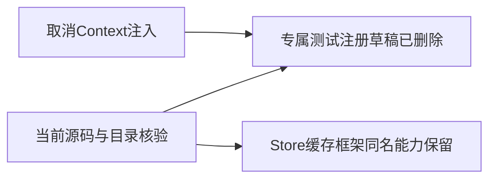
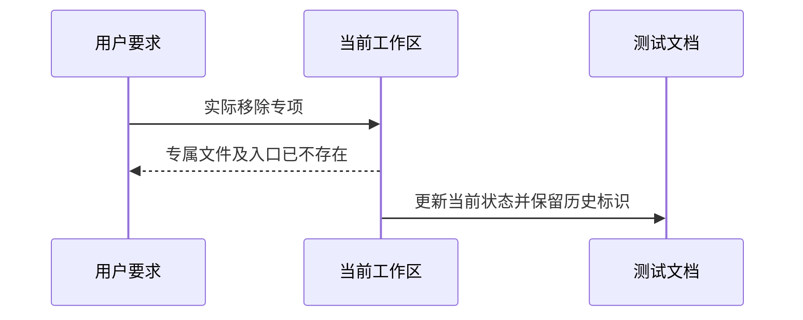

# Context测试移除复核

## Intent：最终目标

执行用户“context特性取消了，应该移除context相关测试”的最新要求，实际移除专项而非仅停用。

## Data：当前证据

实现会话的《移除上下文注入计划》已记录删除专属测试、注册、草稿、文档和生成产物；本轮重新检查当前文件系统及build.zig/suites.json，Context注入专属测试目录与注册均不存在。扫描全部packages与docs的非Markdown、非日志文件，ContextSlot/context_get/context_slots/context_bindings/context_provider均无匹配。

useContext及<Context宽匹配仅命中zray的React.useContext和tRPC泛型context<Context>，不是被取消的ZX/RX注入功能。扫描原始结果保存在 `/tmp/zxc-context-test-removal-scan.log`。

## Edges：边界与限制

Store编译环境中的context.stores、缓存摘要、预置枚举类型表、Node测试回调context及React/tRPC Context均有独立职责，予以保留。历史执行日志和阶段结论保留为历史，不能据它们宣称当前仍有Context专项。

## Answer：结果与成功标准

当前工作区专属测试、注册、代码草稿已删除；本轮无需再次删除不存在的文件。已修正测试README及覆盖清单中“仅停止、等待移除”的过时当前状态。此次审计未运行任何Context测试，也未为取消特性新增拒绝测试。

## 自我复核

前几轮报告“继续停止”未反映实现会话已完成的实际删除，表述已纠正。不能为了显示删除数量而移除同名但无关的Store/缓存/框架测试。目录审计通过不等于完整根回归通过，未作此推断。
