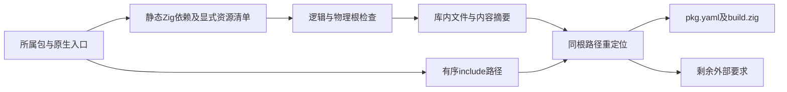
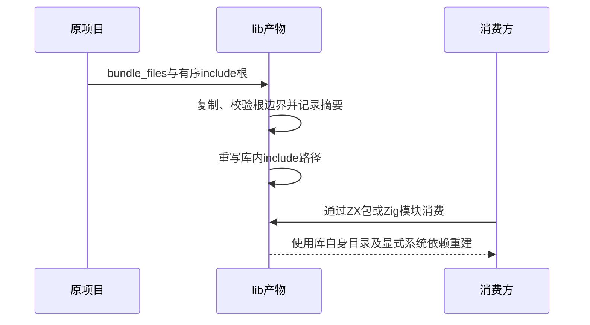

# C 原生库资源搬迁实施计划

## Intent：最终目标

让源码型 lib 能携带明确声明的 C 头文件及配套资源，在删除原项目后仍可被 ZX 和 Zig 消费。保持原 include 搜索顺序和目录关系，不通过回指原机器目录伪装可搬迁。

## Data：可用证据

现有 native_sources 已复制 Zig 静态依赖及 bundle_files，并记录哈希和 watch 输入；但纯 header 模块未调用该收集器，bundle_files 被忽略。library 将 include_paths 保存为绝对路径，生成 build.zig 使用 cwd_relative，不能表达依赖包根下的相对搜索目录。

app 的后端 file_system_inputs 已能观测实际 C 依赖；它只反映当前目标和预处理条件，不能证明另一个平台的头文件集合完整。已有配置中的 bundle_files 是显式资源清单，可作为可搬迁 C 资源的声明边界，无需另写不完整的 C 预处理器。

## Edges：边界与限制

Zig 模块的 bundle_files 继续相对其入口所在目录；纯 header 模块的清单相对所属包根。按清单复制所有资源，保留完整相对路径；清单必须覆盖需要随库交付的传递和条件头文件。系统 SDK 和系统库仍是外部要求，不擅自复制。

纯 header 模块只有在提供 bundle_files 时才启用资源搬迁；未声明的模块保留显式外部依赖。已打包资源根内部的 include_paths 改写到库内，根外路径保留并记录为外部要求。列表顺序不变，不合并同名目录，不按文件扩展名猜测 C 资源。

沿用逻辑与物理根边界检查、文件摘要、watch 输入和发布一致性门禁。绝对 C 头文件入口不能在保持原字符串时宣称已经搬迁；需要在资源清单可定位的范围内明确处理，否则报告不可搬迁。

不新增测试、不运行全量测试。验证使用既有库构建回归及已有 C 调用材料；不把当前平台成功外推为所有目标 SDK 均已具备。

## Answer：交付格式与成功标准

正式实现共用的原生资源收集、纯 C 清单接入、有序 include 路径重定位及 library.json 外部要求记录。生成的 pkg.yaml 和 build.zig 使用同一份重定位配置；Zig dependency 消费以库根解析相对路径。

成功标准是已有资源规则不退化，声明的 C 文件确实写入产物并具有摘要，输出配置不再引用它们的原始搜索根，并保存实际消费结果与能力边界。

## 实施细节

- bundle_files 同时支持文件与目录，递归文件清单经过排序，沿用逻辑与物理根边界检查。纯 C 模块的入口保持 header，不生成虚假的 Zig 源路径。
- include 路径按各原生模块的所属包解析。一个搜索根包含打包资源时，必须完整覆盖其中的文件，才能改为库内路径，避免遗漏同名头文件后悄悄改变搜索结果。
- watch 的资源目录使用完整目录项摘要；工作区发现继续使用原来的目录摘要规则。快照刷新保留观察模式，能够看到新文件和删除事件。
- 旧产物的 bundled_files 提供清理所有权。只清理 native 下不再发布、物理位置仍位于输出根、普通文件类型且 SHA256 未修改的文件；清理时核对本轮输入集合。普通 lib 编译同样采集输入。
- watch 先核对待写路径与退休资源，再复制新文件、清理退休资源，最后发布 library.json。未登记用户文件保留；这不保证整个目录在文件系统失败时原子回滚。

## 自我批判

资源清单覆盖的是用户声明的文件集合，不是跨目标 C 预处理闭包证明；系统 SDK、外部搜索根和链接库仍需消费方提供。目录完整性约束可能要求多交付一些未使用文件，但能保留搜索语义，不靠猜测扩展名裁剪。资源符号链接只允许文件且目标在根内，不能承诺保留任意链接拓扑。

早期实现只观察子目录，漏掉新建资源文件；随后实际 watch 删除验证又发现旧头文件留在产物中。这两处均从输入摘要及产物所有权边界修复，不以固定文件名特判。清理采用上一版清单，因此无法识别旧版本曾经遗漏登记的历史垃圾文件，也不会猜测删除用户文件。

## 验证记录

1. CLI 最终构建 `zig build --summary all`：17/17 步骤通过。
2. 既有 `test-build-modes` 与 `test-watch-library`：12/12 步骤通过，包括 app、ZX/Zig 搬迁消费、72 次聚合引用调用、25 个原生调用输入、264 次压缩独立对照调用，以及 watch 失败恢复与用户文件保留。
3. 使用已有 C 头文件示例，声明整个 include 目录。最终 watch 实际新增 copied.h 后清单和产物均出现该文件；删除源文件后，两者均移除该条目。native 下未登记的 user_owned.txt 内容保持不变。
4. 将原项目路径移走并将 lib 移至新目录后，分别用 ZX 和 Zig dependency.module("library") 构建消费程序，7 → 9、2.5 → 4.5。再次导出后移走第一份库，第二份库重新构建的 ZX 程序仍得到相同结果。
5. 14 个本轮 Zig 文件通过 zig fmt --check；本轮 diff 通过空白检查。未新增测试文件，未执行全量测试或浏览器确认。

[实际消费结果](C原生库资源搬迁/验证/消费结果.json)、[库清单](C原生库资源搬迁/验证/库清单.json)、[示例](C原生库资源搬迁/示例/pkg.yaml)及[实现快照](C原生库资源搬迁/实现/)随本记录保存。

现有测试材料中把纯 header 配合 bundle_files 视为非法的旧负例已与新契约不符；该材料由另一个测试会话维护，本轮未修改。当前机器验证不代表其他系统的 C SDK 已具备。
