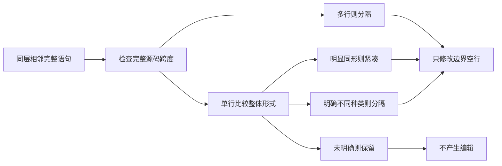

# GCS 空行规则对齐实施

## Intent：最终目标

以用户指定的本地 gpu-code-spacer/rules.md 为依据，使 ZX lint 比较同层相邻完整语句的实际形式，保留相似单行组、分隔多行表达式，避免按语义职责或宽泛 AST 分类机械分组。

## Data：可用证据

- 权威输入：`/Users/xiewendao/Documents/MatrixAges/gpu-code-spacer/rules.md`，已完整读取。其多行示例明确在 waitersUpdater 多行赋值前后留空行，本地内容优先于远端快照。
- 当前 spacing.zig 将所有连续 constant/destructure 压紧，不检查多行范围；任何非声明之间总插空行。两处都不足以表达完整形式。
- ZX 没有 Java 的任意赋值、无初始化局部声明或普通表达式语句；不能硬编码 Java 类型、变量名或案例作为 ZX 判定规则。

## Edges：边界与限制

- 只改完整语句之间的空白；保留缩进、非空行字节、注释和字符串内部、表达式内换行及 LF/CRLF。
- 同一物理行内的多个语句不拆行；块首尾不为“周围空行”额外插行。
- 多行语句一定分隔。单行声明不能只按外层标签合并；明显同形的表达式忽略绑定名、普通类型名和方法名差异。不同结构但未获规则明确判断的组合保留现有间距，不发明相似度分数或类型白名单。
- 原有导入区、类型声明区与函数分区保留；GCS 的 Java 字段示例不足以要求合并 ZX 的所有公开类型声明。
- 不修改 GCS 数据集，不新增测试用例，不使用浏览器 UI。用既有格式回归和实际仓库源码检查幂等及非空行不变。

## Answer：交付与成功标准

在 lint 中分开“语句是否同形”和“应用空行编辑”：判定返回分隔、紧凑或保留三种结果。多行判定基于完整 Statement.span；注释仍由现有边界规划负责。编译与 fmt 共用 edits，不能各自维护规则。

相同单行声明的形状比较覆盖标量/解构左侧、类型表达形式与右侧结构。标识符、字面值内容及成员名称不参与身份判断；参数数目等局部差异不作为自动拆组理由。对没有明确匹配证据的组合保持原状，比把所有 const 当作同形更接近规则要求。

## 实施与验证

- `packages/lint/src/shape.zig` 承担完整语句形式判断；`spacing.zig` 继续负责注释边界、换行与编辑应用。
- 只读扫描 250 个 ZX 文件，其中 72 个文件需要空行调整。另有 9 个 `.d.zx` 原生接口声明不适用于普通程序的 fmt 解析入口，本次未改动。
- 72 个文件实际调整后，逐文件验证非空行完整字节序列一致，并再次格式化确认幂等。主要变化是标量声明与解构声明之间增加分隔；未改动输入、预期值或测试逻辑。
- 同步调整集合、字符串集合和 Store 的既有生成器，防止重新生成时恢复旧布局；未新增测试用例。
- 用既有 collections 源码的临时多行变体检查 LF、CRLF、行尾注释及后续独立注释；非空行字节和幂等验证均通过，临时目录已清理。
- CLI 分发构建、Zig 格式检查、相关文档和 TypeScript 的 Prettier 检查通过。完整仓库回归通过：979/979 个构建步骤、53,356/53,356 个测试成功，包含真实 Z3 验证及现有生成目录检查。

## 自我复核

GCS 文件包含人工判断约束，不能把新算法包装成模型输出的逐字复刻。实现只把有明确依据的规则作为门禁，保留未确定边界；后续具体人工反馈应继续校准，而不能通过堆积文件名或变量名特例修正。
