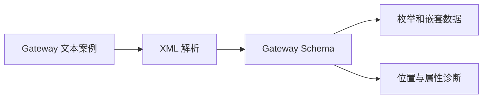

# Gateway 真实文本契约验证

## IDEA

- Intent：覆盖 Gateway、Group、Route 的真实文本 Schema 契约，补充公开枚举、字段约束、嵌套与资源失败验证。
- Data：当前 gateway 标签定义与已有 AST 测试；五种 protocol、九种 method；真实 XML 解析及单文件校验接口。
- Edges：不推断监听端口、网络协议适配、HTTP 路由冲突检查或 service 目标装载已执行。文件名和根节点需要匹配。Schema 允许协议和 method 缺省，不擅自收紧契约。
- Answer：独立命名测试、测试分配器失败注入、现有文本专项登记及实际验证结果。所有 Schema 负例先确认 XML 正确。

## 执行计划

1. 草稿编写五协议、九方法的精确枚举解码测试。
2. 补充字段、非法子节点、服务引用、根文件身份和嵌套数据断言。
3. 对合法与非法真实文本执行分配失败检查，运行文本专项并同步覆盖记录。

## 架构

## 数据流

## 执行结果

新增 46 个独立命名 Zig 测试：14 个协议/方法枚举解码、26 个结构拒绝、1 个嵌套及 XML 实体解码、1 个双缺省值、2 个文件根类型拒绝、2 个逐次分配失败测试。

`zig build test-rx-text --summary all` 退出 0，15/15 步骤、85/85 测试通过，日志 `/tmp/zxc-gateway-text-final.log`。两条资源测试分别覆盖合法嵌套文本和先解码合法 Route 再遭遇非法 service 的路径。Zig 测试分配器同时检查泄漏。

格式、diff 与草稿一致性检查通过。无生产源码修改，未发现需要通知实现会话的新缺陷。JSONL 仍为 57,745，上游仍为 328/53,597；最近完整根回归为阶段 90。本轮仅运行相关文本专项。

## 自我批判

- 五协议与九方法只验证 enum 解码，没有发送网络请求，不能声明对应网络适配器工作正常。
- relative service 文本保留不证明路径已解析到文件；父目录引用的项目边界属于集合装载职责。
- 当前 path/prefix/listen 的测试以已有非空字符串契约为边界，不假造尚未实现的 HTTP 地址或路由语义。
- 分配失败遍历只覆盖两种固定结构的分配轨迹，并非所有输入的内存安全证明。
- 本轮增加自有特性覆盖，没有增加 Test262 审阅进度，整体目标仍未完成。
