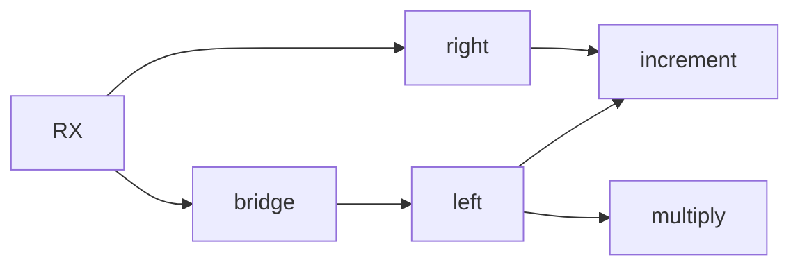
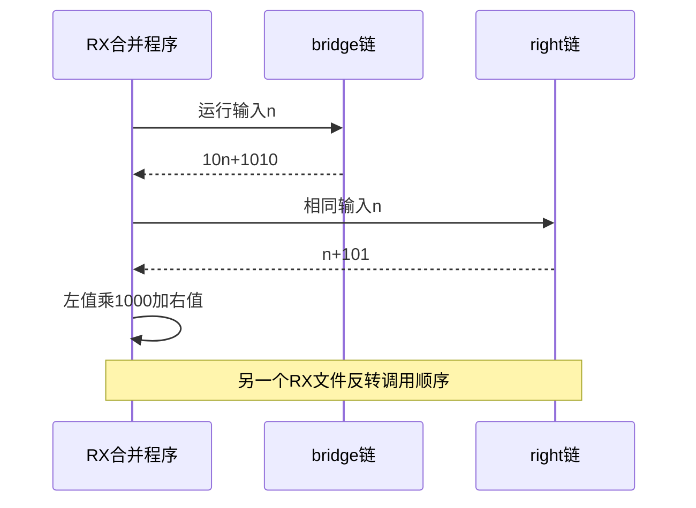

# RX共享依赖函数执行验证

## Intent：最终目标

阶段252：验证RX合并多个ZX程序时，内部函数编号重映射在共享依赖、多层导入及调用顺序改变后仍正确。

## Data：可用证据

program/builder.importFunction复制每个callee.functions并设置编号偏移；阶段251仅多次导入无依赖函数，未覆盖内部函数引用。现有真实运行构建可复用。

## Edges：边界与限制

构造两个callee共享increment，其中一个经bridge→left→increment/multiply形成两层导入。两种RX调用顺序共用独立运行预期，不修改生产实现，不宣称跨RX service调用已支持。

## Answer：交付与成功标准

正序与反序各三个输入，经真实XML、IR合并、Zig生成编译执行，结果严格一致且符合10001*n+1010101。三输入0/1/7作为不同运行数据，六项独立运行检查，不增加Test262或JSONL计数。

## 实际结果

`test-rx-runtime`：18/18步骤、16/16运行测试通过，其中新增两种依赖导入顺序各3项共6项。n=0/1/7分别得到1010101/1020102/1080108，正序反序一致。构建分别生成两份不同XML流程对应的Zig程序，共用同一组独立数值断言；并非把同一程序重复运行计数。

增设left/right/bridge三个ZX函数fixture，left调用increment和multiply，right共享increment，bridge调用left。编译工具以显式模式枚举选择五种RX文本，未知模式报InvalidMode，避免新增模式误落到旧fixture。现有10项运行测试随工具变动一起重跑通过。

代码与fixture、构建草稿、日志及builder实现SHA归档。格式与本次README diff检查通过。独立RX运行测试由10增至16，自动契约仍30；JSONL64,145及Test2621,047保持不变。结果已通知实现会话，无新缺陷。

## 自我批判

非交换的嵌套运算使错误callee编号或调用次序更容易暴露，但这些标量结果并不能证明原生模块表、聚合类型编号、错误路径和所有权映射都正确。六项属于不同流程/输入组合，不把共享依赖数量或内部函数数量作为额外案例。没有全仓回归或生产修改。
