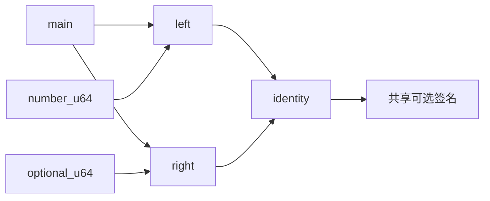
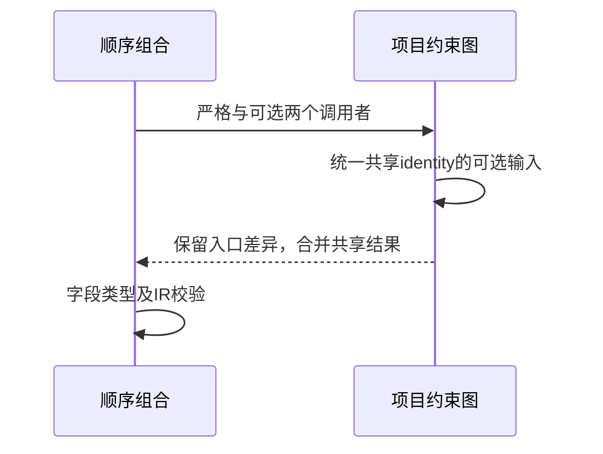

# RX共享服务可选约束顺序验证

## Intent：最终目标

阶段277：验证菱形共享服务同时接受u64与u64?时，推导与调用顺序、模块登记顺序无关。

## Data：可用证据

入口number与optional两个ZX签名约束输入，left/right两个RX模块共同调用identity透传模块。共享identity需要接受可选输入，两侧结果均为u64?。所有XML真实解析。

## Edges：边界与限制

只有四个顺序组合：调用前/后×登记前/后，不宣称四模块全部24排列。检查类型和联结IR，不把推导通过称为实际运行通过。

## Answer：交付与成功标准

四组合均保留入口number:u64、maybe:u64?，输出left/right:u64?且IR有效。独立验证通过后纳入正式测试；发现问题才通知实现会话。

## 实际结果

独立4/4步骤4/4测试通过，正式纳入project/diamond/optional_test.zig及六个fixtures；正式test-rx-inference构建4/4步骤62/62通过。入口对象两字段分别u64/u64?，输出两个字段均u64?，字段名和对象字段数量均检查，完整IR验证通过。

格式和本次diff检查通过，独立/正式日志及验证后project源码哈希保存。没有新实现问题，未向实现会话发送通过消息。独立RX推断62、运行55；JSONL与上游审阅数保持不变。

## 自我批判

共享服务只有一个统一签名，两个调用者结果均变为optional是本次验证的契约，不应假定编译器按每次调用进行泛型特化。四组合覆盖两个独立顺序因素，并非四模块所有排列；尚未测试共享服务的实际null传递、返回所有权或运行错误。没有生产修改、全仓回归或UI验证。
