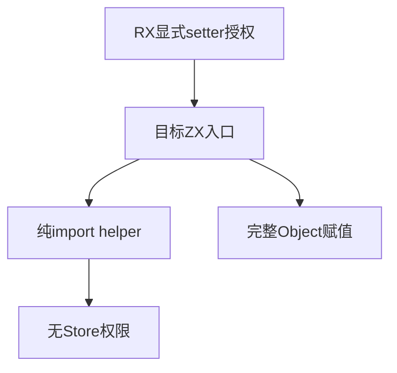

# RX函数状态权限隔离验证

## Intent：最终目标

验证Call.setter只授权目标ZX函数，不传给普通import；授权同时要求显式第二参数且只允许完整对象写入。

## Data：可用证据

modules/project.zig仅对entry注入context.stores；analyzer拒绝无授权的setter参数；store.read检查readable，writeSlot检查完整Object路径。当前RX call/target.zig为setter注入write-only handle。

## Edges：边界与限制

保持同一真实RX和Store定义，改变最小ZX函数片段。正例是纯helper计算新值、入口负责写入；反例分别尝试helper写/读、入口直接读、漏参数、字段赋值和缺字段对象。检查诊断文件与类别，本批不宣称精确源码位置覆盖。

## Answer：交付与成功标准

七项功能边界和两项逐分配失败检查，完整推导专项通过；正例校验生成IR与单槽。失败路径必须释放输入构造、XML与推导结果。

## 自我复核

必须保留纯helper正例，避免靠禁用所有import通过负例。写权限不包含读权限，完整对象赋值不等于字段原地更新；分别测试，避免错误原因相互遮挡。

## 首次夹具路径复核

首次132项中124通过、8失败，实际module拒绝先于权限检查。夹具将RX Call可省略扩展名的习惯误用于ZX普通import；既有bridge/left/right使用完整.zx路径。已将import改为./helper.zx，保留首次日志；不把尚未到达授权阶段的失败当作实现缺陷，也不放宽诊断断言。

## 阶段310最终结果

修正路径后完整推导退出0，4/4步骤、132/132测试通过，净增9项。纯helper参与计算且由入口完整写入的正例成功；helper写/读均没有继承调用权限，入口write-only handle不能读，缺第二参数/字段写/不完整对象分别在正确文件拒绝。成功和helper权限拒绝的逐分配失败检查通过。

Zig格式与diff空白检查通过，没有生产实现缺陷或通知。首次module失败与最终权限验证日志分别保留。普通import隔离通过不代表RX跨服务权限或原生宿主持久化已验证，本批保持边界。
