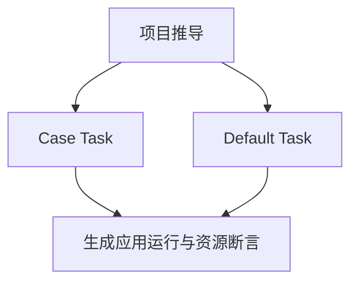
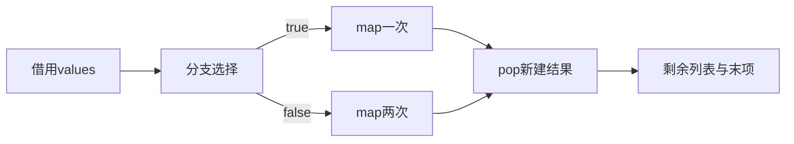

# RX分支所有权执行验证

## Intent：最终目标

验证Case/Default中的Task返回新建列表，跨服务调用和pop后的结果拥有正确生命周期；原始借用输入在成功和分配失败路径均保持不变。

## Data：可用证据

复用现有map_values.zx（每项加一）及owned_service_test.zig的arena、输入副本和逐分配失败断言。Case调用服务一次，Default调用两次；两分支同名ctx.items，各自作用域独立。

## Edges：边界与限制

不引入生产特殊分支。不只校验结果元素，还检查非空返回列表不与输入共用指针。每条路径分别执行空/单项/多项/安全整数边界和分配失败。此处不证明所有别名图或任意嵌套深度正确。

## Answer：交付与成功标准

草稿在同日分支所有权目录，正式夹具和断言位于packages/test/tests/rx/runtime。10项新断言通过、完整RX专项保持成功；失败保留日志并区分测试接线与实现问题。

## 自我复核

每条分支应有不同可观测结果以防选择错误被掩盖；最大值输入按实际加法次数减少，不制造预期外溢出。输入副本由外层testing allocator管理，生成程序由注入失败的arena管理，失败时也核验输入。

## 阶段296实际结果

首次命令误在仓库根请求仅测试包提供的test-rx-inference，构建图未执行；改在packages/test运行完整RX专项，退出0，82/82步骤、211/211测试通过（运行126、推导85）。新增10项，包括两条分支各四组值断言与一项逐分配失败检查。原始命令错误与正式日志均保留。

两条路径都正确返回新建列表pop结果，原始输入保持不变，非空剩余列表与输入指针不同；生成代码执行的逐分配失败检查通过。没有实现缺陷，未发送消息。普通列表pop通过不代表其他聚合操作或多层别名关系已完成验证。
