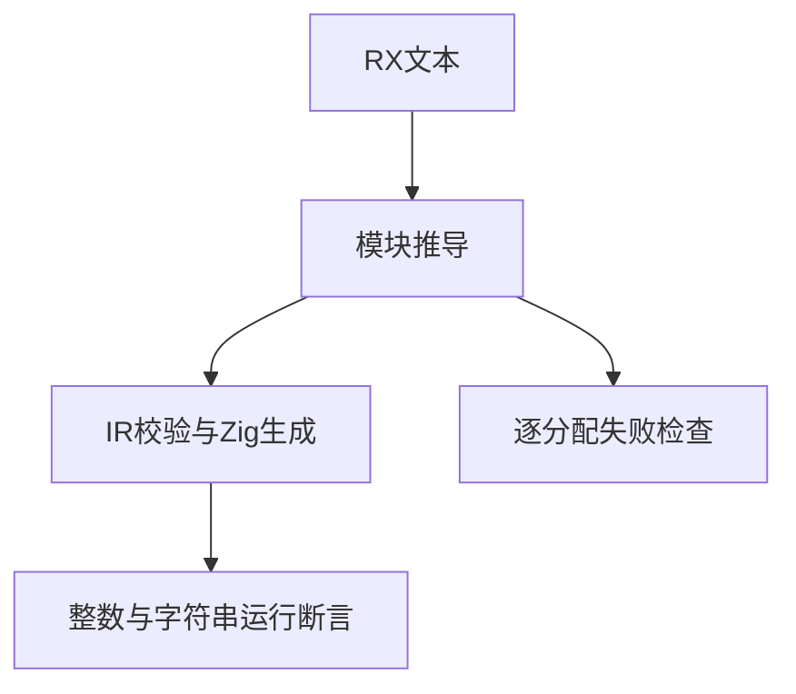
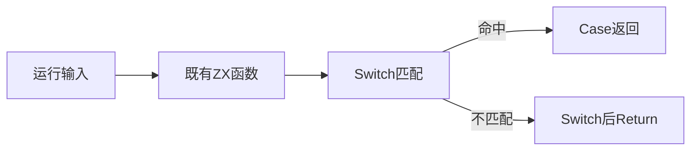

# RX分支续行与资源验证

## Intent：最终目标

验证无Default时的整数与字符串匹配、未匹配继续执行，以及控制流推导成功和失败过程的资源释放。

## Data：可用证据

RX公开契约规定Switch只执行选中分支，无匹配时继续后续步骤；字符串按ZX字面量匹配。复用已有increment.zx与text.zx约束输入，运行夹具真实解析、生成并执行。

## Edges：边界与限制

不将重复专项计为新增案例；不改生产实现。字符串使用空串、Unicode、XML实体、长度与大小写差异及内嵌NUL检验内容比较；未覆盖所有Unicode规范化，也不声称规范化等价。整数最大subject由安全的max-1输入加一生成。Switch单次求值仍需另行可观察证据。

## Answer：交付与成功标准

草稿和结果保存在本目录，正式案例位于packages/test/tests/rx。13项运行断言与资源失败测试接入后，完整RX专项退出0、无泄漏；按实际日志登记计数。

## 自我复核标准

成功构建不能替代执行结果；正负匹配同时检查，避免仅测试容易命中的常量。资源测试必须使用testing allocator覆盖失败点，普通arena执行不证明分配失败清理正确。

## 阶段295实际结果

完整RX专项退出0，79/79步骤、201/201测试通过：运行116、推导85。净增整数5项、字符串8项，以及成功/作用域错误/重复标签三项逐分配失败测试。格式和diff空白检查通过。没有实现缺陷，未向实现会话发送消息。

本批验证未匹配时能到达Switch后的Return，命中时使用对应Case返回值，UTF8与解码字符串按内容精确匹配；内嵌NUL不会被当成字符串结束。资源测试使用Zig testing allocator逐一注入分配失败并检查释放，不把一次正常执行视为资源证明。未覆盖一般规模任意嵌套流程或生成应用中的所有权分配失败，后续继续补充。
