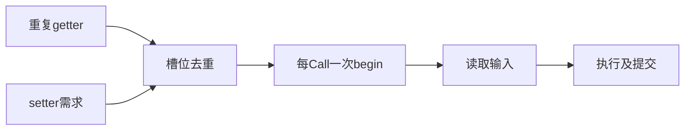
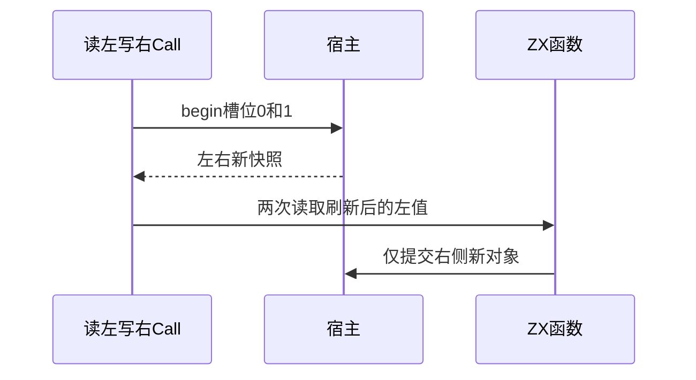

# RX 刷新槽位合并验证

## Intent：最终目标

阶段三百三十二：验证同Call多个getter去重、跨Object读写槽位合并、getter与setter重叠去重，以及没有getter的setter也需要刷新。

## Data：可用证据

begin.zig从store_get常量与transaction调用的Store需求收集槽位。新增真实XML流程包含5个Call：重复读左、重复读左写右、重复读右、重复读右写右、仅写右。预期begin数组依次[0]、[0,1]、[1]、[1]、[1]，每个Call恰一次。

## Edges：边界与限制

在已有dual生成工具增加独立union模式，原isolation夹具继续运行。测试宿主只用于观测生成接口，实际生产持久化不在本批范围。每次选中Object更新到新快照(value+100)，并保留旧值。重复读取的两个字段都应来自同一次刷新。

## Answer：交付格式与成功标准

真实RX/ZX夹具、独立宿主和运行断言，经project.infer、IR验证、生成Zig、实际编译执行。覆盖正常结果、五个刷新失败位置和分配失败。既有RX测试保持通过，并记录任何确定的实现缺陷。

## 自我复核

参数数组逐次精确比较，重复getter与setter不能产生重复槽位或重复刷新。setter-only不能被当作无需Store输入而省略刷新。结果使用独立手算状态，不从生成代码反推期望。

## 验证结果

在packages/test运行新增`test-rx-store-runtime`入口，9/9步骤27/27测试通过（原双Object19加本批8）。完整RX运行专项`test-rx-runtime`随后94/94步骤185/185通过，确认新入口被整体专项依赖。格式及diff检查通过。

五次begin依次精确匹配[0]、[0,1]、[1]、[1]、[1]；输出重复字段同为103与304，两次读取写入结果为204、405，setter-only最后结果为2，旧值3/100与数组保留。五个失败位置均核对已完成的刷新与提交。成功和最后一次刷新失败的分配失败注入通过。

代码只改测试包：dual编译工具增加模式参数并保留旧身份验证，新夹具与新宿主相互独立；没有改生产实现，没有发现需通知实现聊天的缺陷。JSONL仍65194，上游2036已审阅不变；独立RX运行总数185。未重跑完整根回归。

这组流程验证直接Call的槽位合并；嵌套service多槽位非恒等数组映射尚未验证，单槽位映射通过也不能替代该场景。
