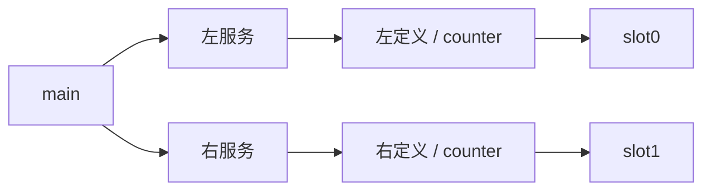
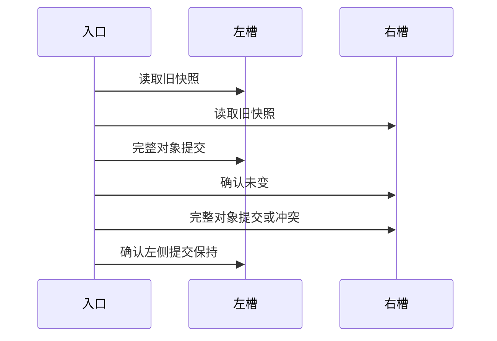

# RX 双状态槽执行验证

## Intent：最终目标

阶段三百一十二：两个不同定义路径拥有相同 Store.name 与 Object.name，验证实际初始化、读写、失败提交与旧快照隔离。

## Data：可用证据

既有单槽执行和项目推导测试未证明双槽提交隔离。本阶段以独立真实 XML 定义、真实 ZX setter 和两个生成初值程序验证。左侧 value=3/history=[8]，右侧 value=100/history=[50]。

## Edges：边界与限制

通过 project.infer 注册不同定义路径；不声明覆盖 CLI realpath 或符号链接。使用显式测试宿主，不代表原生持久化、并发冲突检测实现完成。测试宿主只执行槽位更新并注入指定次序的冲突。

## Answer：交付格式与成功标准

测试按 store/dual 子目录收口。生成应用必须包含两个不同身份的槽位，两个初值均执行；验证写左不改右、随后写右不改左、第二次冲突保留左侧提交，以及完整对象和列表旧快照不变。逐分配失败覆盖成功及后续冲突路径。实际运行 `cd packages/test && zig build test-rx-runtime --summary all`：90/90 构建步骤、153/153 测试通过，其中本阶段新增九项。完整日志见 RX双状态槽测试草稿/运行回归.log。

## 自我复核

已核对两个真实 Store XML 的 name、Object.name 和字段形状相同，初值不同；推导后显式断言两个槽位身份分别是 store.left.store.rx:counter、store.right.store.rx:counter。应用和两个初值 Program 都通过 IR 校验，再生成 Zig 执行。

九项测试覆盖增量 0、1、7、最大安全增量，两处冲突、成功和后续冲突的逐分配失败，以及重复请求。成功结果还返回旧快照、左侧更新后的右侧未变快照与最终快照，验证 value、history 内容和更新前后列表地址不同。

宿主只按 pending 指定槽位更新，不根据用例输入决定写哪个槽。测试中确定性冲突用于检查调用提交边界，不模拟真实并发控制。文件系统符号链接、规范化物理路径和持久化仍未覆盖。本次仅改测试与构建接入，未发现生产实现缺陷，未发送实现消息。格式化及本次 diff 空白检查通过，未重新执行完整根回归。
