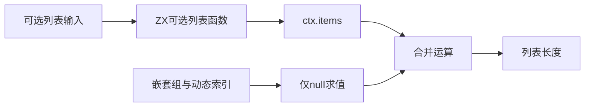
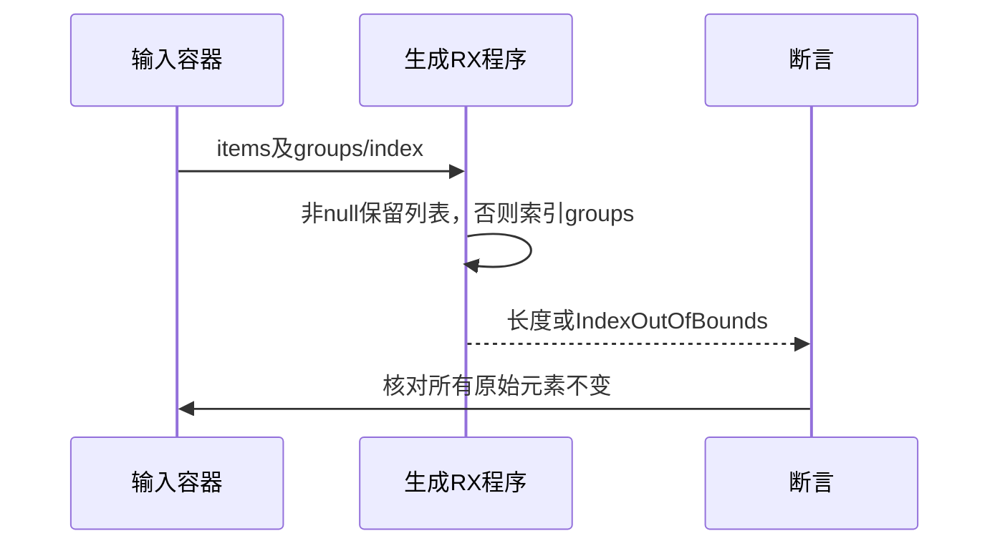

# RX可选列表与嵌套合并执行验证

## Intent：最终目标

阶段273：验证RX可选列表跨函数调用、null与空列表区分、合并右侧嵌套列表索引及错误传播。

## Data：可用证据

沿用已通过的可选标量真实运行结构，函数输入输出改为u64[]?，Return为(ctx.items ?? $in.groups[$in.index]).length。需要推导嵌套列表、动态索引及可选聚合ABI。

## Edges：边界与限制

已有空列表是有效值，不能触发fallback。仅null允许读取groups[index]。全部输入在运行前复制比较，不能消费借用容器。没有声明对象可选或服务模块行为已覆盖。

## Answer：交付与成功标准

7个真实运行场景覆盖空/非空已有值、最大未选索引、null选择空/非空列表、动态第二组和越界错误；完整RX运行套件通过。若推导/生成/执行失败，保留并通知实现会话。

## 实际结果

完整test-rx-runtime构建36/36步骤47/47通过；新增7项检查了空列表为有效已有值、非空值跳过最大索引、null选择空/非空fallback、第二组索引及两种越界传播。使用真实生成ABI与程序，所有输入列表元素运行前后深比较不变。

期间生产实现由对应会话完成有向赋值重构并提交742fa9df3dff8a1dcf41c8c5505b59d7f01bf760。旧coercion.zig已移除，采集哈希时识别到路径变化，改为保存当前inference目录全部文件的验证后快照；没有用缺失文件推断构建失败。由于实现改变，额外跑test-rx-inference，4/4步骤49/49全部通过。

格式及本次diff检查通过，日志与正式测试草稿保存。JSONL与Test262计数不变，独立RX运行47、推断49；结果已同步实现会话。

## 自我批判

该测试同时穿过可选聚合ABI、nested list推导、短路生成及索引错误传播，但不覆盖多层optional或对象字段协变。验证后哈希只用于标识观察到的实现，不冒充构建系统的完整依赖锁。项目级服务推导仍由实现会话开发，不从本轮成功外推已实现。没有修改生产源码、全仓回归或UI验证。
