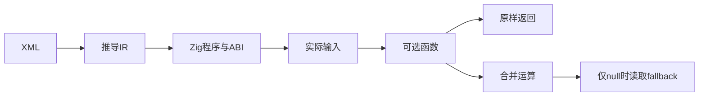
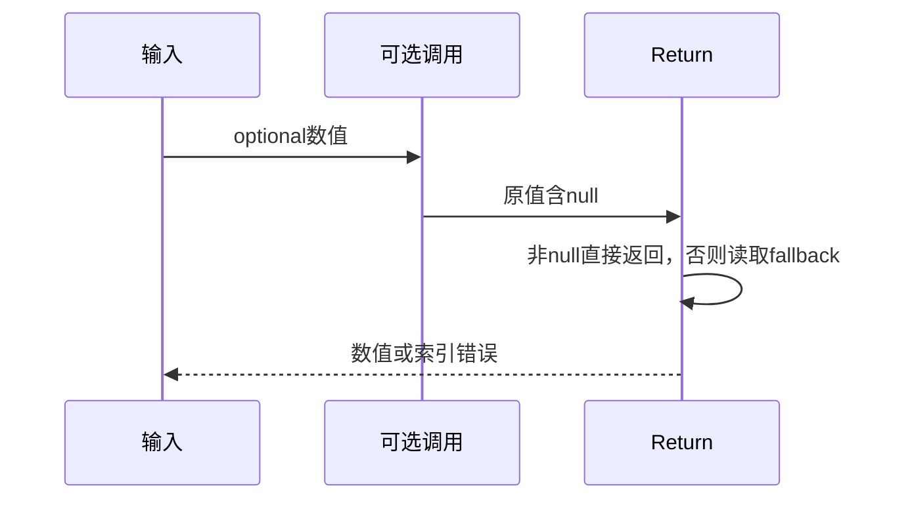

# RX可选调用与合并执行验证

## Intent：最终目标

阶段272：把RX可选签名验证推进到真实生成代码执行，检查null保留和合并运算的短路及错误传播。

## Data：可用证据

已有RX runtime工具运行parseXml→module.infer→validateIr→emitBundle，生成ABI和程序后编译Zig测试。沿用conditional测试对输入列表前后比较的方法。

## Edges：边界与限制

只验证顺序Call.fn/Return路径，不外推服务模块联结。仅当null触发fallback索引时允许IndexOutOfBounds；0必须是已有值，不能当作null。使用实际运行输入，不能预计算返回常量。

## Answer：交付与成功标准

可选原样返回3项：null、0、u64最大值；合并6项：已有值跳过空fallback、null取fallback、null空fallback报错及0/极值保留。完整RX运行套件通过，列表输入不被修改。

## 实际结果

新增9项全部通过，正式test-rx-runtime总计33/33构建步骤40/40运行测试通过。可选原样返回null、0、u64最大值；合并路径在0/41与空fallback组合时成功，证明不提前执行索引；null分别读取7和0，空列表时准确报IndexOutOfBounds，最大值覆盖不同fallback仍保留。

列表fallback每例保存前值并在运行后比较。新的两个XML及optional_number.zx均通过编译工具embedFile纳入依赖追踪；正式工具仍仅接受显式枚举模式。Zig格式及本次diff检查通过，完整日志、测试草稿和实现哈希已保存。独立RX运行40项、推断49项；JSONL与Test262审阅计数保持不变。

## 自我批判

成功执行支持实际可选ABI与短路结论，但未覆盖多层可选包装、对象/列表可选值或跨模块服务调用。不把生成成功当成执行成功，也不把当前单模块结果外推为实现会话正在开发的求解器完成。没有新增生产逻辑、全仓回归或UI验证。
