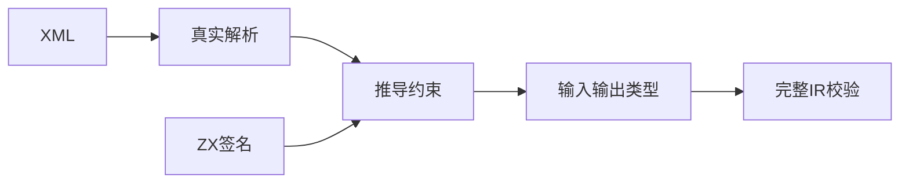
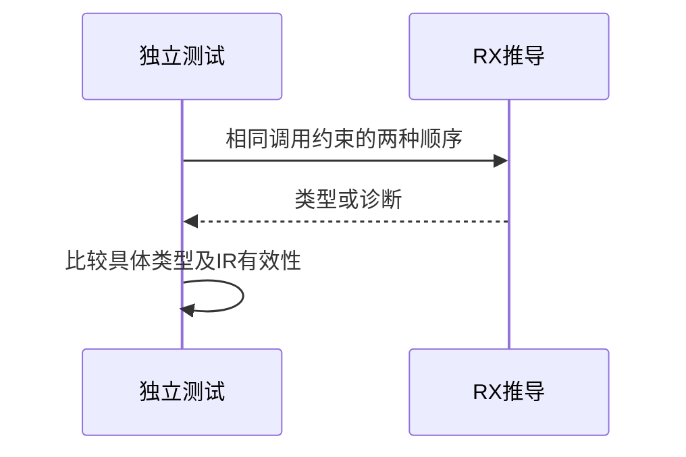

# RX可选赋值推导顺序验证

## Intent：最终目标

阶段271：为实现会话正在完善的有向赋值约束建立独立顺序对照。相同输入同时用于u64与u64?调用时，应推导u64且不依赖调用顺序。

## Data：可用证据

实际XML parseXml→analysis.module.infer；现有ZX固定签名number/optional/text作为外部约束，检查输入输出类型和最终IR。实现会话当前正在修改底层等价类与可选层数求解，不能从计划推断已经完成。

## Edges：边界与限制

先在docs独立复现，保留失败；未通过的复现不注册为全包通过案例。不更改生产源码。只检查单模块显式Call.fn赋值，不能代表Call.service全模块求解。

## Answer：交付与成功标准

七项独立对照：只有可选签名、严格先/可选先、字面量包装、可选返回、合并返回、不兼容底层类型。每次真实解析并检查类型，成功时验证最终IR。将具体失败交实现会话。

## 实际结果

独立7/7对照通过，正式纳入packages/test/tests/rx/inference/optional/contract_test.zig及fixtures。正式test-rx-inference构建4/4步骤，49/49测试全部通过。

输入仅受u64?约束时保留optional；同时受u64和u64?约束时两顺序均推导u64；常量7包装合法；可选输出保留包装，??7返回u64；u64?/string?底层不兼容仍报type_mismatch。成功分支均验证完整contract.program IR。独立复现实现哈希和两次结果日志已保存，格式检查通过。

已向实现会话同步测试位置及范围。JSONL64,292、上游1,212/53,597未变化；新增7项为单独统计的Zig API测试。

## 自我批判

最初从coercion局部实现怀疑先见optional会锁定输入，但真实完整推导七项均通过；不能把局部阅读的猜测当缺陷。本轮只证明单模块固定ZX签名对照，不覆盖服务模块跨调用者求解、嵌套optional层数或容器构造传播。生产求解器仍由实现会话修改，测试成功不代表其未完成设计已经落地。没有生产改动、全仓回归或UI验证。
