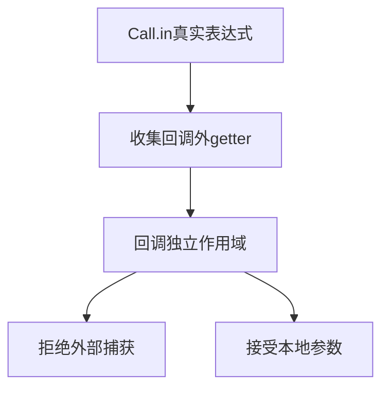
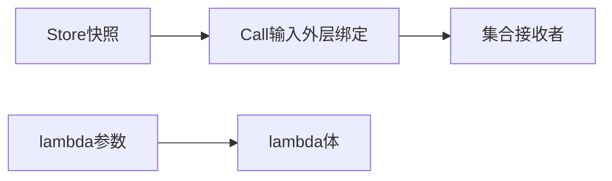

# RX回调状态隔离验证

## Intent：最终目标

验证Call.in的临时Store getter不会成为回调可捕获变量，同时不错误禁止回调中的同名局部参数。

## Data：可用证据

当前563bacc，getters.contains跳过lambda；推导和ZX集合分析在进入回调时设置scope floor。既有权限测试只有普通表达式，未覆盖外层先出现getter后回调再次引用的组合。

## Edges：边界与限制

保留真实Store定义和Call.in，使用列表/对象输入函数避免类型不匹配先掩盖捕获问题。只验证推导与IR，不宣称本批执行生成程序。普通ZX导入权限另行验证。

## Answer：交付与成功标准

五项：纯回调捕获拒绝、外层已用getter后捕获拒绝、getter作为集合接收者合法、同名store局部参数合法、外层getter加同名局部参数合法。负例核对name及精确原文位置，正例校验槽位与IR；完整推导专项通过。

## 自我复核

必须同时有外层getter存在的负例与局部参数同名的正例，不能通过禁止所有store文本来让测试通过。

## 阶段309实际结果

五项新增全部通过，完整推导4/4步骤、123/123测试通过。外层已有getter仍不能被lambda捕获，普通同名store参数在有/无外层getter时均合法。没有实现缺陷或消息。

本批只证明推导隔离与IR合法；未执行新生成应用，未重跑完整根。
