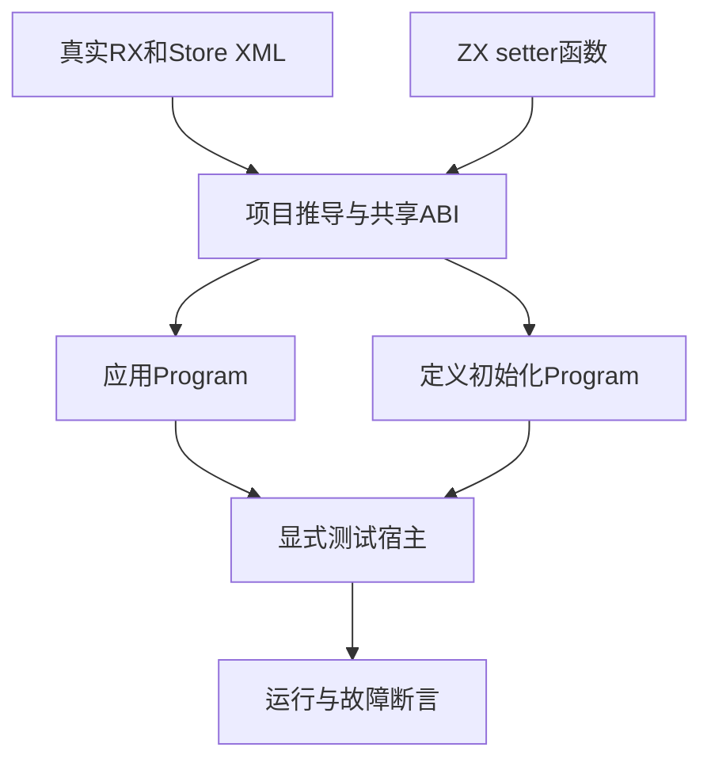
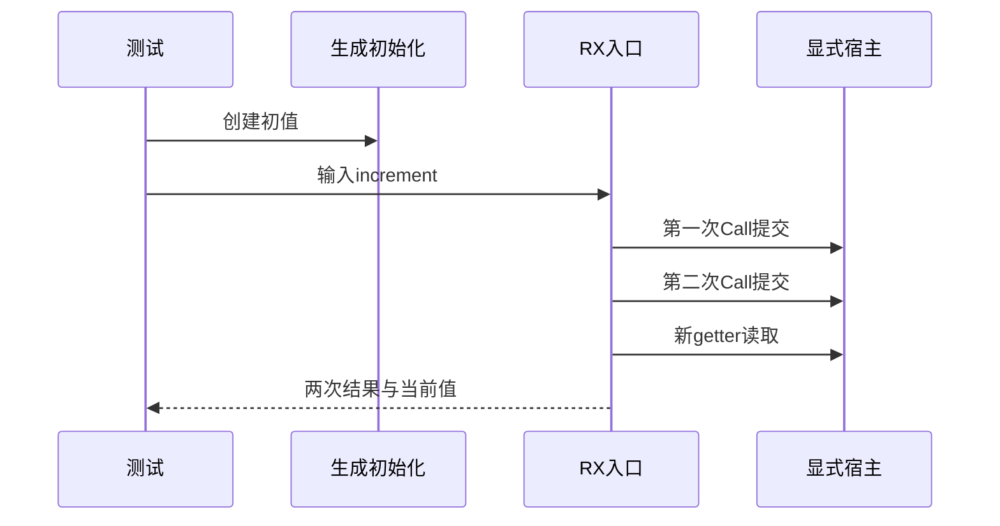

# RX声明状态联结执行验证

## Intent：最终目标

为新实现的Store声明、getter/setter和跨服务调用建立正式生成执行测试，验证物理身份共享、逐Call提交、冲突边界与分配失败。

## Data：可用证据

当前2d5587d、更新后的RX开发约定与README，以及真实声明示例：main使用outer别名，advance服务使用inner别名指向同一state.store.rx；调用两次写入，再通过getter读取。contract.store_definitions保留可执行初始化Program，显式宿主接收稳定槽位指针和commit(pending)。

## Edges：边界与限制

本批验证源码联结和显式测试宿主，不宣称原生应用持久化或版本管理已经接通。宿主通过确定的第几次提交注入Conflict，只用于测试失败边界；没有任何生产特例。Store初值必须来自真实定义生成的初始化程序，不能由测试手写3替代初始化。

## Answer：交付与成功标准

夹具和独立compile_store工具放在packages/test/tests/rx/runtime/store，复用既有生成ABI和Zig运行链。验证同一物理槽位、初值、零/普通/整数边界输入、第一次/第二次提交冲突、重复请求不重置初值，以及逐分配失败清理。源代码生成与运行通过后记录真实数量，不把草稿计入正式通过。

## 自我复核

测试宿主只能模拟提交边界，不能证明生产持久化、并发冲突或快照深复制正确。正常路径必须恰好两次提交，避免把整个RX服务再当作事务；冲突后检查已提交状态，不只检查错误名称。分配失败中也检查状态与已成功提交次数一致。

## 阶段307实际结果

新增9项全部通过，完整RX运行专项退出0：83/83步骤、135/135测试。编译工具显式检查仅一个物理Store槽、路径为store.state.store.rx:counter、仅一个定义/Object，并分别校验应用和初值IR。初值程序实际产生value=3、history=[8]。

事务函数在每次提交候选中通过map创建新的history，正常两次提交后为[10]，旧初值仍为[8]；重复调用后保留前一次[10]且当前为[12]。首次Conflict保持初值，第二次Conflict保持第一次提交。正常和第二次冲突路径逐分配失败通过，任何OOM时状态都与已成功提交次数一致。

格式与diff空白检查通过。没有实现缺陷，未向实现会话发送消息。此处宿主与请求共用测试arena保留旧版本，仍不能推断生产请求回收、并发冲突或持久化完成；下一批补授权和作用域诊断。
