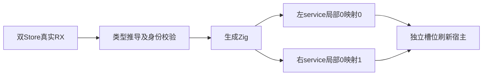
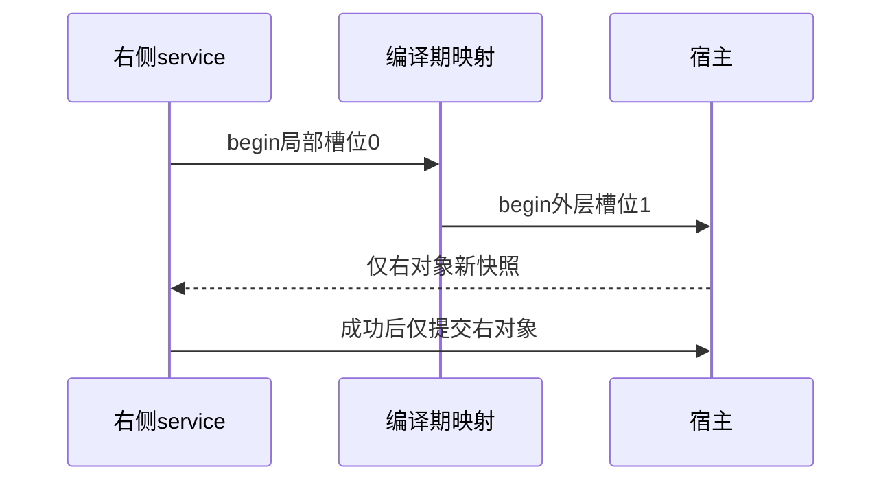

# RX 多对象刷新验证

## Intent：最终目标

阶段三百三十一：检验两个同名Store定义具有独立物理身份，子service局部槽位0能正确映射外层槽位1，刷新只作用于当次选中的Object。

## Data：可用证据

复用dual真实RX/ZX项目：读左、读右、写左service、读右、写右service、读左、读右。已存在编译器测试工具检查两个物理身份与IR，再生成独立程序。预期刷新槽位序列为0、1、0、1、1、0、1。

## Edges：边界与限制

测试宿主每次刷新为选中对象分配新快照并将value增加100；不同刷新次数使旧输入与最新状态可区分。禁止修改另一槽位。测试的宿主行为只模拟外部快照，不实现持久化。保留无begin宿主原9项回归。当前仍不验证同Call多个getter去重。

## Answer：交付格式与成功标准

新建独立刷新宿主和测试，覆盖成功、七个刷新失败位置、成功与失败分配注入。运行RX专项，留存真实生成、运行计数与旧对象验证结果。

## 自我复核

调用顺序与槽位预期来自真实XML，不从生成代码复制。外部刷新值与之前提交值刻意不同，避免缺失begin仍通过。错误路径核对双方保留状态、调用次数和提交次数；分配失败路径按真实arena释放验证，不将测试宿主当生产实现。

## 验证结果

packages/test内执行`zig build test-rx-runtime --summary all`，90/90步骤、177/177项通过。本轮新增10项，dual运行测试由9增至19；独立RX运行总数由167增至177。没有增加JSONL目录数量或改变Test262映射。

成功路径7次begin槽位顺序精确匹配[0,1,0,1,1,0,1]，两个service写结果分别204与401，最后两次读取为304与501；原始值3/100及历史数组仍保持。七个失败位置分别检查已发生的刷新和提交，没有通过统一归零掩盖先前成功效果。成功与第5次失败路径的分配失败注入通过。

无需修改生产实现、无需通知实现聊天；本轮未重跑完整根回归。同Call多个getter去重、getter与setter槽位并集仍需后续专项，不能以七次单槽位begin覆盖这两条规则。
