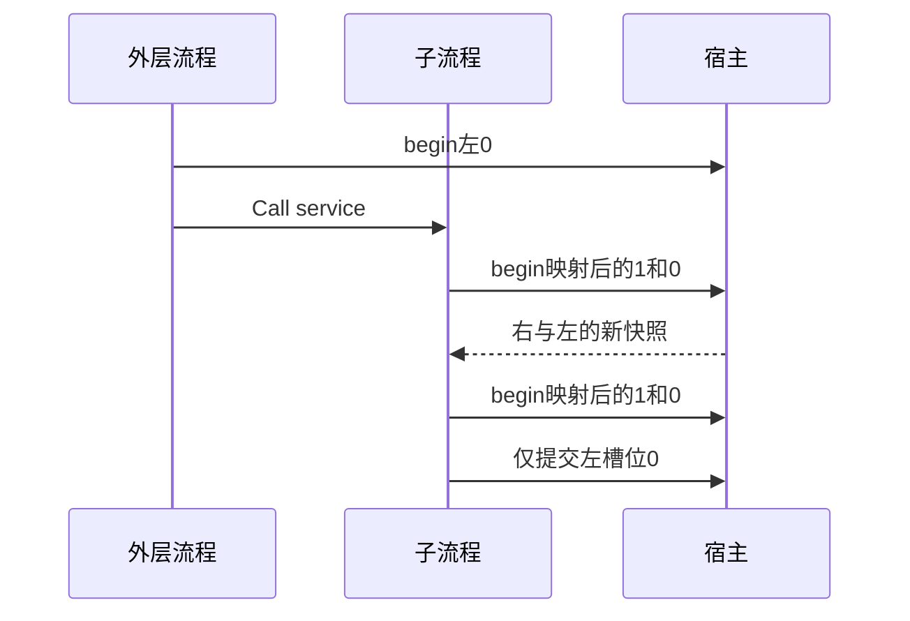

# RX 嵌套槽位置换验证

## Intent：最终目标

阶段三百三十三：验证多个槽位同时穿过service边界时，编译期映射正确处理内外不同顺序，以及额外中间service不会重复刷新或丢失映射。

## Data：可用证据

builder.store按首次实际使用注册槽位。外层先读左，使外层顺序为左、右；子流程先读右和左，使局部顺序为右、左。子流程第二Call读取右并写左，同样需要两槽位。预期外层begin依次[0]、[1,0]、[1,0]。

## Edges：边界与限制

同一子流程通过直接和增加bridge两种调用路径运行。编译工具额外验证IR存在双槽位非恒等映射[1,0]，防止仅声明顺序改变却实际没有置换。仍使用测试宿主观测已有接口，不假设CLI持久化已经实现。

## Answer：交付格式与成功标准

新增真实RX夹具和独立宿主/测试，直接与多层链各检验成功、3个刷新失败位置、成功与失败分配注入。完整RX运行专项通过，文档保存源码及日志。

## 自我复核

运行预期从XML调用顺序独立手算；IR断言只证明确实构造了置换场景，不替代运行断言。中间service不能额外刷新，否则调用计数及数组序列失败。旧输入快照也必须在后续刷新后保持原值。

## 验证结果

Store专项15/15步骤39/39项通过，含本轮6个测试通过2条调用链执行的12项新增验证。整体RX专项100/100步骤197/197通过。IR真实[1,0]映射断言通过，宿主观测到恰好三次刷新[0]、[1,0]、[1,0]，增加bridge未增加刷新次数。

外层旧输入103保持；子流程首次观察右200、左203，随后读右写左得到301；最终左301、右300，旧值3/100和历史数组保持。三个刷新失败位置分别核对先前效果，成功和第三次失败的分配失败注入通过。

首次复用写右函数但在Call授权写左，编译器正确报capability；增加真正写左的配套ZX函数后通过。该错误来自夹具，保留首轮日志，不上报为实现缺陷。不修改生产代码；不向实现聊天发送无问题通知。格式检查通过，未重跑完整根回归。JSONL65194与Test262已审阅2036不变，独立RX运行197项。
