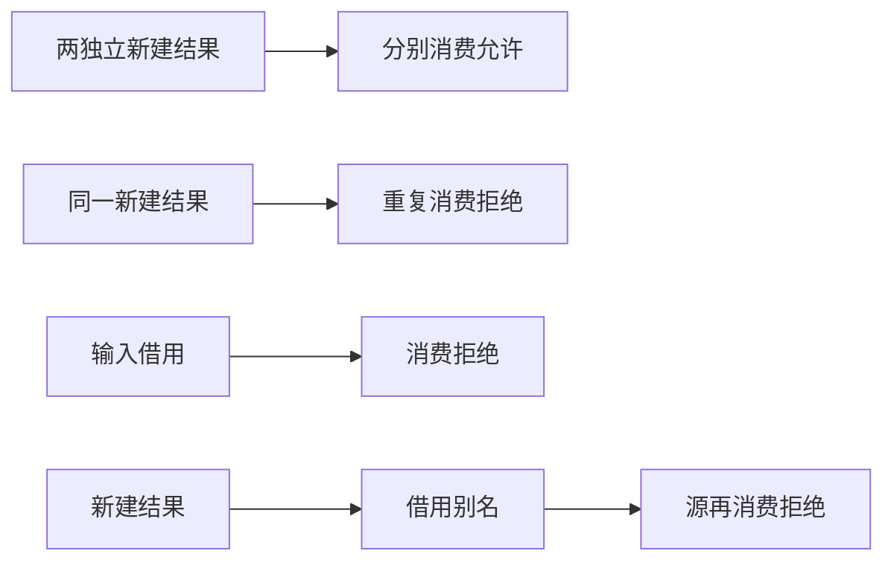
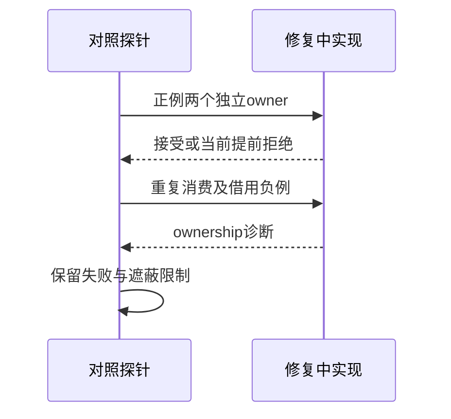

# RX所有权修复边界验证

## Intent：最终目标

阶段256：在阶段255修复进行时建立独立所有权边界对照，防止修复只让单个示例通过却放宽重复消费或借用限制。

## Data：可用证据

实现会话已确认合成环境提前把owned绑定视为borrowed，正在把所有权判断移到完整流程。当前原四项重跑仍3/4，历史失败保留。

## Edges：边界与限制

新增两独立owned可分别pop、同一owned两次pop拒绝、直接$in.pop拒绝、借用别名形成后消费源拒绝。修复前负例可能因第一次消费提前拒绝，不能据此证明整体流程所有权正确。

## Answer：交付与成功标准

与原四项合并形成八项对照。修复完成后必须八项全部通过，之后才接正式回归和运行值验证；当前记录实际通过/失败，不改预期迎合实现。

## 实际结果：阶段255差异已闭环

开始时原四项仍3/4，保持原始失败。随后实现会话落地compileForLinking路径，将跨步骤所有权交给完整Program分析；新增边界与原四项共8/8通过。既有拒绝规则仍由负例验证，未把拒绝改为接受来制造修复。

八项已纳入packages/test/tests/rx/inference/ownership，自动契约38/38通过。新增owned_pop真实运行4项：空输入返回([],none)，[7]先map加一后pop返回([],8)，[1,3,8]返回([2,4],9)，另以多项输入对执行分配请求逐点注入失败。正常及失败后原输入保持不变，清理无泄漏报告。

整体命令test-rx-runtime/test-rx-inference：30/30步骤、69/69通过（31运行、38契约）。由于修复涉及独立表达式编译路径，另跑test-expression-bindings/test-expression-runtime/test-xml-expression：18/18步骤、64/64通过（40绑定、9执行、15XML位置）。这不是全仓回归。

阶段255失败日志保持不变，修复前复查、修复后八项探针、正式回归、独立表达式回归分别归档在同日RX所有权修复运行草稿。源码/构建副本与修复后实现SHA保存。格式和README本次diff检查通过；已通知实现会话完成独立闭环。

独立RX契约由30增至38，真实运行由27增至31；JSONL64,145、上游1,047仍不变，不把docs探针重复计为正式案例。

## 自我批判

修复前的重复消费负例可能被第一次消费拒绝遮蔽；修复后合法owned消费通过，再连同重复消费负例一起通过，才构成有效边界证据。本轮八项未检查所有负例的第二次消费精确span，不扩展到全面诊断定位保证。

实际运行覆盖一份owned列表返回pop tuple，两个独立owner只做分析对照，仍未运行所有嵌套别名组合。执行分配注入只覆盖实际arena底层请求。生产实现由实现会话修改，本会话负责复验与测试。
