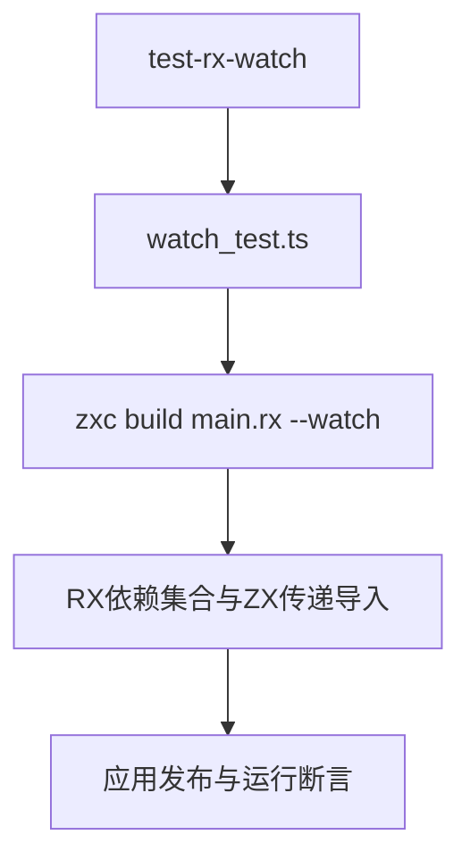

# RX持续构建依赖追踪验证

## Intent：最终目标

阶段285：验证单个RX watch进程自动发现ZX传递依赖修改、RX语义错误与修复、ZX传递依赖删除与恢复，保持失败前应用可用。

## Data：可用证据

当前rx/analyze.zig向collection及ZX sources传递watch Inputs，rx/compile.zig使用observed后端构建与发布。阶段284只覆盖独立build进程，本轮沿用既有ZX watch恢复测试的进程生命周期管理。

## Edges：边界与限制

不把进程存活当成重建成功：每次等待新built标记后运行应用核对结果；错误后核对应用哈希。失败超时保留诊断，发现实现缺陷再通知实现会话。普通RX顺序项目，不涵盖宿主或事件调度。

## Answer：交付与成功标准

新增一个完整watch生命周期测试，独立目标test-rx-watch并接入test-rx-cli。类型检查与专项通过，保存日志、草稿、两图及自我批判。

## 验证结果

`zig build test-rx-watch --summary all`退出0，10/10步骤、1/1 Node生命周期测试通过，约35秒。`npm run typecheck`、`zig fmt --check packages/test/build.zig`及本次diff空白检查通过。结束时watch子进程正常清理。

同一进程先执行helper加3，更新加5后自动重建；RX子模块名称错误时哈希保持，修复并改加8后自动重建；删除ZX传递依赖时哈希保持，恢复为加2后自动重建。每次使用输入0、7、19与独立算式`(input + increment) * 2`核对。

RX CLI累计21项，其中此前20项在阶段284通过，本轮新增watch专项1项通过；未重跑全部CLI组合目标。JSONL登记64,292、Test262上游审阅1,212保持不变。没有发现实现缺陷，未向实现会话发送消息。

## 自我批判

这是单个顺序故障恢复生命周期，未证明并发连续编辑、路径重定向或宿主模块的watch行为。每次在诊断或新发布标记之后验证应用，而非依赖固定等待时长；built标记只用作同步，实际值与哈希才是行为证据。沿用本地成熟watch测试结构，复用项目夹具，未新增通用进程框架。本轮没有进行全仓回归。
