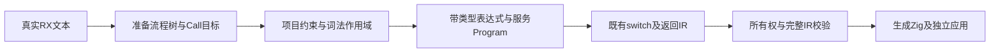
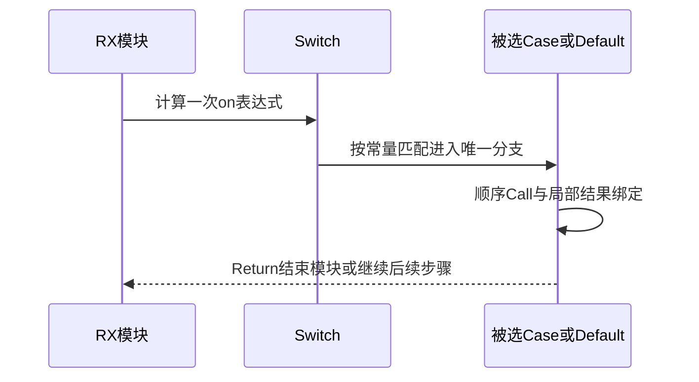

# RX 控制流实施计划

## Intent：最终目标

让真实 RX 文本中的 Task 与 Switch 进入现有项目类型推导、服务联结和 IR 执行链，结束仅顺序 Call/Return 可运行的限制。每次只执行选中的分支，Return 结束当前服务，完整项目依赖无环与所有权规则保持有效。

## Data：可用证据

当前 project.prepare、constraints、module_compile 与 program.lower 都保存线性 Call 数组及单个末尾 Return。Schema 已允许嵌套 Task/Switch，依赖图也已递归扫描；执行层却明确拒绝这些节点。现有 ZX IR 已提供 switch_stmt、分支作用域、终止路径及路径敏感所有权校验，可复用而无需新增运行时。

## Edges：边界与限制

Task 是具名顺序分组，分组与每个 Case/Default 有自己的结果绑定作用域；外部绑定可读取，内部绑定不泄漏，兄弟分支可使用同名结果。Switch.on 只求值一次，Case.value 使用 ZX 字面量标签规则，无 fallthrough；Default 在所有 Case 不匹配时执行，与声明位置无关。不同返回路径统一约束同一个 Output；没有完整返回路径的非 void 模块拒绝。

沿用 ZX switch 的可比较类型、常量和重复值校验，不将所有分支线性执行。Parallel、Store 和事件不因本轮控制流接入就被当作可执行。继续保留所有服务共享单一契约，调用者约束可穿过分支，不能按用例生成特例。

不新增测试文件，不执行全量测试。使用已有定向回归及 docs 中可审阅的真实应用材料验证；正式源码按用户完整实现授权写入 compiler。

## Answer：交付与成功标准

准备阶段形成流程树并保留 Call 索引；类型推导按词法作用域遍历树，联结阶段编译真实属性表达式，降低到既有 IR switch。整个 Program 再执行所有权和 IR 校验，然后通过现有 CLI 构建。

成功标准：嵌套分组、分支调用、分支 Return 和后续步骤可生成独立应用，选择与返回行为符合输入；分支内名字不可被错误泄漏，未选分支不执行，原有顺序及跨服务回归继续通过。

## 实施与自我复核

准备、类型约束、属性编译和 IR lowering 使用相同深度优先流程顺序。Call 表继续集中保存目标与签名，流程树只保存索引与结构。Task/Case 退出时三个阶段都恢复绑定范围；服务输入输出依然是项目级共享契约。

最终 lowering 使用已有 switch_stmt，不增加专用调度器；类型明确后判断 bool/enum 穷尽性，非 void 入口必须完整返回。标签检查拒绝非字面量和解码后重复值。RX 尚未提供枚举类型名字的导入环境，因此不能把 IR 中枚举穷尽规则作为 RX 枚举标签已经可用的证据。

局部作用域选择避免把只在部分路径创建的值当作已初始化；本轮不提供隐式合流或 Phi。Task.name 没有调度副作用，Parallel/Emit/Store 继续明确拒绝。只读复核没有发现作用域、Call 编号、分支执行或所有权门禁丢失的确定问题；这不是形式化证明。

## 验证记录

- 最终 CLI 构建 17/17 步骤通过。
- 既有 RX 推导、运行与 CLI 定向回归首轮 77/77 步骤、162/162 测试通过，另包含 11 个 CLI 场景、9 个磁盘服务项目场景和一个 watch 生命周期。标签诊断与内部收口后，推导及运行复验 64/64 步骤、162/162 测试通过。
- [真实示例](RX控制流/示例/main.rx)经 CLI 构建为独立应用并运行：double(21) 得到 42；absolute(-7) 得到 7，absolute(4) 得到 4；Default 返回原值。Default 在最前，内部 bool Switch 无 Default 且覆盖 true/false。
- Default 输入 i64 最大值及最小值仍原样返回；未选择的 double 与 absolute 运算没有触发溢出，提供了未选分支未执行的实际证据。[运行结果](RX控制流/运行结果.json)保存六次输出及产物摘要，[生成源码](RX控制流/生成/flow.zig)可供审阅。
- 未新增测试用例或测试文件，未运行全量测试或浏览器。独立示例不能证明所有标签、类型和路径组合；正式缺陷回归由既有测试会话继续维护。

初次示例把 RX 路径写入 pkg.yaml.entry，被当前只接受 .zx 入口的清单契约拒绝；现改为显式 CLI RX 入口，未为示例放宽包契约。初次诊断辅助函数使用了错误的 Zig Code 类型访问，已改为既有 Diagnostic.code 字段类型，随后构建及定向复验通过。
