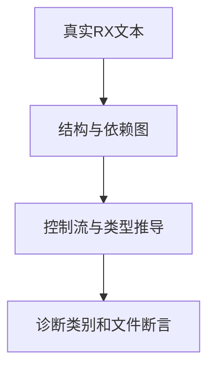
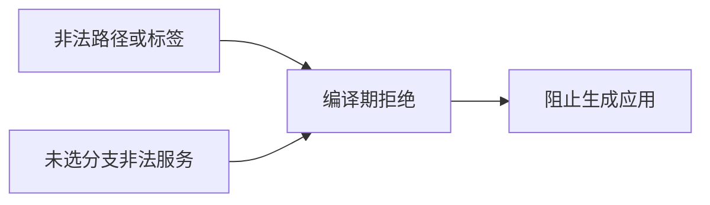

# RX控制流拒绝边界验证

## Intent：最终目标

以十个独立负例检验控制流完整性、标签限制与全图依赖校验，保证运行时不选中的分支仍不能藏匿非法依赖。

## Data：可用证据

RX README规定所有非void路径必须返回、终止后步骤不可达、标签为字面量、主体只允许整数/bool/字符串/可用枚举。selection.zig明确将0与-0视为重复，项目prepare与module_compile使用return_path诊断。

## Edges：边界与限制

复用既有module.infer测试帮助函数，检查诊断类别和main.rx归属。本批不冒充精准位置覆盖，精确位置另由已有control/scope_test验证。静态常量条件也不能绕过缺失服务或自环检查；保持无环硬约束。

## Answer：交付与成功标准

十项独立断言落入inference/control/rejection_test.zig；完整推导专项通过，保留原始日志。出现不同诊断先定位真实拒绝阶段，不能直接改成任意错误即通过。

## 自我复核

这些都是负例，不能独立证明合法路径可用；应结合阶段294至296的正常运行对照。多种拒绝原因不能被合并成一次异常断言，诊断与目标文件均需准确匹配。

## 零标签首次预期复核

首次95项中94通过，0/-0用例实际type_mismatch。独立CLI诊断确认无约束0主体下，负零先被“integer literal does not fit its type”拒绝；将主体改为-1形成有符号对照后，准确得到name / duplicate Switch case value。保留前者为类型拒绝，新增后者验证重复检测，总新增由10增至11。两类断言各自准确，不接受任意错误，也未将测试分类错误报为实现缺陷。原始日志和两次CLI诊断JSON已归档。

## 阶段297最终结果

推导专项退出0，4/4步骤、96/96测试通过；净增11项拒绝边界。格式与diff空白检查通过。没有修改运行代码，因此未重复已通过的126项运行专项，也未重跑完整根。

现在已具备所有返回路径检查、不可达后续步骤、分支返回类型冲突、主体/标签限制、无符号负零及有符号重复零标签、未选分支缺失服务/自环的明确断言。精确位置和跨模块多层环仍由既有专项分别支撑，不将本批类别断言夸大为全部位置覆盖。
