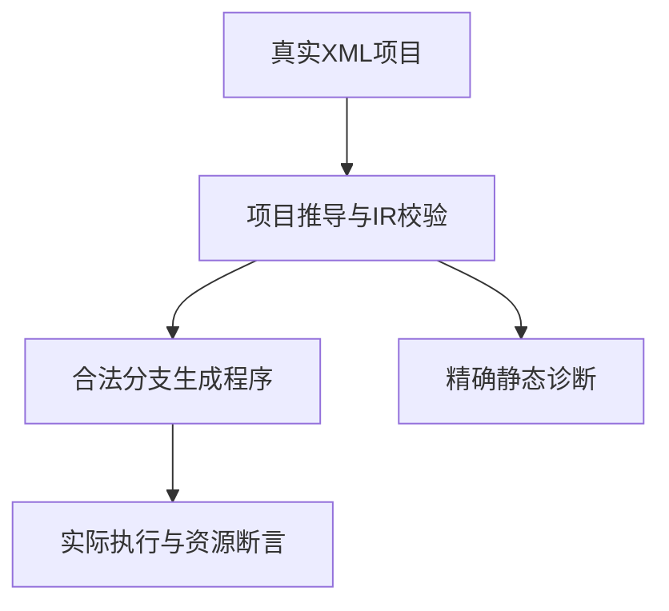
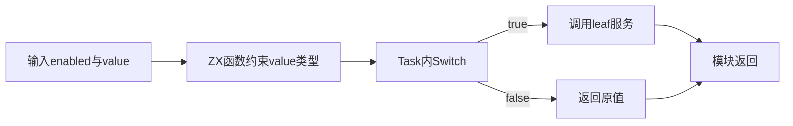

# RX控制流程测试执行计划

## Intent：最终目标

在当前完整回归结束后，针对新增Task/Switch实现建立独立推导、诊断、真实执行与分配失败测试。正式测试仍待接入；下方隔离草稿验证不计入正式案例。

## Data：可用证据

当前RX README的Task与Switch执行章节，以及analysis/flow_compile.zig、selection.zig：Task和Case有局部绑定作用域，Switch支持整数/bool/字符串字面量，Default位置任意，无fallthrough；Return结束当前模块，服务Return不结束调用者。枚举名环境、Parallel、Store和事件仍有明确边界。

## Edges：边界与限制

不修改正在运行完整回归的正式清单。草稿当前验证结果见末节；正式接入时仍须核对实现与测试的最新版本。执行结果、静态诊断、资源失败分别取证，不用生成IR存在推断真实分支已运行。Switch.on只执行一次需要可观察的执行证据，不能仅靠普通数值结果或IR字段计数下结论。

## Answer：交付与成功标准

第一批先落地Task内Switch的两条实际路径与服务调用返回边界；随后覆盖下表。所有正式测试位于packages/test/tests/rx，复用当前项目编译与运行工具，草稿确认后再接入。

| 边界 | 核验方式 |
| --- | --- |
| bool真/假与Default任意位置 | 同一输入在不同分支顺序下结果一致 |
| 无Default且未匹配 | 执行Switch后的步骤 |
| bool true/false完整覆盖 | 无Default仍满足所有路径返回 |
| Task或嵌套Switch中的Return | 后续步骤不可达的静态诊断 |
| 服务内部Return | 调用者仍能继续计算并返回 |
| 兄弟Case同名out | 允许各自绑定，结果互不污染 |
| Task和Case局部out越界读取 | 精确name位置，与可读外部绑定对照 |
| 分支覆盖外部out路径 | 拒绝，不能通过局部重名绕开 |
| 0与-0、实体解码后重复标签 | 精确duplicate诊断 |
| 算术表达式或运行绑定作标签 | 拒绝非字面量，保留合法字面量对照 |
| 未选分支运行错误 | 不执行；选择该分支时错误传播 |
| 未选分支缺失服务或环 | 仍在编译期拒绝 |
| 聚合输入与分支所有权 | 成功/错误均保持借用输入，分配失败无泄漏 |

## 自我批判

此计划只确定验证边界，不表示新增特性已经被本测试包充分覆盖。草稿选择简单类型约束减少无关干扰，后续必须补充分支所有权、跨模块约束与实际失败路径；不能只留下两条容易通过的正常路径。

## 隔离草稿实际验证

从当前完整复验的进程参数取得实际CLI路径，保存其SHA-256，在临时目录映射main.rx、leaf.rx、helper.zx，执行zxc build与生成应用。最终草稿四组输入通过：false/0返回0、false/7返回7、true/0返回11、true/7返回18。真分支的子服务先加1，调用者取得结果后再加10，避免直接转发结果无法辨别服务Return边界。

程序、执行脚本与结构化结果均保存在RX控制流程测试草稿目录。最初直接转发版本也通过四组输入，但最终用上面的继续计算版本增强证据，不把两轮重复执行累计成八个新案例。尚未接入packages/test测试图，正式计数不变；没有实现缺陷，未发送消息。

## Default位置草稿验证

在相同XML内容上仅交换Default与Case的相对位置，分别构建两个程序；四组输入在两种位置下全部通过，共8组实际执行。Default位于前面时不会抢先匹配true，服务返回后的继续计算仍保持11/18。最终结构化结果包含两次构建与八次执行；不把先前四组重复执行再叠加计数。脚本在失败时也会保存已经取得的结果，正式测试图和目录计数仍未改变。

## 作用域与标签诊断草稿

六项静态草稿通过：Task局部绑定外泄、Case局部绑定外泄、Task覆盖外部路径均为name诊断；动态绑定作Case标签为type_mismatch；实体解码后重复标签为context；兄弟Case同名局部out且bool true/false穷尽的对照成功生成源码。成功生成不单独算作运行结果，正式图和案例计数仍未改动。

首次将实体重复标签预期为分析层name，实际被更早的XML Switch refine拒绝。源码Switch.zig调用checks.uniqueChildren，checks.zig的fail明确为context，故按该真实阶段契约修正预期，并保留首次分类日志；不是放宽断言，也不是实现缺陷。后续正式定位测试须独立检查原始XML字节位置，目前草稿只检查主文件、行号和诊断类别。

## 未选分支与服务错误草稿

新增隔离草稿：Switch的true分支调用leaf服务，leaf通过已有first.zx读取列表首项；Default返回9。四组实际执行全部通过：false配空列表/非空列表均返回9，true配[7]返回7，true配空列表退出1、stdout为空、stderr首行为error: IndexOutOfBounds。错误断言沿用已有application protocol测试的公开输出契约，不以任意非零退出或崩溃代替正确失败。

这证明本草稿中未选分支没有执行有错误的索引操作，选中时错误穿过服务传回入口。执行脚本、三个输入文件与结果JSON保存在同一草稿目录。尚未验证所有权或分配失败，不外推这些边界；仍不增加正式测试计数。

## 阶段294：正式接入开始

阶段293完整根退出0后，接入三种控制流编译模式：Default末尾、Default开头、分支服务错误。对应17项实际运行断言及6项项目推导断言；结果尚待专项完成。项目工具继续复用既有编译链，新增案例放入runtime/control与inference/control。

首次专项发现推导测试不能跨Zig模块根embed运行夹具，改为复用推导目录内已有同契约的number.zx；这是测试接线错误，未报告为实现缺陷。

## 阶段294结果与自我复核

修正夹具路径后的完整RX专项退出0，73/73步骤、185/185测试通过：运行103项、推导82项；相较既有86项运行和76项推导净增17+6项。Zig格式与diff空白检查通过，首次与修正日志均归档。

六项定位断言检查原始XML的文件、offset、line、column；成功分支验证IR。运行覆盖两种Default位置的正常和整数极值、调用者继续执行及服务IndexOutOfBounds传播。这里的整数最大值是类型边界，不是针对用户用例的生产特例；没有改动生产实现。

尚未验证Switch主体一次求值、字符串与整数不匹配续行、聚合所有权和分配失败，不能从本批正常标量分支通过推断它们正确。完整根通过的阶段293基线早于本批；不将专项185项伪装为再次根回归。
