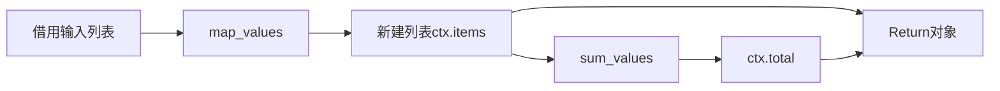
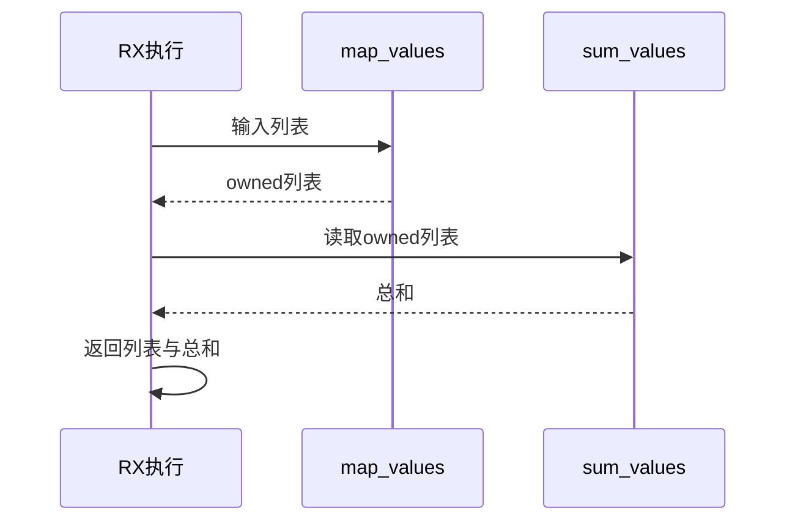

# RX新建列表跨调用执行验证

## Intent：最终目标

阶段254：验证RX执行合并器能够传递ZX新建列表的所有权，借用读取后再作为聚合结果返回。

## Data：可用证据

已有运行覆盖标量、借用字符串和条件索引；缺少owned列表跨两个Call的执行。ZX map生成新列表，reduce读取列表生成标量，RX Return组装items和total。

## Edges：边界与限制

只覆盖无溢出的u64列表。检查输出内容、非空输出与输入不共用存储、原输入不变、arena生命周期内结果有效。结果不声明可在arena释放后使用。

## Answer：交付与成功标准

空、单项、多项、零值混合四运行输入全部得到逐项加一列表及总和；另一个代表输入逐分配点注入失败且无泄漏。真实XML→IR→生成Zig执行，差异须保留并反馈。

## 实际结果

新增aggregate模式5项，整组test-rx-runtime为24/24步骤、27/27通过。四实际输入分别为空、[7]、[1,3,8]、[0,9,0]，输出列表分别[]、[8]、[2,4,9]、[1,10,1]，total分别0、8、15、12。非空输出items与输入指针不同；可变输入副本在正常及错误路径均与原始预期保持相同。

第五项对实际生成代码执行arena的分配请求逐次注入失败；正常结果断言和错误清理均通过，没有报告泄漏或错误吞噬。输入fixture自身复制使用独立测试分配器，不计入被注入的执行分配点。所有输出检查在执行arena释放前完成。

之前22项运行测试随编译工具更新一起重跑通过。格式、README本次diff检查通过，源码/fixture/构建、运行日志及实现SHA归档；已通知实现会话。独立RX运行27、契约30，JSONL64,145及上游1,047不变。

## 自我批判

此次验证owned列表被后续reduce借用读取后能在最终聚合中返回，不涉及将同一个owner交给两个消费操作、嵌套聚合或原生ABI转移。非空不同指针证明本例有独立存储，空列表不要求不同指针。未把分配注入轮次作为额外测试数量。没有生产修改、全仓回归或UI验证。
