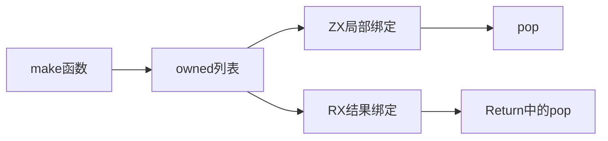
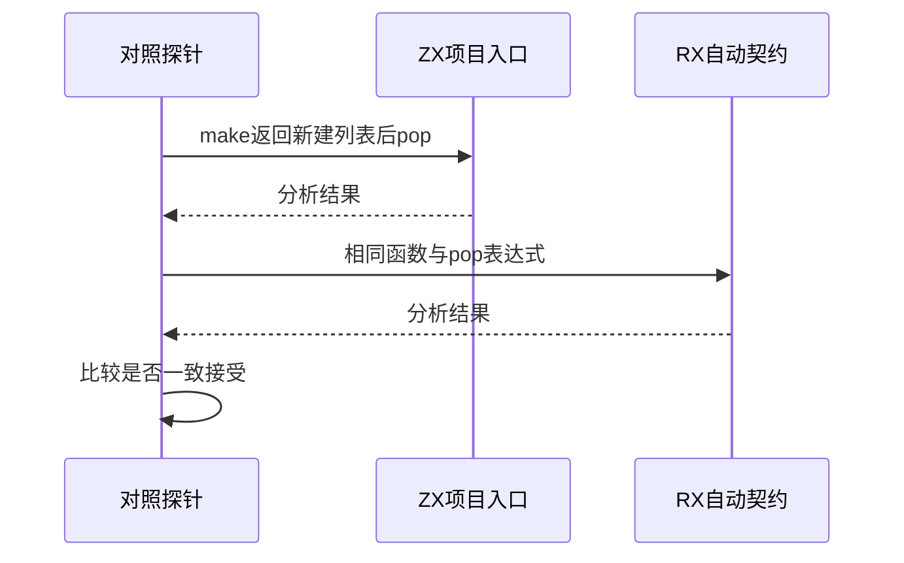

# RX新建调用结果消费对照

> 阶段256已独立复验修复：八项边界8/8、正式RX69/69、独立表达式64/64通过。下文为阶段255历史失败记录；闭环见同日《RX所有权修复边界验证》。

## Intent：最终目标

阶段255：确认新建ZX返回列表在RX绑定后是否仍可消费，不把借用结果拒绝规则误施于owned结果。

## Data：可用证据

既有ZX返回所有权测试允许调用结果owned后消费；RX infer支持pop类型推导，但表达式Binding仅保存类型，独立表达式编译可能将所有绑定视为借用。需要实测等价的ZX/RX表达式。

## Edges：边界与限制

使用pop返回[list, optional]避免void tuple歧义。生成函数返回[in]，不消费原输入。仅docs复现，不把疑似错误登记成预期拒绝的正式通过测试。

## Answer：交付与成功标准

同一make.zx，ZX与RX均应接受新建结果消费；先独立解析和分析两种入口。若存在差异，保存失败日志及实现快照并通知实现会话；后续以修复后独立复验闭环。

## 实际差异：未修复

独立构建四项对照3/4通过，1项失败：

| 场景 | 实际结果 | 预期 |
| --- | --- | --- |
| ZX调用make返回[in]后pop | 接受 | 接受 |
| RX调用同一make，Return ctx.items.pop() | ownership拒绝 | 接受 |
| RX调用返回原输入的借用函数后pop | ownership拒绝 | 拒绝 |
| RX Return [1].pop() | 接受 | 接受 |

失败报文为consuming list operations require an owned value; borrowed values cannot be consumed。前后三对照排除了pop整体不支持或所有权规则应统一放宽的解释。

复现命令：`zig build --build-file docs/2026-10-04/RX新建结果消费复现/build.zig test --summary all`。首次差异、借用对照和最终四项日志分别归档，不覆盖失败历史。测试尚未纳入正式绿灯统计；独立RX运行27/契约30、JSONL64,145、上游1,047均不变。

## 根因线索与修复约束

module_compile中的输出Binding只传name/type_id，expression.compile基于独立表达式环境编译，未携带此前Call返回值的owned摘要。这与实际提前ownership拒绝一致；完整根因和安全实现由实现会话处理。最终Program的所有权检查不能挽救更早的错误拒绝。

已向实现会话发送复现、失败日志、线索及约束：保留$in与借用返回值不能消费、重复消费禁止等安全规则，不能全局绕过ownership。待修复后需用同一四项对照复验，再补充真实pop输出与负例正式回归。

## 自我批判

本轮证明的是分析接受性差异，尚未执行这份RX pop程序；不报告为运行结果错误。初版探针的诊断打印字段误写issue.message导致脚手架编译失败，修正为公开Diagnostic.message后才取得上述四项结果，未把脚手架错误归因生产。

未修改生产代码，也未把实际错误改成正式预期拒绝来制造通过。此问题仍待修复，不宣称整体任务或本差异已闭环。
