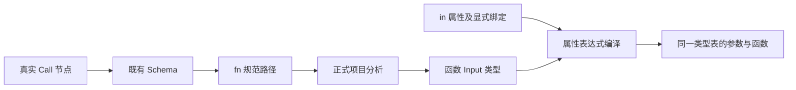
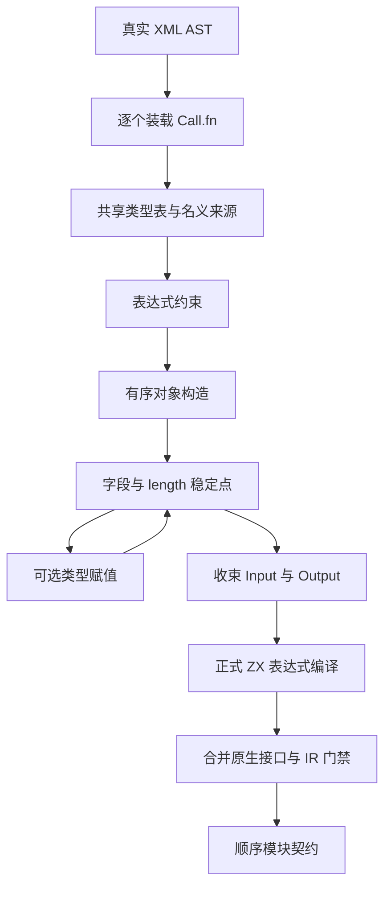

# RX 显式函数调用联结计划

## Intent：最终目标

把真实 RX Call.fn 指向的 ZX 函数与 Call.in 表达式连接到同一类型表，形成可生成和执行的显式函数调用。为完整 RX 应用编译提供函数调用阶段，数据通过 Input 传入。

## Data：可用证据

cli/src/cli/rx/function.zig 目前只装载并检查 ZX 文件，未按函数 Input 检查 Call.in。现有 rx_analysis.expression.compile 已支持真实属性、显式绑定和原始 XML 位置映射；compiler.analyzeProject 提供正式风格检查、模块装载分析、名义类型来源与完整 IR 门禁。成熟接口参照 rx_analysis.expression 的 arena 所有权，以及 rx.flow.Call 的现有 Schema，不重复实现标签规则。

真实旧示例 RX依赖装载示例/function.rx 调用 calculate.zx，后者导入 add_one.zx；该示例可用于运行验证，无需新增测试用例。

## Edges：边界与限制

用户已明确 Module 输入输出由编译器自动推导：不新增类型文件或声明语法，in/out 名称用于推导后的契约。后续按真实表达式和流程数据流收集约束，合并字段需求与完整对象约束，再用既有分析器复核。当前函数调用阶段提供确定的 ZX Input/Output 约束，不把它声称为完整 RX 执行 CLI。函数调用联结只接受 fn；service、setter 与 Store 能力需要各自正式阶段，不能静默忽略。Call.out 的可见范围、分支合流与完整流程返回由上层流程联结处理。

接口接收实际 Call AST、所属 RX 路径、ZX 源集合、既有项目选项和显式绑定。先用现有 Call Schema 校验，再规范化 fn 路径并分析函数，最后按函数 Input 编译属性。返回独立拥有的两个 Program 与名义类型来源；它们使用同一类型表前缀。原生模块及完整 ABI 由应用生成阶段统一处理，不能仅凭结构相同跨模块传对象。

不引入隐式注入或兼容别名；不新增测试、不调用浏览器；仅修改调用阶段的源码及公开参考。

## Answer：交付格式与成功标准

提供 rx_analysis.call.link；有效调用返回 callee 与 argument IR，错误给出实际 RX 或 ZX 文件位置。用已有真实示例生成 Zig、执行函数并核对输出；仅构建所需模块并运行已有示例；按用户最新要求，不执行全量测试，回归由另一会话负责。生成演示使用通用 IR/AST 生成接口，不在生产实现中硬编码示例名称、路径或类型编号。



```mermaid
sequenceDiagram
  participant RX as 调用者
  participant Link as 函数联结
  participant ZX as ZX 分析器
  RX->>Link: Call AST 与显式环境
  Link->>ZX: 规范化函数路径与项目选项
  ZX-->>Link: 函数签名与类型表
  Link->>Link: 按 Input 检查 in 表达式
  Link-->>RX: 有效调用或原始源码诊断
```

## 执行与自我复核

待记录。当前阶段不包含 service 调度、事件或 Store 提交宿主。

### 恢复实施

先修复已有通用检查器暴露的三处编译问题：两个错误集转换分支显式返回 OutOfMemory，属性位置换算调用实际的 sourceSpan 方法。可选类型的分析提示逐层取 payload，但最终期望仍交给既有转换检查，不剥离实际值的 optional 类型。

开放对象 spread 不能仅复制当前已知字段；需要保留有序对象构造关系，在约束稳定时传播字段来源和字段赋值要求。多个未知 spread 都可能提供同一必需字段时，必须报告无法唯一推断，不能任意挑选来源。数值默认类型也必须在最终可用类型集合内选择，不能把默认 u64 当成不可改变的类型约束。

上述事项尚在实现；不将当前顺序 Call.fn/Return 推导入口描述为完整 RX 流程执行。

### 顺序模块约束实现

`rx_analysis.call.link` 提供单次调用联结；`rx_analysis.module.infer` 从真实 Module AST 收集顺序 Call.fn 和 Return 的约束，得到输入、输出、调用参数和函数 IR。共享类型表及外部名义类型来源沿每次函数装载传递；最后合并原生接口并逐个执行正式 IR 校验。

对象构造保留 `result + ordered parts`，不再复制展开源字段的瞬时快照。稳定点循环传播构造字段、length 投影和可选类型赋值；最后检查缺失字段和来源歧义。最终显式字段保留上下文类型提示，被后续字段覆盖的值不反向约束最终字段。对未知展开源尚不能证明字段不存在时，不擅自选择前面的字段作为最终来源。

数值默认从最终允许的标量集合选取；具体函数签名已给出类型时仍保持该类型。可选类型的赋值约束在结构约束稳定后处理，保留源字段为非可选值、目标字段允许包装的方向性。



### 当前验证及自我复核

通用 `inspect-rx-module` 检查器构建成功。对已有 function.rx、calculate.zx、add_one.zx 输入，结果为一个 Call，Input=i32、Output=i32；DebugAllocator 未报告泄漏。未新增测试，未调用浏览器，未运行全量测试。

这项验证仅证明该真实示例与所调用接口的构建链，不能替代字段展开、错误分支和分配失败的覆盖。另一会话正在独立补充模块推断回归。尚未提供 RX 流程执行 CLI；service、条件流程、事件与 Store 联结仍需后续阶段，不把顺序契约当成完整运行时。

复核后补充：字段集合是否完整由构造来源判断，无展开的对象立即可判定完整，全部来源完整的嵌套展开也完整；这不要求提前确定字段类型。同一开放源重复展开按图节点身份去重，不作为两个独立候选。仍不实现根据类型试探任意候选、字段上界或禁止字段，独立未知源的歧义保持显式诊断。

测试会话已报告 `test-rx-inference` 8/8 基础回归通过，覆盖真实 XML 的空模块、固定返回、函数输入约束、嵌套字段、顺序绑定、未约束输入、冲突类型和不可达步骤；该报告不覆盖本次对象展开修改，本会话未重复执行或生成测试。

根目录 `zig build --summary all` 构建 14/14 成功；这是构建结果，未运行全量测试。参考入口及行为边界已写入 `packages/compiler/src/rx/README.md`。
